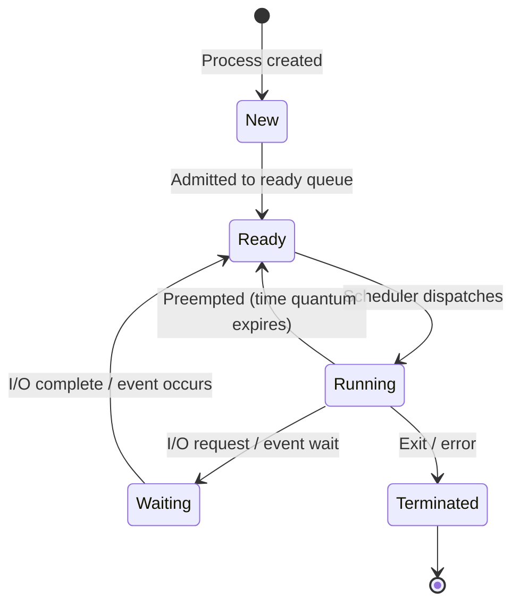

# 📘 MSc Admission Prep — Subject 02: Operating Systems
### 🎯 JUST-Style Exam Handbook | Fast Revision Edition

> **Goal:** Deep, visual, exam-focused revision of OS concepts. Every topic includes intuition, diagrams, traces, and exam tips.

---

## 📋 Table of Contents

| # | Topic | Tier |
|---|-------|------|
| 1 | [Process States & Diagram](#1-process-states--diagram) | 🔴 Must Master |
| 2 | [CPU Scheduling](#2-cpu-scheduling) | 🔴 Must Master |
| 3 | [Process Synchronization](#3-process-synchronization) | 🔴 Must Master |
| 4 | [Deadlock](#4-deadlock) | 🔴 Must Master |
| 5 | [Memory Management & Paging](#5-memory-management--paging) | 🔴 Must Master |
| 6 | [Page Replacement Algorithms](#6-page-replacement-algorithms) | 🔴 Must Master |
| 7 | [Virtual Memory](#7-virtual-memory) | 🔴 Must Master |
| 8 | [File System](#8-file-system) | 🔴 Must Master |

---

---

# 1. Process States & Diagram

## 💡 Intuition First

> Think of a **job application process**. You submit (new), get called for interview (ready), go into the interview room (running), wait for results (waiting/blocked), and finally get hired or rejected (terminated). A process goes through similar stages in an OS.

**Real-world analogy:** A customer at a bank — arrives (new), waits in queue (ready), gets served at counter (running), waits for document verification (waiting), leaves (terminated).

**Why it matters:** Process state transitions are the foundation of scheduling, synchronization, and OS design. Diagram questions appear in almost every exam.

---

## 📐 Process States

```
                    ┌─────────────────────────────────────────┐
                    │                                         │
         admitted   ▼        scheduler        I/O or event   │
  NEW ──────────► READY ──────dispatch──────► RUNNING ───────┘
                    ▲                            │
                    │        I/O or event        │
                    │◄────── completion ─────── WAITING
                    │                            
                    └──────────────────────────► TERMINATED
                         exit / error
```

### Full 5-State Diagram



### State Descriptions

| State | Description | Example |
|-------|-------------|---------|
| **New** | Process being created | `fork()` called |
| **Ready** | Waiting for CPU | In ready queue |
| **Running** | Currently executing on CPU | On CPU right now |
| **Waiting/Blocked** | Waiting for I/O or event | Reading from disk |
| **Terminated** | Finished execution | `exit()` called |

---

## 🔄 Key Transitions

| Transition | Trigger |
|------------|---------|
| New → Ready | OS admits process |
| Ready → Running | Scheduler picks this process |
| Running → Ready | Time quantum expires (preemption) |
| Running → Waiting | Process requests I/O |
| Waiting → Ready | I/O completes |
| Running → Terminated | Process finishes or crashes |

> 🔑 **Key fact:** A process can go from Running → Ready (preemption) but **NOT** from Waiting → Running directly. It must go through Ready first.

---

## 📦 Process Control Block (PCB)

> The OS stores all information about a process in a **PCB** — like a student's file in a university.

```
┌─────────────────────────┐
│   Process Control Block │
├─────────────────────────┤
│ Process ID (PID)        │
│ Process State           │
│ Program Counter         │
│ CPU Registers           │
│ Memory Limits           │
│ Open File List          │
│ I/O Status              │
│ Priority                │
└─────────────────────────┘
```

---

## ⚖️ Process vs Thread

| Feature | Process | Thread |
|---------|---------|--------|
| Definition | Program in execution | Lightweight unit within process |
| Memory | Own address space | Shares process memory |
| Creation overhead | High | Low |
| Communication | IPC (complex) | Shared memory (easy) |
| Crash impact | Isolated | Can crash whole process |
| Example | Chrome browser | Each tab as a thread |

---

## ⚠️ Common Mistakes

> 🚫 **Mistake 1:** Saying a process goes directly from Waiting → Running. It must go Waiting → Ready → Running.
> 🚫 **Mistake 2:** Confusing "blocked" and "waiting" — they mean the same thing.
> 🚫 **Mistake 3:** Forgetting that preemption moves a process from Running → Ready (not Terminated).

---

## ⚡ One-Minute Recap

- 5 states: New → Ready → Running → Waiting → Terminated
- Waiting → Ready (not Running) after I/O completes
- PCB stores all process metadata
- Process = heavy, own memory | Thread = light, shared memory

---

## 📝 Probable Exam Questions

> **5-mark:** Draw and explain the process state transition diagram with all states and transitions.
> **Short note:** What is a PCB? What information does it contain?
> **Conceptual:** What is the difference between a process and a thread?
> **Diagram:** Show what happens when a running process requests I/O.

---

---

# 2. CPU Scheduling

## 💡 Intuition First

> The CPU is a single worker. Multiple processes want to use it. The **scheduler** decides who gets the CPU and for how long — like a manager assigning tasks to one employee.

**Why it matters:** Scheduling directly affects system performance. Exam questions always include Gantt charts and metric calculations.

---

## 📐 Key Metrics

```
Arrival Time (AT)    = when process enters ready queue
Burst Time (BT)      = CPU time needed
Completion Time (CT) = when process finishes
Turnaround Time (TAT) = CT - AT
Waiting Time (WT)    = TAT - BT
Response Time (RT)   = time from arrival to first CPU access
```

---

## 📊 Algorithm 1: FCFS (First Come First Served)

> **Non-preemptive.** Processes served in order of arrival. Simple but can cause **convoy effect**.

### Example

```
Process  AT  BT
P1        0   4
P2        1   3
P3        2   1
P4        3   2

Gantt Chart:
|  P1  |  P2  | P3 | P4 |
0      4      7    8   10

Calculations:
P1: CT=4,  TAT=4-0=4,  WT=4-4=0
P2: CT=7,  TAT=7-1=6,  WT=6-3=3
P3: CT=8,  TAT=8-2=6,  WT=6-1=5
P4: CT=10, TAT=10-3=7, WT=7-2=5

Avg TAT = (4+6+6+7)/4 = 5.75
Avg WT  = (0+3+5+5)/4 = 3.25
```

> ⚠️ **Convoy Effect:** A long process holds the CPU while short processes wait — like a slow truck blocking a highway.

---

## 📊 Algorithm 2: SJF (Shortest Job First)

> **Non-preemptive.** Pick the process with the shortest burst time. Optimal average waiting time but requires knowing burst time in advance.

### Example (Non-preemptive SJF)

```
Process  AT  BT
P1        0   6
P2        1   8
P3        2   7
P4        3   3

At t=0: Only P1 available → run P1 (BT=6)
At t=6: P2(8), P3(7), P4(3) available → pick P4 (shortest BT=3)
At t=9: P2(8), P3(7) available → pick P3 (BT=7)
At t=16: Only P2 → run P2

Gantt Chart:
|    P1    | P4 |    P3    |    P2    |
0          6    9         16         24

P1: CT=6,  TAT=6-0=6,   WT=0
P4: CT=9,  TAT=9-3=6,   WT=3
P3: CT=16, TAT=16-2=14, WT=7
P2: CT=24, TAT=24-1=23, WT=15

Avg WT = (0+3+7+15)/4 = 6.25
```

### SRTF (Shortest Remaining Time First) — Preemptive SJF

> At each moment, if a new process arrives with shorter remaining time than current, preempt.

---

## 📊 Algorithm 3: Round Robin (RR)

> **Preemptive.** Each process gets a fixed **time quantum (q)**. After q expires, process goes back to ready queue. Fair but has context switch overhead.

### Example (q = 2)

```
Process  AT  BT
P1        0   5
P2        1   3
P3        2   1
P4        3   2

Ready Queue evolution:
t=0: P1 arrives → run P1 for 2 → P1 remaining=3
t=2: P2,P3,P4 check arrivals → P2(AT=1)✓, P3(AT=2)✓ → Queue:[P2,P3,P1]
     Run P2 for 2 → P2 remaining=1
t=4: P4(AT=3)✓ → Queue:[P3,P1,P4,P2]
     Run P3 for 1 (only 1 left) → P3 done
t=5: Queue:[P1,P4,P2]
     Run P1 for 2 → P1 remaining=1
t=7: Queue:[P4,P2,P1]
     Run P4 for 2 → P4 done
t=9: Queue:[P2,P1]
     Run P2 for 1 → P2 done
t=10: Queue:[P1]
      Run P1 for 1 → P1 done

Gantt Chart:
|P1|P2|P3|P1|P4|P2|P1|
0  2  4  5  7  9 10 11

P1: CT=11, TAT=11, WT=6
P2: CT=10, TAT=9,  WT=6
P3: CT=5,  TAT=3,  WT=2
P4: CT=9,  TAT=6,  WT=4
```

> 🔑 **Key:** Smaller time quantum → more responsive but more context switches. Larger quantum → approaches FCFS.

---

## ⚖️ Scheduling Algorithm Comparison

| Algorithm | Preemptive? | Starvation? | Overhead | Best For |
|-----------|-------------|-------------|----------|----------|
| FCFS | No | No | Low | Batch systems |
| SJF | No | Yes (long jobs) | Medium | Minimize avg wait |
| SRTF | Yes | Yes | High | Minimize avg wait |
| Round Robin | Yes | No | Medium | Time-sharing |
| Priority | Both | Yes (low priority) | Medium | Real-time |

---

## 🧮 Metric Formulas — Quick Reference

```
TAT = CT - AT
WT  = TAT - BT
RT  = First CPU time - AT

CPU Utilization = (Total CPU busy time / Total time) × 100%
Throughput = Number of processes / Total time
```

---

## ⚠️ Common Mistakes

> 🚫 **Mistake 1:** In RR, forgetting to add newly arrived processes to the queue before the preempted process.
> 🚫 **Mistake 2:** Calculating WT as CT - BT instead of TAT - BT.
> 🚫 **Mistake 3:** In SJF, not checking which processes have arrived before picking the shortest.
> 🚫 **Mistake 4:** Confusing Response Time with Waiting Time — RT is first CPU access, WT is total wait.

---

## 🎯 Exam Tips

> 💡 **Always draw the Gantt chart first**, then calculate metrics from it.
> 💡 In RR, track the ready queue carefully — arrival order matters when quantum expires.
> 💡 SJF minimizes **average waiting time** — this is a provable theorem.
> 💡 FCFS suffers from **convoy effect** — mention this in any comparison question.

---

## ⚡ One-Minute Recap

- FCFS: arrival order, non-preemptive, convoy effect
- SJF: shortest burst first, optimal avg WT, starvation possible
- RR: time quantum, fair, preemptive, no starvation
- TAT = CT - AT | WT = TAT - BT

---

## 📝 Probable Exam Questions

> **5-mark:** Given processes with AT and BT, draw Gantt chart for FCFS and RR (q=2). Calculate avg WT and TAT.
> **5-mark:** Apply SJF (non-preemptive) on given processes. Show Gantt chart and metrics.
> **Short note:** What is the convoy effect in FCFS? How does RR solve it?
> **Compare:** Compare FCFS, SJF, and Round Robin scheduling algorithms.

---

---

# 3. Process Synchronization

## 💡 Intuition First

> Two people editing the same Google Doc simultaneously — if both save at the same time, one person's changes might overwrite the other's. That's a **race condition**. Synchronization prevents this.

**Real-world analogy:** A shared bank account. If two people withdraw simultaneously, the balance check and deduction must happen atomically — no interruption allowed.

---

## 🏁 The Critical Section Problem

> A **critical section** is a code segment that accesses shared resources. Only **one process** should execute it at a time.

```
Process structure:
┌─────────────────────┐
│   Entry Section     │  ← Request permission to enter
├─────────────────────┤
│   Critical Section  │  ← Access shared resource
├─────────────────────┤
│   Exit Section      │  ← Release permission
├─────────────────────┤
│   Remainder Section │  ← Rest of the code
└─────────────────────┘
```

### Three Requirements

| Requirement | Meaning |
|-------------|---------|
| **Mutual Exclusion** | Only one process in CS at a time |
| **Progress** | If no process is in CS, one waiting process must enter |
| **Bounded Waiting** | A process must not wait forever (no starvation) |

---

## ⚡ Race Condition

```
Shared variable: counter = 5

Process P1: counter++   →  reads 5, adds 1, writes 6
Process P2: counter++   →  reads 5, adds 1, writes 6

Expected: counter = 7
Actual:   counter = 6  ← RACE CONDITION!

Why? P2 read the old value before P1 wrote back.
```

---

## 🔐 Peterson's Solution (Software)

> A classic software solution for **2 processes** using two shared variables: `flag[]` and `turn`.

```
Shared: flag[2] = {false, false}
        turn = 0

Process Pi (i=0 or 1, j=1-i):

do {
    flag[i] = true;        // I want to enter
    turn = j;              // Give turn to other
    while (flag[j] && turn == j);  // Wait if other wants AND it's their turn
    
    // CRITICAL SECTION
    
    flag[i] = false;       // I'm done
    
    // REMAINDER SECTION
} while (true);
```

> ✅ Satisfies all 3 requirements: mutual exclusion, progress, bounded waiting.
> ❌ Only works for **2 processes**. Busy waiting wastes CPU.

---

## 🔒 Semaphores

> A **semaphore** is an integer variable accessed only through two atomic operations: `wait()` and `signal()`.

```
wait(S):              signal(S):
  while S <= 0:         S = S + 1
    ; // busy wait
  S = S - 1
```

### Types

| Type | Initial Value | Use |
|------|---------------|-----|
| **Binary Semaphore (Mutex)** | 1 | Mutual exclusion |
| **Counting Semaphore** | n | Resource counting |

### Mutex Example

```
Semaphore mutex = 1

Process P1:          Process P2:
wait(mutex)          wait(mutex)
  // Critical          // Critical
  // Section           // Section
signal(mutex)        signal(mutex)

If P1 enters first: mutex becomes 0
P2 calls wait(mutex): 0 ≤ 0 → P2 BLOCKS
P1 exits: signal(mutex) → mutex=1 → P2 unblocks
```

---

## 🍽️ Classic Synchronization Problems

### 1. Producer-Consumer Problem

```
Shared buffer of size N
Producer: adds items to buffer
Consumer: removes items from buffer

Semaphores:
  mutex = 1      (mutual exclusion for buffer access)
  empty = N      (count of empty slots)
  full  = 0      (count of filled slots)

Producer:                    Consumer:
while(true) {                while(true) {
  produce item                 wait(full)
  wait(empty)                  wait(mutex)
  wait(mutex)                  remove item from buffer
  add item to buffer           signal(mutex)
  signal(mutex)                signal(empty)
  signal(full)                 consume item
}                            }
```

### 2. Readers-Writers Problem

```
Multiple readers can read simultaneously.
Only one writer at a time (exclusive access).

Semaphores:
  mutex = 1      (protect readcount)
  wrt   = 1      (exclusive write access)
  readcount = 0

Reader:                      Writer:
wait(mutex)                  wait(wrt)
  readcount++                  // WRITE
  if readcount==1:           signal(wrt)
    wait(wrt)
signal(mutex)
  // READ
wait(mutex)
  readcount--
  if readcount==0:
    signal(wrt)
signal(mutex)
```

### 3. Dining Philosophers Problem

```
5 philosophers sit at a round table.
5 forks between them (one between each pair).
To eat: philosopher needs BOTH left and right fork.

Problem: If all pick up left fork simultaneously → DEADLOCK

Solution (Semaphore approach):
  fork[5] = {1,1,1,1,1}  // each fork is a semaphore

Philosopher i:
  wait(fork[i])           // pick left fork
  wait(fork[(i+1)%5])     // pick right fork
  // EAT
  signal(fork[i])
  signal(fork[(i+1)%5])

Deadlock prevention: Make one philosopher pick RIGHT fork first.
```

---

## ⚖️ Mutex vs Semaphore vs Monitor

| Feature | Mutex | Semaphore | Monitor |
|---------|-------|-----------|---------|
| Value | 0 or 1 | 0 to N | — |
| Ownership | Yes (only locker can unlock) | No | Yes |
| Use | Mutual exclusion | Counting + sync | High-level sync |
| Language support | OS/library | OS primitive | Java `synchronized` |

---

## ⚠️ Common Mistakes

> 🚫 **Mistake 1:** Forgetting that `wait()` and `signal()` must be **atomic** — otherwise they themselves have race conditions.
> 🚫 **Mistake 2:** In producer-consumer, swapping `wait(mutex)` and `wait(empty)` → causes deadlock.
> 🚫 **Mistake 3:** Peterson's solution only works for **2 processes**.
> 🚫 **Mistake 4:** Busy waiting in semaphores wastes CPU — blocking semaphores use sleep/wakeup instead.

---

## 🎯 Exam Tips

> 💡 **Critical section requirements** (mutual exclusion, progress, bounded waiting) are always asked.
> 💡 Peterson's solution: memorize the `flag` and `turn` logic — it's a favorite.
> 💡 Producer-consumer: always write the semaphore order correctly (empty/full before mutex).
> 💡 Dining philosophers: explain the deadlock scenario AND the solution.

---

## ⚡ One-Minute Recap

- Critical section: only one process at a time
- Race condition: concurrent access to shared data → wrong result
- Semaphore: wait() decrements, signal() increments
- Binary semaphore = mutex | Counting semaphore = resource pool
- Producer-consumer: mutex + empty + full semaphores

---

## 📝 Probable Exam Questions

> **5-mark:** Explain Peterson's solution. Does it satisfy all three requirements of the critical section problem?
> **5-mark:** Write the producer-consumer solution using semaphores.
> **Short note:** What is a race condition? Give an example.
> **Diagram:** Explain the dining philosophers problem and its deadlock scenario.

---

---

# 4. Deadlock

## 💡 Intuition First

> Four cars at a 4-way intersection, each waiting for the car ahead to move. Nobody moves. That's a **deadlock** — a circular wait where everyone is blocked waiting for someone else.

**Real-world analogy:** Two people each holding one chopstick, each waiting for the other to give theirs up. Neither can eat.

---

## 📐 Four Necessary Conditions (Coffman Conditions)

> **ALL FOUR must hold simultaneously for deadlock to occur.**

| Condition | Meaning | Example |
|-----------|---------|---------|
| **Mutual Exclusion** | Resource can't be shared | Printer used by one process |
| **Hold and Wait** | Process holds resource while waiting for another | P1 holds R1, waits for R2 |
| **No Preemption** | Resource can't be forcibly taken | Can't snatch printer mid-job |
| **Circular Wait** | P1 waits for P2, P2 waits for P1 | Circular dependency chain |

> 🔑 **Memory trick:** "**M**y **H**ouse **N**eeds **C**leaning" → Mutual exclusion, Hold & wait, No preemption, Circular wait

---

## 🔄 Resource Allocation Graph (RAG)

```
Notation:
  Process: circle  ○
  Resource: rectangle  □
  Request edge: ○ ──► □  (process requests resource)
  Assignment edge: □ ──► ○  (resource assigned to process)

Deadlock example:
  P1 ──► R1 ──► P2 ──► R2 ──► P1
  (P1 holds R2, wants R1)
  (P2 holds R1, wants R2)
  → CYCLE = DEADLOCK

No deadlock:
  P1 ──► R1 ──► P2
  (P1 wants R1, R1 assigned to P2, P2 will release it)
  → No cycle = No deadlock (for single-instance resources)
```

---

## 🛡️ Deadlock Prevention

> Eliminate at least one of the four necessary conditions.

| Condition to Break | Strategy |
|-------------------|----------|
| Mutual Exclusion | Make resources sharable (not always possible) |
| Hold and Wait | Request ALL resources at once before starting |
| No Preemption | Allow OS to forcibly take resources |
| Circular Wait | Impose ordering on resource requests (R1 before R2) |

---

## 🏦 Banker's Algorithm (Deadlock Avoidance)

> The OS acts like a **banker** — only grants a loan (resource) if it can still satisfy all future requests. If granting would lead to an unsafe state, it waits.

### Key Concepts

```
n = number of processes
m = number of resource types

Data structures:
  Available[m]       = currently available instances of each resource
  Max[n][m]          = maximum demand of each process
  Allocation[n][m]   = currently allocated resources
  Need[n][m]         = Max - Allocation (remaining need)
```

### Safety Algorithm

```
function isSafe(Available, Allocation, Need):
    Work = Available.copy()
    Finish = [false] * n

    while True:
        found = False
        for each process i where Finish[i] == false:
            if Need[i] <= Work:          // can satisfy i's need?
                Work = Work + Allocation[i]  // simulate release
                Finish[i] = true
                found = True
        if not found: break

    return all(Finish)   // True = safe state
```

### Worked Example

```
5 processes (P0-P4), 3 resource types (A, B, C)
Total resources: A=10, B=5, C=7

         Allocation    Max        Need        Available
         A  B  C      A  B  C    A  B  C     A  B  C
P0       0  1  0      7  5  3    7  4  3     3  3  2
P1       2  0  0      3  2  2    1  2  2
P2       3  0  2      9  0  2    6  0  0
P3       2  1  1      2  2  2    0  1  1
P4       0  0  2      4  3  3    4  3  1

Safety check:
Work = [3,3,2], Finish = [F,F,F,F,F]

Step 1: Check P1: Need=[1,2,2] ≤ Work=[3,3,2]? YES
        Work = [3,3,2]+[2,0,0] = [5,3,2], Finish[1]=T

Step 2: Check P3: Need=[0,1,1] ≤ Work=[5,3,2]? YES
        Work = [5,3,2]+[2,1,1] = [7,4,3], Finish[3]=T

Step 3: Check P4: Need=[4,3,1] ≤ Work=[7,4,3]? YES
        Work = [7,4,3]+[0,0,2] = [7,4,5], Finish[4]=T

Step 4: Check P0: Need=[7,4,3] ≤ Work=[7,4,5]? YES
        Work = [7,4,5]+[0,1,0] = [7,5,5], Finish[0]=T

Step 5: Check P2: Need=[6,0,0] ≤ Work=[7,5,5]? YES
        Work = [7,5,5]+[3,0,2] = [10,5,7], Finish[2]=T

All Finish = True → SAFE STATE ✅
Safe sequence: P1 → P3 → P4 → P0 → P2
```

---

## 🔍 Deadlock Detection & Recovery

### Detection
- Maintain RAG; check for cycles
- For multiple instances: use a variant of Banker's algorithm

### Recovery Options

| Method | Description | Drawback |
|--------|-------------|----------|
| **Process termination** | Kill one or all deadlocked processes | Lose work |
| **Resource preemption** | Take resources from a process | May cause starvation |
| **Rollback** | Roll process back to safe checkpoint | Overhead |

---

## ⚖️ Prevention vs Avoidance vs Detection

| Approach | When | How | Cost |
|----------|------|-----|------|
| **Prevention** | Before deadlock | Break one condition | Low utilization |
| **Avoidance** | Before allocation | Banker's algorithm | Needs max info |
| **Detection** | After deadlock | RAG cycle check | Recovery needed |
| **Ignorance** | Never | Ostrich algorithm | Risk of deadlock |

---

## ⚠️ Common Mistakes

> 🚫 **Mistake 1:** Saying "two conditions are enough for deadlock" — ALL FOUR must hold.
> 🚫 **Mistake 2:** Confusing prevention (break conditions) with avoidance (Banker's).
> 🚫 **Mistake 3:** In Banker's, forgetting Need = Max - Allocation.
> 🚫 **Mistake 4:** A cycle in RAG means deadlock ONLY for single-instance resources. For multi-instance, need further analysis.

---

## 🎯 Exam Tips

> 💡 **Coffman conditions** — memorize all four with examples. Very high frequency.
> 💡 Banker's algorithm: always show the full table and the safe sequence.
> 💡 RAG: draw the graph, identify cycles, conclude deadlock or not.
> 💡 "Ostrich algorithm" = ignore deadlock (used in most OS like Windows/Linux for rare cases).

---

## ⚡ One-Minute Recap

- 4 conditions: Mutual exclusion, Hold & wait, No preemption, Circular wait
- Prevention: break one condition | Avoidance: Banker's algorithm
- Banker's: grant only if safe state remains
- Safe sequence = order in which all processes can complete

---

## 📝 Probable Exam Questions

> **5-mark:** Apply Banker's algorithm to determine if the system is in a safe state. Find the safe sequence.
> **5-mark:** What are the four necessary conditions for deadlock? How can each be prevented?
> **Short note:** Differentiate between deadlock prevention and deadlock avoidance.
> **Diagram:** Draw a Resource Allocation Graph showing a deadlock situation.

---

---

# 5. Memory Management & Paging

## 💡 Intuition First

> RAM is like a **hotel** with limited rooms. Multiple programs (guests) need rooms. The OS (hotel manager) decides how to allocate rooms, handle overbooking, and swap guests in/out when the hotel is full.

**Paging** is like dividing the hotel into equal-sized rooms (pages) and giving each guest a room map (page table) so they don't need contiguous rooms.

---

## 📐 Memory Management Goals

```
1. Relocation    — process can be loaded anywhere in memory
2. Protection    — processes can't access each other's memory
3. Sharing       — allow controlled sharing of memory
4. Logical org   — separate code, data, stack segments
5. Physical org  — manage RAM and disk efficiently
```

---

## 🗂️ Paging

> Divide **physical memory** into fixed-size **frames**.
> Divide **logical memory** (process) into same-size **pages**.
> Map pages to frames using a **page table**.

```
Logical Address Space:          Physical Memory (Frames):
┌──────────┐                    ┌──────────┐
│  Page 0  │ ──────────────────►│ Frame 3  │
├──────────┤                    ├──────────┤
│  Page 1  │ ──────────────────►│ Frame 7  │
├──────────┤                    ├──────────┤
│  Page 2  │ ──────────────────►│ Frame 1  │
└──────────┘                    └──────────┘

Page Table:
Page 0 → Frame 3
Page 1 → Frame 7
Page 2 → Frame 1
```

### Address Translation

```
Logical Address = (Page Number, Offset)
Physical Address = (Frame Number, Offset)

Given:
  Page size = 4 KB = 2^12 bytes
  Logical address = 13000

Page number  = 13000 / 4096 = 3  (integer division)
Offset       = 13000 % 4096 = 712

Look up page table: Page 3 → Frame 6

Physical address = 6 × 4096 + 712 = 25288
```

### Page Table Entry

```
┌──────────┬───┬───┬───┬───┐
│ Frame No │ V │ R │ M │ P │
└──────────┴───┴───┴───┴───┘
V = Valid bit (page in memory?)
R = Referenced bit
M = Modified/Dirty bit
P = Protection bits
```

---

## 🔄 TLB (Translation Lookaside Buffer)

> A **hardware cache** for page table entries. Speeds up address translation.

```
CPU generates logical address
        │
        ▼
   Check TLB ──── HIT ────► Get frame number → physical address
        │
       MISS
        │
        ▼
   Access Page Table → Get frame number
        │
        ▼
   Update TLB → physical address

TLB Hit ratio = h
Effective Access Time = h × (TLB time + Memory time)
                      + (1-h) × (TLB time + 2 × Memory time)
```

---

## ⚖️ Paging vs Segmentation

| Feature | Paging | Segmentation |
|---------|--------|--------------|
| Division | Fixed-size pages | Variable-size segments |
| Fragmentation | Internal | External |
| User view | Invisible | Visible (code, data, stack) |
| Address | Page# + offset | Segment# + offset |
| Protection | Per page | Per segment |

---

## 🧩 Fragmentation

| Type | Cause | Solution |
|------|-------|---------|
| **Internal** | Allocated block larger than needed | Smaller page size |
| **External** | Free memory scattered in small chunks | Compaction, paging |

```
Internal fragmentation example:
  Page size = 4 KB
  Process needs 9 KB
  Gets 3 pages = 12 KB
  Wasted = 12 - 9 = 3 KB (internal fragmentation)
```

---

## ⚠️ Common Mistakes

> 🚫 **Mistake 1:** Paging eliminates **external** fragmentation but causes **internal** fragmentation.
> 🚫 **Mistake 2:** Confusing page (logical) with frame (physical) — pages map TO frames.
> 🚫 **Mistake 3:** Forgetting that page size must be a power of 2 for efficient bit manipulation.
> 🚫 **Mistake 4:** TLB miss requires TWO memory accesses (page table + actual data).

---

## ⚡ One-Minute Recap

- Paging: divide logical into pages, physical into frames, map via page table
- Address = page# + offset → frame# + offset
- TLB: hardware cache for page table → faster translation
- Internal fragmentation: wasted space within allocated page
- Paging eliminates external fragmentation

---

## 📝 Probable Exam Questions

> **5-mark:** Given page size = 1 KB and page table, translate logical address 3000 to physical address.
> **Short note:** What is a TLB? How does it improve memory access time?
> **Compare:** Paging vs Segmentation — advantages and disadvantages.
> **Conceptual:** What is internal fragmentation? How does paging cause it?

---

---

# 6. Page Replacement Algorithms

## 💡 Intuition First

> Your desk has only 3 slots for books. You need a 4th book but the desk is full. Which book do you remove? That's page replacement — when RAM is full and a new page is needed, which existing page gets evicted?

**Page fault** = requested page is NOT in memory → must load from disk.

---

## 📊 Reference String Concept

```
Reference string: sequence of page numbers accessed
Frame count: number of physical frames available

Goal: Minimize page faults
```

---

## 🔄 Algorithm 1: FIFO (First In, First Out)

> Evict the page that has been in memory the **longest**.

### Trace (3 frames)

```
Reference string: 7, 0, 1, 2, 0, 3, 0, 4, 2, 3, 0, 3, 2, 1, 2, 0, 1, 7, 0, 1

Frames: 3

Ref  Frames          Fault?
7    [7, -, -]        ✅ YES
0    [7, 0, -]        ✅ YES
1    [7, 0, 1]        ✅ YES
2    [2, 0, 1]        ✅ YES (evict 7, oldest)
0    [2, 0, 1]        ❌ NO  (0 already in)
3    [2, 3, 1]        ✅ YES (evict 0, oldest)
0    [2, 3, 0]        ✅ YES (evict 1, oldest)
4    [4, 3, 0]        ✅ YES (evict 2, oldest)
2    [4, 2, 0]        ✅ YES (evict 3, oldest)
3    [4, 2, 3]        ✅ YES (evict 0, oldest)
...

Total page faults: 15
```

> ⚠️ **Belady's Anomaly:** With FIFO, adding MORE frames can sometimes cause MORE page faults!

---

## 🔄 Algorithm 2: LRU (Least Recently Used)

> Evict the page that was **least recently used** (not accessed for the longest time).

### Trace (3 frames)

```
Reference string: 7, 0, 1, 2, 0, 3, 0, 4, 2, 3, 0, 3, 2, 1, 2, 0, 1, 7, 0, 1

Ref  Frames (most recent → least recent)   Fault?
7    [7]                                    ✅ YES
0    [0, 7]                                 ✅ YES
1    [1, 0, 7]                              ✅ YES
2    [2, 1, 0]  evict 7 (LRU)              ✅ YES
0    [0, 2, 1]  0 used, move to front      ❌ NO
3    [3, 0, 2]  evict 1 (LRU)              ✅ YES
0    [0, 3, 2]  0 used, move to front      ❌ NO
4    [4, 0, 3]  evict 2 (LRU)              ✅ YES
2    [2, 4, 0]  evict 3 (LRU)              ✅ YES
3    [3, 2, 4]  evict 0 (LRU)              ✅ YES
...

Total page faults: 12 (better than FIFO's 15)
```

---

## 🔄 Algorithm 3: Optimal (OPT / Belady's Optimal)

> Evict the page that will **not be used for the longest time in the future**. Theoretical — requires future knowledge.

### Trace (3 frames)

```
Reference string: 7, 0, 1, 2, 0, 3, 0, 4, 2, 3, 0, 3, 2, 1, 2, 0, 1, 7, 0, 1

Ref  Frames          Fault?  Evict?
7    [7, -, -]        ✅ YES
0    [7, 0, -]        ✅ YES
1    [7, 0, 1]        ✅ YES
2    [2, 0, 1]        ✅ YES  evict 7 (next use of 7 is farthest)
0    [2, 0, 1]        ❌ NO
3    [2, 0, 3]        ✅ YES  evict 1 (next use of 1 is farthest)
0    [2, 0, 3]        ❌ NO
4    [4, 0, 3]        ✅ YES  evict 2 (next use of 2 is at pos 8)
...

Total page faults: 9 (minimum possible — benchmark)
```

---

## 📊 Comparison Table

| Algorithm | Page Faults (example) | Belady's Anomaly | Practical? |
|-----------|----------------------|------------------|------------|
| **FIFO** | 15 | ✅ Yes (suffers) | ✅ Yes |
| **LRU** | 12 | ❌ No | ✅ Yes (approx) |
| **Optimal** | 9 | ❌ No | ❌ No (needs future) |

> 🔑 **Optimal = best possible = benchmark** | LRU ≈ Optimal in practice

---

## 🧮 Page Fault Rate Calculation

```
Page fault rate = (number of page faults) / (total references)

Example: 20 references, 12 page faults
Page fault rate = 12/20 = 0.6 = 60%

Effective Access Time (EAT):
EAT = (1 - p) × memory_access_time + p × page_fault_time
where p = page fault rate
```

---

## ⚠️ Common Mistakes

> 🚫 **Mistake 1:** In LRU, evicting the page not used for longest time in the **past** (not future — that's Optimal).
> 🚫 **Mistake 2:** Forgetting Belady's anomaly applies to FIFO but NOT to LRU or Optimal.
> 🚫 **Mistake 3:** Counting a hit (page already in frame) as a page fault.
> 🚫 **Mistake 4:** In Optimal, when two pages have equal future distance, either can be evicted.

---

## 🎯 Exam Tips

> 💡 **Always draw a table** with columns: Reference | Frame contents | Fault? | Evicted page.
> 💡 Optimal gives the **minimum** page faults — use it as a benchmark comparison.
> 💡 Belady's anomaly: FIFO with 4 frames can have MORE faults than with 3 frames.
> 💡 LRU is the most practical and most exam-asked algorithm.

---

## ⚡ One-Minute Recap

- Page fault: page not in memory → load from disk
- FIFO: evict oldest page | suffers Belady's anomaly
- LRU: evict least recently used | no Belady's anomaly
- Optimal: evict page used farthest in future | theoretical benchmark
- More frames → fewer page faults (usually, except FIFO)

---

## 📝 Probable Exam Questions

> **5-mark:** Apply FIFO, LRU, and Optimal page replacement on reference string `1,2,3,4,1,2,5,1,2,3,4,5` with 3 frames. Count page faults for each.
> **Short note:** What is Belady's anomaly? Which algorithm suffers from it?
> **Compare:** Compare FIFO, LRU, and Optimal page replacement algorithms.
> **Calculate:** Given page fault rate and access times, calculate effective access time.

---

---

# 7. Virtual Memory

## 💡 Intuition First

> Your laptop has 8 GB RAM but you're running programs that together need 20 GB. How? The OS uses the **hard disk as an extension of RAM**. Pages not currently needed are stored on disk and swapped in when required. This illusion of unlimited memory is **virtual memory**.

**Real-world analogy:** A student with a small desk — keeps only current books on desk, stores others in a shelf. When needed, swaps books between desk and shelf.

---

## 📐 Core Concepts

```
Virtual Address Space:
┌─────────────────────────────────┐
│         Stack (grows ↓)         │
│                                 │
│         (free space)            │
│                                 │
│         Heap (grows ↑)          │
│         Data (BSS, initialized) │
│         Code (Text)             │
└─────────────────────────────────┘

Physical Memory (RAM):
Only SOME pages of the virtual space are loaded at any time.
Rest are on disk (swap space).
```

### Demand Paging

> Pages are loaded into memory **only when demanded** (accessed), not all at once.

```
Process starts → only load essential pages
When page accessed:
  → Check page table
  → Valid bit = 1? → Page in memory → access directly
  → Valid bit = 0? → PAGE FAULT → load from disk
```

### Page Fault Handling Steps

```
1. CPU generates logical address
2. MMU checks page table → valid bit = 0 → PAGE FAULT
3. OS traps (interrupt)
4. OS finds free frame (or evicts a page)
5. OS loads required page from disk into frame
6. Update page table (set valid bit = 1, set frame number)
7. Restart the faulting instruction
```

---

## 🌊 Thrashing

> If a process doesn't have enough frames, it constantly page faults — spending more time swapping than executing. This is **thrashing**.

```
Thrashing scenario:
  Process needs 5 pages to run efficiently
  OS gives it only 2 frames
  → Page fault → load page → evict another needed page
  → Page fault again → load that page → evict another
  → Infinite cycle of page faults!

CPU utilization drops to near 0 while disk is 100% busy.
```

**Solution:** Working Set Model — give each process enough frames for its **working set** (pages actively used in a time window).

---

## ⚖️ Virtual Memory Benefits & Costs

| Benefit | Cost |
|---------|------|
| Run programs larger than RAM | Page fault overhead |
| More processes in memory | Disk I/O is slow |
| Memory isolation between processes | Thrashing risk |
| Efficient memory use | TLB miss overhead |

---

## ⚠️ Common Mistakes

> 🚫 **Mistake 1:** Virtual memory ≠ RAM. Virtual memory uses disk as extension.
> 🚫 **Mistake 2:** Demand paging ≠ swapping. Swapping moves entire process; demand paging moves individual pages.
> 🚫 **Mistake 3:** More virtual memory doesn't mean faster — disk access is 1000x slower than RAM.

---

## ⚡ One-Minute Recap

- Virtual memory: illusion of large memory using disk
- Demand paging: load pages only when needed
- Page fault: page not in RAM → load from disk
- Thrashing: too few frames → constant page faults → CPU idle
- Working set: set of pages actively used → allocate enough frames

---

## 📝 Probable Exam Questions

> **Short note:** What is virtual memory? How does demand paging work?
> **Conceptual:** What is thrashing? How can it be prevented?
> **5-mark:** Explain the steps taken by the OS when a page fault occurs.

---

---

# 8. File System

## 💡 Intuition First

> A file system is like a **library catalog system** — it organizes files (books), tracks where they're stored (shelf locations), and provides a way to find them quickly (index cards / inodes).

---

## 📁 Directory Structure

```
Types of directory structures:

1. Single-level:  All files in one directory
   /file1, /file2, /file3 ...
   Problem: Name conflicts, no organization

2. Two-level:     Separate directory per user
   /user1/file1, /user2/file1 (same name, different users)
   Problem: No sharing between users

3. Tree-structured: Hierarchical (used in Unix/Windows)
   /home/user/docs/report.txt
   ✅ Most common, supports subdirectories

4. Acyclic graph:  Allows sharing (hard/soft links)
   /user1/shared → /user2/shared (same file, two paths)

5. General graph:  Allows cycles (rare, needs garbage collection)
```

---

## 🗂️ FAT (File Allocation Table)

> A table stored at the beginning of the disk. Each entry corresponds to a disk cluster and points to the next cluster of the file (or marks end-of-file).

```
FAT Table:
Index:  0    1    2    3    4    5    6    7
Value: [sys][sys][EOF][ 5 ][ 6 ][EOF][ 7 ][EOF]

File A starts at cluster 2: 2 → EOF (single cluster)
File B starts at cluster 3: 3 → 5 → 6 → 7 → EOF

Disk clusters:
[0:sys][1:sys][2:FileA][3:FileB_part1][4:free][5:FileB_part2][6:FileB_part3][7:FileB_part4]
```

**Advantages:** Simple, widely supported (USB drives, SD cards)
**Disadvantages:** FAT table can be large, fragmentation, no permissions

---

## 📋 Inode (Index Node) — Unix/Linux

> An **inode** stores all metadata about a file EXCEPT its name. The directory maps filename → inode number.

```
Inode structure:
┌─────────────────────────────────┐
│ File type (regular, dir, link)  │
│ Permissions (rwxrwxrwx)         │
│ Owner (UID, GID)                │
│ File size                       │
│ Timestamps (created, modified)  │
│ Link count                      │
│ Direct block pointers [0..11]   │
│ Single indirect pointer         │
│ Double indirect pointer         │
│ Triple indirect pointer         │
└─────────────────────────────────┘
```

### Block Addressing

```
Block size = 4 KB
Pointer size = 4 bytes → each block holds 4096/4 = 1024 pointers

Direct blocks:      12 × 4 KB = 48 KB
Single indirect:    1024 × 4 KB = 4 MB
Double indirect:    1024 × 1024 × 4 KB = 4 GB
Triple indirect:    1024³ × 4 KB = 4 TB

Max file size ≈ 4 TB (with triple indirect)
```

---

## ⚖️ FAT vs Inode

| Feature | FAT | Inode (Unix) |
|---------|-----|--------------|
| Metadata location | FAT table | Inode structure |
| File permissions | ❌ No | ✅ Yes |
| Hard links | ❌ No | ✅ Yes |
| Max file size | Limited | Very large |
| Fragmentation | High | Lower |
| Used in | USB, SD cards | Linux, macOS |

---

## 🔗 Hard Link vs Soft Link

```
Hard Link:
  Two directory entries pointing to the SAME inode
  file.txt ──► inode 42 ◄── hardlink.txt
  Deleting one doesn't affect the other
  Cannot cross file systems

Soft Link (Symbolic Link):
  A file that contains the PATH to another file
  softlink.txt → "/home/user/file.txt"
  If original deleted → broken link
  Can cross file systems
```

---

## ⚠️ Common Mistakes

> 🚫 **Mistake 1:** Inode stores file metadata but NOT the filename — the directory does.
> 🚫 **Mistake 2:** Hard links share the same inode; soft links are separate files with a path.
> 🚫 **Mistake 3:** FAT is NOT the same as NTFS — FAT has no permissions, NTFS does.
> 🚫 **Mistake 4:** Deleting a hard link doesn't delete the file until link count = 0.

---

## 🎯 Exam Tips

> 💡 **Inode structure** is a very common exam question — know direct, single, double, triple indirect blocks.
> 💡 Calculate max file size using block size and pointer count.
> 💡 FAT vs inode comparison is a classic short note question.
> 💡 Know the difference between hard link and soft link clearly.

---

## ⚡ One-Minute Recap

- FAT: table of cluster chains, simple, no permissions
- Inode: metadata + block pointers, Unix/Linux, supports permissions
- Directory: maps filename → inode number
- Hard link: same inode, multiple names | Soft link: path pointer
- Inode block addressing: direct(12) + single + double + triple indirect

---

## 📝 Probable Exam Questions

> **5-mark:** Explain the inode structure. How does it support large files using indirect pointers?
> **Short note:** Compare FAT and inode-based file systems.
> **Conceptual:** What is the difference between a hard link and a symbolic link?
> **Calculate:** Given block size = 1 KB and pointer size = 4 bytes, calculate the maximum file size using inode with triple indirect addressing.

---

---

# 🏁 Master Quick Revision Sheet — Operating Systems

## ⚡ Process Scheduling Formulas

```
TAT = CT - AT
WT  = TAT - BT  =  CT - AT - BT
RT  = First CPU time - AT

Avg WT  = Sum of all WT / n
Avg TAT = Sum of all TAT / n
```

## 🔑 Key Facts to Remember

| Fact | Detail |
|------|--------|
| Process states | New → Ready → Running → Waiting → Terminated |
| Waiting → Running | ❌ IMPOSSIBLE — must go through Ready |
| FCFS problem | Convoy effect |
| SJF advantage | Minimum average waiting time |
| RR advantage | No starvation, fair |
| Deadlock conditions | Mutual exclusion, Hold & wait, No preemption, Circular wait |
| Banker's algorithm | Deadlock avoidance (needs max demand info) |
| Paging fragmentation | Internal (not external) |
| Belady's anomaly | FIFO only — more frames → more faults |
| LRU vs Optimal | LRU ≈ Optimal in practice |
| Thrashing cause | Too few frames per process |
| Inode stores | Metadata + block pointers (NOT filename) |

## 🧠 Memory Tricks

- **Coffman conditions:** "**M**y **H**ouse **N**eeds **C**leaning" → Mutual exclusion, Hold & wait, No preemption, Circular wait
- **Scheduling order (best avg WT):** Optimal > SJF > RR > FCFS
- **Page replacement (best):** Optimal > LRU > FIFO
- **Semaphore operations:** "**W**ait = **W**aste (decrement)" | "**S**ignal = **S**end (increment)"
- **Inode pointers:** "**D**irect **S**ingle **D**ouble **T**riple" → 12 + 1 + 1 + 1

## 🎯 Top 10 Most Probable Exam Questions

1. Draw process state transition diagram with all transitions
2. Gantt chart + metrics for FCFS, SJF, Round Robin
3. Banker's algorithm — safe state check + safe sequence
4. Four necessary conditions for deadlock + prevention strategies
5. Producer-consumer problem using semaphores
6. FIFO, LRU, Optimal page replacement — trace + fault count
7. Paging — logical to physical address translation
8. Inode structure — explain indirect block addressing
9. Peterson's solution — explain and verify correctness
10. Compare paging vs segmentation

## 📊 Algorithm Summary

```
Scheduling:
┌──────────────┬─────────────┬───────────┬──────────────┐
│ Algorithm    │ Preemptive? │ Starvation│ Best For     │
├──────────────┼─────────────┼───────────┼──────────────┤
│ FCFS         │ No          │ No        │ Batch        │
│ SJF          │ No          │ Yes       │ Min avg WT   │
│ SRTF         │ Yes         │ Yes       │ Min avg WT   │
│ Round Robin  │ Yes         │ No        │ Time-sharing │
│ Priority     │ Both        │ Yes       │ Real-time    │
└──────────────┴─────────────┴───────────┴──────────────┘

Page Replacement:
┌───────────┬──────────────┬──────────────┬────────────┐
│ Algorithm │ Evict        │ Belady's?    │ Practical? │
├───────────┼──────────────┼──────────────┼────────────┤
│ FIFO      │ Oldest page  │ Yes (suffers)│ Yes        │
│ LRU       │ Least recent │ No           │ Yes (approx│
│ Optimal   │ Farthest use │ No           │ No         │
└───────────┴──────────────┴──────────────┴────────────┘
```

---

> 📌 **End of Subject 02: Operating Systems**
>
> Next: **Subject 03 — Computer Networks & Data Communication** →

---

*Handbook generated for MSc Admission Preparation | JUST-Style Exam Focus*
*Version 1.0 | Operating Systems*
