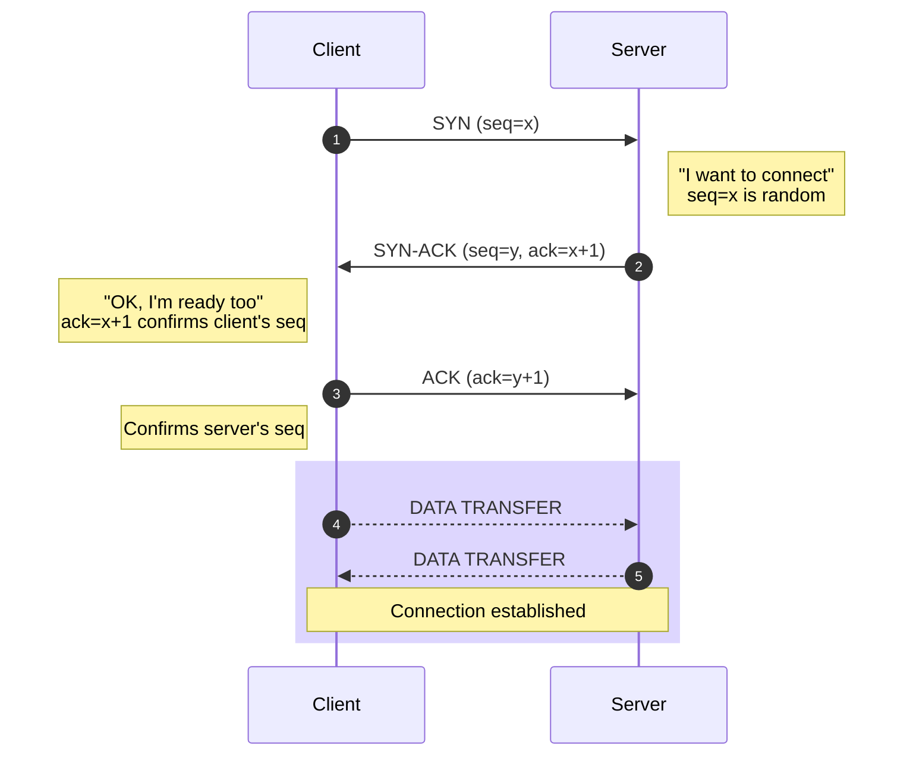
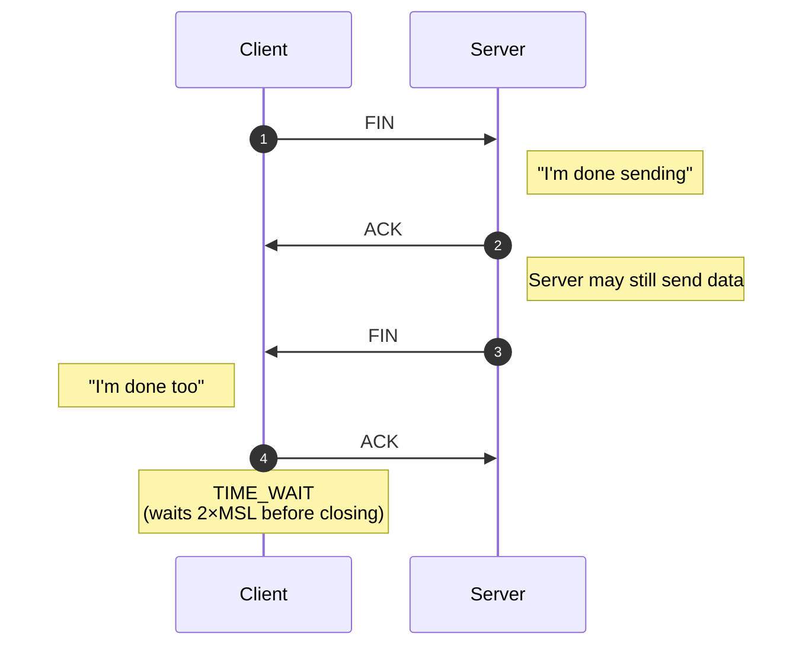
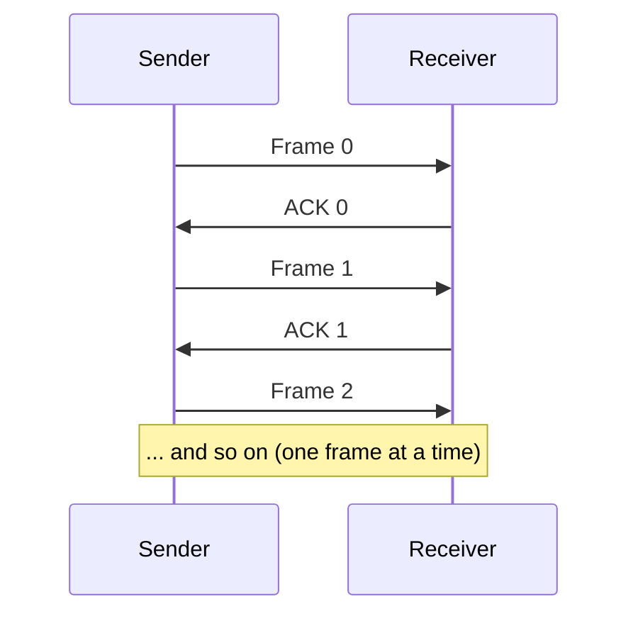
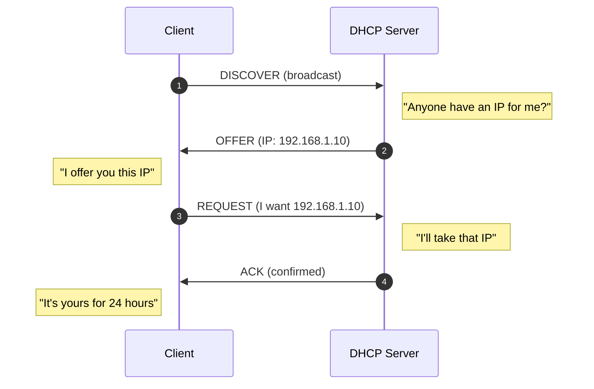

# 📘 MSc Admission Prep — Subject 03: Computer Networks & Data Communication
### 🎯 JUST-Style Exam Handbook | Fast Revision Edition

> **Goal:** Visual, exam-focused revision of networking concepts. Every topic includes intuition, protocol diagrams, traces, and exam tips.

---

## 📋 Table of Contents

| # | Topic | Tier |
|---|-------|------|
| 1 | [OSI & TCP/IP Models](#1-osi--tcpip-models) | 🔴 Must Master |
| 2 | [TCP vs UDP](#2-tcp-vs-udp) | 🔴 Must Master |
| 3 | [TCP Three-Way Handshake](#3-tcp-three-way-handshake) | 🔴 Must Master |
| 4 | [Flow & Congestion Control](#4-flow--congestion-control) | 🔴 Must Master |
| 5 | [Sliding Window Protocols](#5-sliding-window-protocols) | 🔴 Must Master |
| 6 | [IP Addressing & Subnetting](#6-ip-addressing--subnetting) | 🔴 Must Master |
| 7 | [Routing Protocols](#7-routing-protocols) | 🔴 Must Master |
| 8 | [Application Layer Protocols](#8-application-layer-protocols) | 🔴 Must Master |
| 9 | [HTTP/1.1 vs HTTP/2 & HOL Blocking](#9-http11-vs-http2--hol-blocking) | 🔴 Must Master |
| 10 | [Data Communication & Error Detection](#10-data-communication--error-detection) | 🔴 Must Master |
| 11 | [Multiplexing & Transmission Media](#11-multiplexing--transmission-media) | 🔴 Must Master |

---

---

# 1. OSI & TCP/IP Models

## 💡 Intuition First

> Sending a message over the internet is like **mailing a letter internationally**. You write it (application), put it in an envelope (transport), address it (network), hand it to the post office (data link), and it travels through physical roads (physical). Each layer has a specific job and talks only to the layer above/below it.

**Why it matters:** OSI model is the backbone of all networking questions. Every protocol you study lives in one of these layers.

---

## 📐 OSI Model — 7 Layers

```
┌─────────────────────────────────────────────────────────┐
│  Layer 7 │ APPLICATION  │ HTTP, FTP, SMTP, DNS, DHCP    │
├──────────┼──────────────┼───────────────────────────────┤
│  Layer 6 │ PRESENTATION │ Encryption, Compression, JPEG │
├──────────┼──────────────┼───────────────────────────────┤
│  Layer 5 │ SESSION      │ Session setup/teardown, RPC   │
├──────────┼──────────────┼───────────────────────────────┤
│  Layer 4 │ TRANSPORT    │ TCP, UDP, Ports, Segmentation  │
├──────────┼──────────────┼───────────────────────────────┤
│  Layer 3 │ NETWORK      │ IP, ICMP, Routing, Packets    │
├──────────┼──────────────┼───────────────────────────────┤
│  Layer 2 │ DATA LINK    │ MAC, Ethernet, Frames, ARP    │
├──────────┼──────────────┼───────────────────────────────┤
│  Layer 1 │ PHYSICAL     │ Bits, Cables, Wi-Fi, Signals  │
└──────────┴──────────────┴───────────────────────────────┘
```

> 🧠 **Memory trick (top to bottom):** "**A**ll **P**eople **S**eem **T**o **N**eed **D**ata **P**rocessing"
> 🧠 **Memory trick (bottom to top):** "**P**lease **D**o **N**ot **T**hrow **S**ausage **P**izza **A**way"

### Layer Responsibilities

| Layer | PDU Name | Key Job | Devices |
|-------|----------|---------|---------|
| Application | Message | User interface to network | — |
| Presentation | Message | Format, encrypt, compress | — |
| Session | Message | Manage sessions/dialogs | — |
| Transport | Segment | End-to-end delivery, ports | — |
| Network | Packet | Logical addressing, routing | Router |
| Data Link | Frame | Physical addressing (MAC), error detection | Switch, Bridge |
| Physical | Bit | Transmit raw bits | Hub, Cable, NIC |

---

## 📐 TCP/IP Model — 4 Layers

```
┌──────────────────────────────────────────────────────┐
│  Layer 4 │ APPLICATION  │ HTTP, FTP, DNS, SMTP, DHCP │
├──────────┼──────────────┼────────────────────────────┤
│  Layer 3 │ TRANSPORT    │ TCP, UDP                   │
├──────────┼──────────────┼────────────────────────────┤
│  Layer 2 │ INTERNET     │ IP, ICMP, ARP              │
├──────────┼──────────────┼────────────────────────────┤
│  Layer 1 │ NETWORK ACC. │ Ethernet, Wi-Fi, Physical  │
└──────────┴──────────────┴────────────────────────────┘
```

---

## ⚖️ OSI vs TCP/IP

| Feature | OSI Model | TCP/IP Model |
|---------|-----------|--------------|
| Layers | 7 | 4 |
| Developed by | ISO | DARPA |
| Purpose | Reference model | Practical implementation |
| Session/Presentation | Separate layers | Merged into Application |
| Physical/Data Link | Separate layers | Merged into Network Access |
| Usage | Teaching/reference | Real internet |

---

## 🔄 Data Encapsulation

```
Sender (top to bottom):
Application  → adds Application header    → Message
Transport    → adds TCP/UDP header        → Segment
Network      → adds IP header             → Packet
Data Link    → adds MAC header + trailer  → Frame
Physical     → converts to bits           → Bits ──► wire

Receiver (bottom to top):
Physical     → receives bits
Data Link    → removes MAC header/trailer → Packet
Network      → removes IP header          → Segment
Transport    → removes TCP/UDP header     → Message
Application  → reads data
```

---

## ⚠️ Common Mistakes

> 🚫 **Mistake 1:** Confusing OSI (7 layers) with TCP/IP (4 layers) — OSI is reference, TCP/IP is real.
> 🚫 **Mistake 2:** Routers work at Layer 3 (Network), Switches at Layer 2 (Data Link), Hubs at Layer 1 (Physical).
> 🚫 **Mistake 3:** ARP is at Layer 2/3 boundary — maps IP address to MAC address.
> 🚫 **Mistake 4:** PDU names: Segment (Transport), Packet (Network), Frame (Data Link), Bit (Physical).

---

## ⚡ One-Minute Recap

- OSI: 7 layers | TCP/IP: 4 layers
- Application → Transport → Network → Data Link → Physical
- Encapsulation: add headers going down | Decapsulation: remove headers going up
- Router = Layer 3 | Switch = Layer 2 | Hub = Layer 1

---

## 📝 Probable Exam Questions

> **5-mark:** Draw and explain the OSI model. State the function of each layer with an example protocol.
> **Short note:** Compare OSI and TCP/IP models.
> **Diagram:** Show data encapsulation from Application to Physical layer.
> **Conceptual:** At which OSI layer does a router operate? What about a switch?

---

---

# 2. TCP vs UDP

## 💡 Intuition First

> **TCP** is like a **registered mail** — you get a receipt, delivery is confirmed, order is guaranteed, but it's slower.
> **UDP** is like a **flyer drop** — fast, no confirmation, some may be lost, but great for broadcasting.

**Real-world analogy:**
- TCP = Phone call (connection established, both parties confirm)
- UDP = Text broadcast (send and forget, no reply needed)

---

## 📐 TCP (Transmission Control Protocol)

```
TCP Header (20 bytes minimum):
┌────────────┬────────────┐
│ Source Port│  Dest Port │  (16 bits each)
├────────────┴────────────┤
│     Sequence Number     │  (32 bits)
├─────────────────────────┤
│  Acknowledgment Number  │  (32 bits)
├──────┬──────────────────┤
│ HLEN │  Flags (SYN,ACK, │  Flags: URG,ACK,PSH,RST,SYN,FIN
│      │  FIN, RST...)    │
├──────┴──────────────────┤
│      Window Size        │  (flow control)
├─────────────────────────┤
│  Checksum │  Urgent Ptr │
└─────────────────────────┘
```

### TCP Features

| Feature | Description |
|---------|-------------|
| **Connection-oriented** | 3-way handshake before data transfer |
| **Reliable** | Acknowledgments + retransmission |
| **Ordered** | Sequence numbers ensure correct order |
| **Flow control** | Receiver controls sender speed (window) |
| **Congestion control** | Slow start, congestion avoidance |
| **Error detection** | Checksum |

---

## 📐 UDP (User Datagram Protocol)

```
UDP Header (8 bytes only):
┌────────────┬────────────┐
│ Source Port│  Dest Port │
├────────────┴────────────┤
│   Length   │  Checksum  │
└────────────┴────────────┘
```

### UDP Features

| Feature | Description |
|---------|-------------|
| **Connectionless** | No handshake, send immediately |
| **Unreliable** | No ACK, no retransmission |
| **Unordered** | Packets may arrive out of order |
| **Fast** | Minimal overhead |
| **Broadcast/Multicast** | Supports one-to-many |

---

## ⚖️ TCP vs UDP — Master Comparison

| Feature | TCP | UDP |
|---------|-----|-----|
| Connection | Connection-oriented | Connectionless |
| Reliability | Reliable (ACK + retransmit) | Unreliable |
| Ordering | Ordered (seq numbers) | Unordered |
| Speed | Slower | Faster |
| Header size | 20 bytes | 8 bytes |
| Flow control | Yes (window size) | No |
| Congestion control | Yes | No |
| Error checking | Checksum | Checksum (optional) |
| Use cases | HTTP, FTP, SMTP, SSH | DNS, DHCP, VoIP, Video streaming, Gaming |

---

## 🎯 When to Use Which?

```
Use TCP when:                    Use UDP when:
✅ Data integrity critical       ✅ Speed is priority
✅ File transfer (FTP)           ✅ Real-time (VoIP, video)
✅ Web browsing (HTTP/HTTPS)     ✅ DNS queries (small, fast)
✅ Email (SMTP)                  ✅ Live streaming
✅ SSH, Telnet                   ✅ Online gaming
                                 ✅ DHCP
```

---

## ⚠️ Common Mistakes

> 🚫 **Mistake 1:** UDP has a checksum field — it's optional in IPv4 but mandatory in IPv6.
> 🚫 **Mistake 2:** DNS uses UDP for queries but TCP for zone transfers (large data).
> 🚫 **Mistake 3:** "Unreliable" doesn't mean broken — it means no built-in guarantee. Application can add reliability on top.

---

## ⚡ One-Minute Recap

- TCP: reliable, ordered, connection-oriented, slow, 20-byte header
- UDP: unreliable, unordered, connectionless, fast, 8-byte header
- TCP = phone call | UDP = flyer drop
- TCP for accuracy | UDP for speed

---

## 📝 Probable Exam Questions

> **5-mark:** Compare TCP and UDP with respect to reliability, ordering, speed, and use cases.
> **Short note:** Why is UDP preferred for real-time applications like VoIP?
> **Diagram:** Draw and explain the TCP header format.
> **Conceptual:** Can UDP be made reliable? How?

---

---

# 3. TCP Three-Way Handshake

## 💡 Intuition First

> Before two people start a serious conversation, they greet each other: "Hello?" → "Hello! Can you hear me?" → "Yes, I can hear you!" That's the TCP handshake — establishing mutual agreement before data flows.

**Why 3 steps?** Both sides need to confirm they can SEND and RECEIVE. 3 messages are the minimum to achieve this.

---

## 🤝 Three-Way Handshake — Step by Step



### What Each Flag Means

| Flag | Meaning |
|------|---------|
| **SYN** | Synchronize — initiate connection, share seq number |
| **ACK** | Acknowledge — confirm receipt of data |
| **FIN** | Finish — request to close connection |
| **RST** | Reset — abort connection immediately |

---

## 🔌 TCP Connection Termination (4-Way)



> 🔑 **Why 4-way for close?** Because TCP is full-duplex — each direction closes independently.

---

## 📊 TCP State Machine (Key States)

```
CLOSED → LISTEN (server waiting)
CLOSED → SYN_SENT (client sends SYN)
LISTEN → SYN_RCVD (server receives SYN)
SYN_SENT → ESTABLISHED (after SYN-ACK + ACK)
ESTABLISHED → FIN_WAIT_1 (send FIN)
FIN_WAIT_1 → FIN_WAIT_2 (receive ACK)
FIN_WAIT_2 → TIME_WAIT (receive FIN)
TIME_WAIT → CLOSED (after 2×MSL timeout)
```

---

## ⚠️ Common Mistakes

> 🚫 **Mistake 1:** Connection setup is 3-way but teardown is 4-way — don't confuse them.
> 🚫 **Mistake 2:** In SYN-ACK, ack = x+1 (not x) — acknowledges the SYN which consumes one sequence number.
> 🚫 **Mistake 3:** TIME_WAIT exists to handle delayed packets — ensures old packets don't interfere with new connections.

---

## ⚡ One-Minute Recap

- 3-way handshake: SYN → SYN-ACK → ACK
- 4-way teardown: FIN → ACK → FIN → ACK
- SYN consumes one sequence number
- TIME_WAIT: client waits 2×MSL after final ACK

---

## 📝 Probable Exam Questions

> **5-mark:** Explain the TCP three-way handshake with a diagram. What is the purpose of each step?
> **Short note:** Why does TCP use a 4-way handshake for connection termination?
> **Diagram:** Draw the TCP state transition diagram for connection setup and teardown.

---

---

# 4. Flow & Congestion Control

## 💡 Intuition First

> **Flow control:** The receiver says "slow down, I can't process that fast!" — like a customer telling a waiter to stop bringing dishes so quickly.
>
> **Congestion control:** The network itself is overloaded — like a highway traffic jam. The sender must slow down even if the receiver is fine.

---

## 🚦 Flow Control — Sliding Window

> The receiver advertises a **window size** — how many bytes it can accept. The sender must not exceed this.

```
Receiver buffer = 4 KB
Receiver tells sender: "window = 4 KB"
Sender can send up to 4 KB without waiting for ACK

As receiver processes data, it increases window:
"window = 6 KB" → sender can send more
```

### Window Size = 0 (Zero Window)

```
Receiver buffer full → sends window=0 → sender STOPS
Receiver processes data → sends window probe → sender resumes
```

---

## 🌊 Congestion Control — TCP Algorithms

### Phase 1: Slow Start

```
Initial: cwnd (congestion window) = 1 MSS
After each ACK: cwnd doubles (exponential growth)

Round 1: cwnd = 1  → send 1 segment
Round 2: cwnd = 2  → send 2 segments
Round 3: cwnd = 4  → send 4 segments
Round 4: cwnd = 8  → send 8 segments
...until cwnd reaches ssthresh (slow start threshold)
```

### Phase 2: Congestion Avoidance

```
When cwnd ≥ ssthresh:
  cwnd increases by 1 MSS per RTT (linear growth)

Round 5: cwnd = 9
Round 6: cwnd = 10
Round 7: cwnd = 11
...
```

### Phase 3: Congestion Detection

```
Packet loss detected (timeout OR 3 duplicate ACKs):

On TIMEOUT:
  ssthresh = cwnd / 2
  cwnd = 1 MSS
  Restart slow start

On 3 DUPLICATE ACKs (TCP Reno):
  ssthresh = cwnd / 2
  cwnd = ssthresh + 3
  Enter congestion avoidance (fast recovery)
```

### Visual: TCP Congestion Window Over Time

```
cwnd
 │
16│                    *
14│                  *   *
12│                *       *
10│              *           *
 8│            *               *
 6│          *                   ssthresh=8
 4│        *                       *
 2│      *                           *
 1│    *                               * (timeout → reset)
 └──────────────────────────────────────► time
   SS phase │ CA phase │ SS again
```

---

## ⚖️ Flow Control vs Congestion Control

| Feature | Flow Control | Congestion Control |
|---------|-------------|-------------------|
| Problem | Receiver overwhelmed | Network overwhelmed |
| Mechanism | Receiver window (rwnd) | Congestion window (cwnd) |
| Who controls | Receiver | Sender (based on network) |
| Signal | Window size in ACK | Packet loss / delay |
| Protocol | TCP | TCP (Slow Start, AIMD) |

> 🔑 **Effective send rate = min(rwnd, cwnd)**

---

## ⚠️ Common Mistakes

> 🚫 **Mistake 1:** Slow start is NOT slow — it's exponential growth. "Slow" refers to starting from 1 MSS.
> 🚫 **Mistake 2:** Flow control protects the **receiver**; congestion control protects the **network**.
> 🚫 **Mistake 3:** On timeout, cwnd resets to 1. On 3 dup ACKs (TCP Reno), cwnd = ssthresh (not 1).

---

## ⚡ One-Minute Recap

- Flow control: receiver's window limits sender speed
- Congestion control: slow start (exponential) → congestion avoidance (linear)
- Timeout → cwnd=1, restart slow start
- 3 dup ACKs → fast retransmit + fast recovery (TCP Reno)
- Effective window = min(rwnd, cwnd)

---

## 📝 Probable Exam Questions

> **5-mark:** Explain TCP slow start and congestion avoidance. Draw the cwnd vs time graph.
> **Short note:** Differentiate between flow control and congestion control.
> **Trace:** Given ssthresh=8, trace cwnd values for 10 rounds assuming no packet loss.

---

---

# 5. Sliding Window Protocols

## 💡 Intuition First

> Instead of sending one letter and waiting for a reply before sending the next, you send a **batch** of letters at once. The "window" is how many you can have in-flight at a time. This is pipelining — much more efficient.

---

## 📐 Stop-and-Wait Protocol

> Send one frame, wait for ACK, then send next. Simple but inefficient.



```
  ...

Efficiency = Tt / (Tt + 2×Tp)
where Tt = transmission time, Tp = propagation delay

Problem: If Tp >> Tt, sender is idle most of the time!
```

---

## 📐 Go-Back-N (GBN)

> Sender can have up to **N frames** in flight. If one frame is lost/corrupted, **retransmit that frame AND all subsequent frames**.

```
Window size = 4

Sender sends: 0, 1, 2, 3 (window full)
              ↓
Frame 1 is LOST
              ↓
Receiver: accepts 0, discards 2 and 3 (out of order)
Sender: receives NAK for 1 (or timeout)
Sender: retransmits 1, 2, 3 (go back to 1)

Timeline:
Sender:   [0][1][2][3]  [1][2][3]
                  ↑ lost
Receiver: [0]    [×][×]  [1][2][3]
```

### GBN Properties

```
Sender window size: up to 2^n - 1 (n = sequence number bits)
Receiver window size: 1 (only accepts in-order frames)
Sequence numbers needed: 2^n
```

---

## 📐 Selective Repeat (SR)

> Sender can have up to **N frames** in flight. If one frame is lost, **retransmit ONLY that frame**. Receiver buffers out-of-order frames.

```
Window size = 4

Sender sends: 0, 1, 2, 3
Frame 1 is LOST
Receiver: accepts 0, buffers 2 and 3 (out of order)
Sender: retransmits ONLY 1
Receiver: receives 1, delivers 0,1,2,3 in order

Timeline:
Sender:   [0][1][2][3]  [1]
                  ↑ lost
Receiver: [0]    [2][3]  [1] → deliver 0,1,2,3
```

### SR Properties

```
Sender window size: up to 2^(n-1)
Receiver window size: up to 2^(n-1)
Sequence numbers needed: 2^n
```

---

## ⚖️ Stop-and-Wait vs Go-Back-N vs Selective Repeat

| Feature | Stop-and-Wait | Go-Back-N | Selective Repeat |
|---------|---------------|-----------|-----------------|
| Sender window | 1 | N (up to 2ⁿ-1) | N (up to 2ⁿ⁻¹) |
| Receiver window | 1 | 1 | N |
| On error | Retransmit 1 | Retransmit N frames | Retransmit 1 frame |
| Efficiency | Low | Medium | High |
| Buffer needed | None | None | Yes (receiver) |
| Complexity | Simple | Medium | Complex |

---

## 🧮 Efficiency Calculations

```
Stop-and-Wait:
  η = Tt / (Tt + 2×Tp) = 1 / (1 + 2a)   where a = Tp/Tt

Go-Back-N:
  If W ≥ 2a+1:  η = 1
  If W < 2a+1:  η = W / (2a+1)

Selective Repeat:
  If W ≥ 2a+1:  η = 1
  If W < 2a+1:  η = W / (2a+1)

Example:
  Tp = 270ms, Tt = 1ms → a = 270
  Stop-and-Wait: η = 1/(1+540) ≈ 0.18%  (terrible!)
  GBN with W=100: η = 100/541 ≈ 18.5%
  SR with W=100:  η = 100/541 ≈ 18.5%
```

---

## ⚠️ Common Mistakes

> 🚫 **Mistake 1:** GBN receiver window = 1 (only accepts in-order). SR receiver window = N.
> 🚫 **Mistake 2:** GBN max window = 2ⁿ-1, SR max window = 2ⁿ⁻¹ — different limits!
> 🚫 **Mistake 3:** In GBN, out-of-order frames are DISCARDED (not buffered). In SR, they are BUFFERED.

---

## ⚡ One-Minute Recap

- Stop-and-Wait: 1 frame at a time, very inefficient
- GBN: window N, error → retransmit from error frame onwards
- SR: window N, error → retransmit only error frame, buffer out-of-order
- GBN window ≤ 2ⁿ-1 | SR window ≤ 2ⁿ⁻¹

---

## 📝 Probable Exam Questions

> **5-mark:** Compare Go-Back-N and Selective Repeat protocols. Which is more efficient and why?
> **Calculate:** If propagation delay = 270ms and transmission time = 1ms, find efficiency of Stop-and-Wait and GBN with window size 100.
> **Trace:** Show what happens in GBN when frame 2 is lost out of frames 0,1,2,3,4 with window size 4.

---

---

# 6. IP Addressing & Subnetting

## 💡 Intuition First

> An IP address is like a **postal address** — it identifies where a device lives on the internet. Subnetting is like dividing a city into neighborhoods — each neighborhood (subnet) has its own range of addresses.

---

## 📐 IPv4 Address Structure

```
IPv4 = 32 bits = 4 octets (bytes)

Example: 192.168.1.100
Binary:  11000000.10101000.00000001.01100100

Range: 0.0.0.0 to 255.255.255.255
Total addresses: 2^32 = ~4.3 billion
```

### Address Classes (Classful)

| Class | Range | Default Mask | Networks | Hosts/Network |
|-------|-------|-------------|----------|---------------|
| **A** | 1.0.0.0 – 126.255.255.255 | /8 (255.0.0.0) | 126 | 16M |
| **B** | 128.0.0.0 – 191.255.255.255 | /16 (255.255.0.0) | 16K | 65K |
| **C** | 192.0.0.0 – 223.255.255.255 | /24 (255.255.255.0) | 2M | 254 |
| **D** | 224.0.0.0 – 239.255.255.255 | — | Multicast | — |
| **E** | 240.0.0.0 – 255.255.255.255 | — | Reserved | — |

> 🔑 **Private IP ranges (not routable on internet):**
> - 10.0.0.0/8
> - 172.16.0.0/12
> - 192.168.0.0/16

---

## 🔢 Subnet Mask & CIDR

```
CIDR notation: IP/prefix_length
Example: 192.168.1.0/24

/24 means first 24 bits = network, last 8 bits = host

Subnet mask for /24:
Binary:  11111111.11111111.11111111.00000000
Decimal: 255.255.255.0

Network address:  192.168.1.0   (all host bits = 0)
Broadcast:        192.168.1.255 (all host bits = 1)
Usable hosts:     192.168.1.1 to 192.168.1.254 = 254 hosts
```

### Subnetting Formula

```
Given: IP/prefix

Number of subnets = 2^(borrowed bits)
Hosts per subnet  = 2^(host bits) - 2
                    (-2 for network address and broadcast)

Block size = 256 - subnet_mask_octet
```

---

## ✏️ Subnetting Worked Example

```
Problem: Subnet 192.168.10.0/24 into 4 equal subnets.

Step 1: Need 4 subnets → 2^n ≥ 4 → n=2 bits borrowed
Step 2: New prefix = /24 + 2 = /26
Step 3: New subnet mask = 255.255.255.192
        (11111111.11111111.11111111.11000000)
Step 4: Block size = 256 - 192 = 64

Subnets:
Subnet 1: 192.168.10.0/26
  Network:   192.168.10.0
  Broadcast: 192.168.10.63
  Hosts:     192.168.10.1 – 192.168.10.62  (62 hosts)

Subnet 2: 192.168.10.64/26
  Network:   192.168.10.64
  Broadcast: 192.168.10.127
  Hosts:     192.168.10.65 – 192.168.10.126

Subnet 3: 192.168.10.128/26
  Network:   192.168.10.128
  Broadcast: 192.168.10.191
  Hosts:     192.168.10.129 – 192.168.10.190

Subnet 4: 192.168.10.192/26
  Network:   192.168.10.192
  Broadcast: 192.168.10.255
  Hosts:     192.168.10.193 – 192.168.10.254
```

---

## 🔢 CIDR — Classless Inter-Domain Routing

> CIDR eliminates class boundaries. Any prefix length is valid. Allows **route aggregation** (supernetting).

```
Route aggregation example:
  192.168.0.0/24
  192.168.1.0/24
  192.168.2.0/24
  192.168.3.0/24
  → Can be summarized as 192.168.0.0/22

Why? First 22 bits are common:
  192.168.0.0 = 11000000.10101000.000000|00.00000000
  192.168.3.0 = 11000000.10101000.000000|11.00000000
                                        ↑ first 22 bits same
```

---

## ⚖️ IPv4 vs IPv6

| Feature | IPv4 | IPv6 |
|---------|------|------|
| Address size | 32 bits | 128 bits |
| Notation | Dotted decimal | Colon-hex |
| Total addresses | ~4.3 billion | 3.4 × 10³⁸ |
| Header size | 20 bytes | 40 bytes |
| NAT required | Yes (address shortage) | No |
| Security | Optional (IPSec) | Built-in (IPSec) |
| Example | 192.168.1.1 | 2001:db8::1 |

---

## ⚠️ Common Mistakes

> 🚫 **Mistake 1:** Network address and broadcast address are NOT usable hosts — subtract 2.
> 🚫 **Mistake 2:** /32 = single host (255.255.255.255 mask) | /0 = entire internet.
> 🚫 **Mistake 3:** 127.x.x.x is loopback (localhost), not Class A public.
> 🚫 **Mistake 4:** CIDR /26 gives 64 addresses (2^6), not 62 — 62 are usable hosts.

---

## 🎯 Exam Tips

> 💡 **Subnetting steps:** borrow bits → new prefix → block size → list subnets.
> 💡 Hosts per subnet = 2^(32-prefix) - 2.
> 💡 Always verify: network address (all 0s in host part) and broadcast (all 1s in host part).
> 💡 CIDR /24 = 256 addresses, 254 usable. /25 = 128 addresses, 126 usable.

---

## ⚡ One-Minute Recap

- IPv4: 32 bits, 4 octets, dotted decimal
- Classes: A(/8), B(/16), C(/24)
- Subnet mask: network bits = 1, host bits = 0
- Hosts = 2^(host bits) - 2
- CIDR: flexible prefix, enables route aggregation

---

## 📝 Probable Exam Questions

> **5-mark:** Subnet 172.16.0.0/16 into subnets of at least 500 hosts each. How many subnets? Show first 3 subnets.
> **Short note:** What is CIDR? How does it improve on classful addressing?
> **Calculate:** For IP 192.168.5.130/26, find: network address, broadcast, usable host range, number of hosts.
> **Compare:** IPv4 vs IPv6 — key differences.

---

---

# 7. Routing Protocols

## 💡 Intuition First

> Routing is like a GPS system for packets. Each router decides the best next hop to forward a packet toward its destination. Different routing protocols use different strategies to build their "maps."

---

## 📐 Routing Basics

```
Routing table entry:
┌─────────────┬──────────────┬──────────┬────────────┐
│ Destination │ Subnet Mask  │ Next Hop │ Interface  │
├─────────────┼──────────────┼──────────┼────────────┤
│ 10.0.0.0    │ 255.0.0.0    │ 192.1.1.1│ eth0       │
│ 0.0.0.0     │ 0.0.0.0      │ 192.1.1.2│ eth1       │ ← default route
└─────────────┴──────────────┴──────────┴────────────┘
```

### Types of Routing

| Type | Description | Example |
|------|-------------|---------|
| **Static** | Manually configured | Small networks |
| **Dynamic** | Automatically updated | Large networks |
| **Default** | Catch-all route (0.0.0.0/0) | Internet gateway |

---

## 🔄 RIP (Routing Information Protocol)

> **Distance Vector** protocol. Each router shares its routing table with neighbors. Uses **hop count** as metric (max 15 hops).

```
How RIP works:
1. Each router starts knowing only its directly connected networks
2. Every 30 seconds, share routing table with neighbors
3. Neighbors update their tables: "I can reach X in Y hops via this router"
4. Converges after several rounds

Example:
  A ──1hop── B ──1hop── C ──1hop── D

Router A's table after convergence:
  B: 1 hop via B
  C: 2 hops via B
  D: 3 hops via B
```

### RIP Problems

```
Count-to-infinity problem:
  A ── B ── C
  If A-B link fails:
  B thinks: "I can reach A via C (C said 2 hops)"
  C thinks: "I can reach A via B (B said 3 hops)"
  They keep incrementing until 16 (infinity)

Solutions:
  Split horizon: Don't advertise route back to where you learned it
  Poison reverse: Advertise failed route with metric=16
```

---

## 🔄 OSPF (Open Shortest Path First)

> **Link State** protocol. Each router knows the **complete topology** of the network. Uses **Dijkstra's algorithm** to find shortest path. Metric = cost (based on bandwidth).

```
How OSPF works:
1. Each router discovers neighbors (Hello packets)
2. Each router floods LSA (Link State Advertisement) to ALL routers
3. Every router builds identical topology map (LSDB)
4. Each router runs Dijkstra to find shortest paths
5. Build routing table from shortest path tree

OSPF areas:
  Area 0 (backbone) ← all areas must connect to this
  Area 1, Area 2, etc. (reduce flooding scope)
```

---

## ⚖️ RIP vs OSPF

| Feature | RIP | OSPF |
|---------|-----|------|
| Type | Distance Vector | Link State |
| Metric | Hop count | Cost (bandwidth) |
| Max hops | 15 | Unlimited |
| Convergence | Slow | Fast |
| Bandwidth use | High (full table every 30s) | Low (only on change) |
| Scalability | Small networks | Large networks |
| Algorithm | Bellman-Ford | Dijkstra |
| Standard | RFC 1058 | RFC 2328 |

---

## ⚠️ Common Mistakes

> 🚫 **Mistake 1:** RIP max hop = 15 (16 = infinity/unreachable). OSPF has no hop limit.
> 🚫 **Mistake 2:** RIP uses Bellman-Ford (distributed), OSPF uses Dijkstra (centralized per router).
> 🚫 **Mistake 3:** OSPF is faster to converge because it uses link-state flooding, not periodic updates.

---

## ⚡ One-Minute Recap

- RIP: distance vector, hop count, max 15, slow convergence, count-to-infinity problem
- OSPF: link state, cost metric, fast convergence, Dijkstra, scalable
- Static routing: manual, no overhead | Dynamic: automatic, adapts to changes

---

## 📝 Probable Exam Questions

> **5-mark:** Compare RIP and OSPF routing protocols in terms of algorithm, metric, scalability, and convergence.
> **Short note:** What is the count-to-infinity problem in RIP? How is it solved?
> **Conceptual:** Why is OSPF preferred over RIP in large networks?

---

---

# 8. Application Layer Protocols

## 💡 Intuition First

> Application layer protocols are the **languages** that applications use to communicate. HTTP is how browsers talk to web servers. DNS is the internet's phone book. DHCP is the address assigner.

---

## 🌐 DNS (Domain Name System)

> Translates human-readable domain names to IP addresses. Like a phone book: "google.com" → "142.250.80.46"

```
DNS Resolution Process:
Browser: "What is the IP of www.google.com?"

1. Check local cache → not found
2. Ask Recursive Resolver (ISP's DNS server)
3. Resolver asks Root Name Server → "ask .com TLD server"
4. Resolver asks .com TLD Server → "ask google.com authoritative server"
5. Resolver asks google.com Authoritative Server → "142.250.80.46"
6. Resolver returns IP to browser, caches result

DNS uses UDP port 53 (queries)
DNS uses TCP port 53 (zone transfers)
```

### DNS Record Types

| Record | Purpose | Example |
|--------|---------|---------|
| **A** | Domain → IPv4 | google.com → 142.250.80.46 |
| **AAAA** | Domain → IPv6 | google.com → 2607:f8b0::... |
| **MX** | Mail server | gmail.com → mail.google.com |
| **CNAME** | Alias | www → webserver.google.com |
| **NS** | Name server | google.com → ns1.google.com |
| **PTR** | Reverse lookup | IP → domain |

---

## 🏠 DHCP (Dynamic Host Configuration Protocol)

> Automatically assigns IP addresses to devices. Like a hotel receptionist assigning room numbers.



```
DORA = Discover, Offer, Request, Acknowledge
DHCP uses UDP: Client port 68, Server port 67
```

---

## 📧 SMTP (Simple Mail Transfer Protocol)

> Protocol for **sending** email. Port 25 (server-to-server), Port 587 (client-to-server).

```
Email flow:
Sender → [SMTP] → Sender's Mail Server → [SMTP] → Receiver's Mail Server
                                                          ↓
Receiver ← [POP3/IMAP] ← Receiver's Mail Server

SMTP: push protocol (sending)
POP3: download and delete from server (port 110)
IMAP: sync with server, keep on server (port 143)
```

---

## 🌍 HTTP (HyperText Transfer Protocol)

```
HTTP Request:
GET /index.html HTTP/1.1
Host: www.example.com
Accept: text/html

HTTP Response:
HTTP/1.1 200 OK
Content-Type: text/html
Content-Length: 1234

<html>...</html>
```

### HTTP Status Codes

| Code | Meaning |
|------|---------|
| 200 | OK — success |
| 301 | Moved Permanently |
| 400 | Bad Request |
| 401 | Unauthorized |
| 403 | Forbidden |
| 404 | Not Found |
| 500 | Internal Server Error |

---

## 📊 Protocol Port Numbers — Quick Reference

| Protocol | Port | Transport |
|----------|------|-----------|
| HTTP | 80 | TCP |
| HTTPS | 443 | TCP |
| FTP (data) | 20 | TCP |
| FTP (control) | 21 | TCP |
| SSH | 22 | TCP |
| Telnet | 23 | TCP |
| SMTP | 25 | TCP |
| DNS | 53 | UDP/TCP |
| DHCP (server) | 67 | UDP |
| DHCP (client) | 68 | UDP |
| POP3 | 110 | TCP |
| IMAP | 143 | TCP |
| SNMP | 161 | UDP |

---

## ⚠️ Common Mistakes

> 🚫 **Mistake 1:** DNS uses UDP for queries (fast, small) but TCP for zone transfers (large, reliable).
> 🚫 **Mistake 2:** SMTP is for SENDING email. POP3/IMAP is for RECEIVING.
> 🚫 **Mistake 3:** DHCP uses broadcast — client doesn't have an IP yet, so it can't use unicast.
> 🚫 **Mistake 4:** HTTP is stateless — each request is independent. Cookies add state.

---

## ⚡ One-Minute Recap

- DNS: domain → IP, UDP port 53, DORA-like resolution hierarchy
- DHCP: auto IP assignment, DORA process, UDP 67/68
- SMTP: send email, port 25/587 | POP3: receive (download), port 110 | IMAP: receive (sync), port 143
- HTTP: stateless, request-response, port 80 | HTTPS: encrypted, port 443

---

## 📝 Probable Exam Questions

> **5-mark:** Explain the DNS resolution process with a diagram.
> **Short note:** Explain the DHCP DORA process.
> **Table:** List 8 common protocols with their port numbers and transport protocol.
> **Compare:** POP3 vs IMAP for email retrieval.

---

---

# 9. HTTP/1.1 vs HTTP/2 & HOL Blocking

## 💡 Intuition First

> **HTTP/1.1** is like a single-lane road — cars (requests) go one at a time. If one car breaks down (slow response), everything behind it stops. That's **Head-of-Line (HOL) blocking**.
>
> **HTTP/2** is like a multi-lane highway — multiple cars travel simultaneously. No single slow car blocks others.

---

## 📐 HTTP/1.1 Problems

```
HTTP/1.1 behavior:
  Request 1 ──────────────────────────────► Response 1
                                                        Request 2 ──► Response 2
                                                                                  Request 3 ──► Response 3

Problems:
1. Sequential requests — one at a time per connection
2. HOL blocking — slow response blocks all subsequent requests
3. Workaround: open 6 parallel TCP connections (browser hack)
4. Redundant headers — same headers sent with every request
5. No server push — server can only respond, not initiate
```

---

## 📐 HTTP/2 Solutions

```
HTTP/2 features:
┌─────────────────────────────────────────────────────┐
│ 1. MULTIPLEXING                                     │
│    Multiple requests/responses on ONE TCP connection│
│    Request 1 ──────────────────────────────────────►│
│    Request 2 ──────────────────────────────────────►│  (simultaneous!)
│    Request 3 ──────────────────────────────────────►│
│                                                     │
│ 2. HEADER COMPRESSION (HPACK)                       │
│    Headers compressed → less bandwidth              │
│                                                     │
│ 3. SERVER PUSH                                      │
│    Server sends CSS/JS before browser asks          │
│    Browser: "GET index.html"                        │
│    Server: "Here's index.html + style.css + app.js" │
│                                                     │
│ 4. BINARY PROTOCOL                                  │
│    HTTP/1.1 = text | HTTP/2 = binary (faster parse) │
│                                                     │
│ 5. STREAM PRIORITIZATION                            │
│    Assign priority to requests                      │
└─────────────────────────────────────────────────────┘
```

---

## 🚧 HOL (Head-of-Line) Blocking

```
HTTP/1.1 HOL blocking:
  [Request A (slow)] [Request B] [Request C]
  B and C WAIT for A to complete → HOL blocking

HTTP/2 solves APPLICATION-layer HOL:
  Multiplexing allows B and C to proceed independently

BUT: HTTP/2 still has TRANSPORT-layer HOL:
  All streams share ONE TCP connection
  If a TCP packet is lost → ALL streams stall waiting for retransmit

HTTP/3 (QUIC) solves transport HOL:
  Uses UDP + QUIC (not TCP)
  Each stream is independent at transport layer
  Lost packet only affects its own stream
```

---

## ⚖️ HTTP/1.1 vs HTTP/2 vs HTTP/3

| Feature | HTTP/1.1 | HTTP/2 | HTTP/3 |
|---------|----------|--------|--------|
| Protocol | Text | Binary | Binary |
| Multiplexing | ❌ | ✅ | ✅ |
| Header compression | ❌ | ✅ HPACK | ✅ QPACK |
| Server push | ❌ | ✅ | ✅ |
| Transport | TCP | TCP | UDP (QUIC) |
| HOL blocking | App + Transport | Transport only | ❌ None |
| Connections | Multiple TCP | 1 TCP | 1 QUIC |

---

## ⚠️ Common Mistakes

> 🚫 **Mistake 1:** HTTP/2 eliminates application-layer HOL but NOT transport-layer HOL (TCP still has it).
> 🚫 **Mistake 2:** HTTP/2 uses ONE TCP connection with multiplexing — not multiple connections.
> 🚫 **Mistake 3:** HTTP/3 uses UDP, not TCP — this is a fundamental change.

---

## ⚡ One-Minute Recap

- HTTP/1.1: text, sequential, HOL blocking, multiple TCP connections
- HTTP/2: binary, multiplexed, header compression, server push, 1 TCP connection
- HOL blocking: slow request blocks all behind it
- HTTP/3: QUIC over UDP, eliminates all HOL blocking

---

## 📝 Probable Exam Questions

> **5-mark:** What is HOL blocking? How does HTTP/2 address it compared to HTTP/1.1?
> **Short note:** List the key improvements of HTTP/2 over HTTP/1.1.
> **Compare:** HTTP/1.1 vs HTTP/2 vs HTTP/3 in a table.

---

---

# 10. Data Communication & Error Detection

## 💡 Intuition First

> When data travels over a network, noise can flip bits. Error detection is like a **checksum on a receipt** — if the numbers don't add up, something went wrong. Error correction goes further — it can fix the error without retransmission.

---

## 🔢 Parity Check

> Add an extra bit so the total number of 1s is even (even parity) or odd (odd parity).

```
Even Parity:
  Data: 1011001
  Count of 1s: 4 (even) → parity bit = 0
  Transmitted: 10110010

  Data: 1011101
  Count of 1s: 5 (odd) → parity bit = 1
  Transmitted: 10111011

Detection: Receiver counts 1s. If odd count with even parity → ERROR
Limitation: Can only detect ODD number of bit errors. 2-bit errors go undetected!
```

---

## ➕ Checksum

> Divide data into segments, add them together, send the sum's complement. Receiver adds all segments + checksum — should get all 1s.

```
Example (8-bit checksum):
  Segment 1: 10101001
  Segment 2: 00111001

  Sum: 10101001
     + 00111001
     = 11100010

  Checksum (1's complement): 00011101

Transmitted: Segment1 + Segment2 + Checksum

Receiver:
  10101001
+ 00111001
+ 00011101
= 11111111  ← all 1s → NO ERROR ✅

If any bit is wrong → sum ≠ 11111111 → ERROR detected
```

---

## 🔄 CRC (Cyclic Redundancy Check)

> Most powerful error detection. Treat data as a polynomial, divide by a generator polynomial, append the remainder (CRC bits) to the data.

```
CRC Process:
  Message M = 1101011011
  Generator G = 10011 (degree 4, so append 4 zeros)

Step 1: Append 4 zeros to M:
  M' = 11010110110000

Step 2: Divide M' by G using XOR (binary division):
  11010110110000 ÷ 10011

  11010110110000
  10011
  ─────
   10011
   10011
   ─────
    00001011
       10011
       ─────
        10000
        10011
        ─────
         00110000
            10011
            ─────
             10011
             10011
             ─────
              0000  ← remainder = 0000

Step 3: Transmitted = M + remainder = 1101011011 0000

Receiver: Divide received bits by G → remainder = 0 → NO ERROR ✅
          If remainder ≠ 0 → ERROR detected
```

### Common CRC Generators

| Standard | Generator | Used In |
|----------|-----------|---------|
| CRC-8 | x⁸+x²+x+1 | ATM |
| CRC-16 | x¹⁶+x¹⁵+x²+1 | USB, HDLC |
| CRC-32 | (32-bit poly) | Ethernet, ZIP |

---

## ⚖️ Error Detection Methods Comparison

| Method | Detects | Corrects | Overhead | Reliability |
|--------|---------|----------|----------|-------------|
| **Parity** | Single bit errors | ❌ | 1 bit | Low |
| **Checksum** | Most errors | ❌ | 16 bits | Medium |
| **CRC** | Burst errors | ❌ | 16-32 bits | High |
| **Hamming Code** | Single bit | ✅ Single bit | r bits | Medium |

---

## 🔧 Hamming Code (Error Correction)

```
Hamming code adds redundancy bits at positions 2^0, 2^1, 2^2, ...
(positions 1, 2, 4, 8, ...)

For data bits d, need r parity bits where 2^r ≥ d + r + 1

Example: 4 data bits → r=3 parity bits (2^3=8 ≥ 4+3+1=8)
Total bits = 7 (Hamming(7,4))

Data: 1011
Positions: 1(p1), 2(p2), 3(d1), 4(p3), 5(d2), 6(d3), 7(d4)
           p1     p2     1      p3     0      1      1

p1 covers positions 1,3,5,7: p1,1,0,1 → XOR = 0
p2 covers positions 2,3,6,7: p2,1,1,1 → XOR = 1
p3 covers positions 4,5,6,7: p3,0,1,1 → XOR = 0

Codeword: 0 1 1 0 0 1 1
Position: 1 2 3 4 5 6 7
```

---

## ⚠️ Common Mistakes

> 🚫 **Mistake 1:** Parity can only detect an ODD number of bit errors — 2 flipped bits go undetected.
> 🚫 **Mistake 2:** CRC detects errors but does NOT correct them — need retransmission.
> 🚫 **Mistake 3:** In CRC, the remainder is appended to the original message (not the zero-padded version).
> 🚫 **Mistake 4:** Checksum uses 1's complement addition, not regular binary addition.

---

## ⚡ One-Minute Recap

- Parity: count 1s, add parity bit | detects odd-number errors only
- Checksum: add segments, send complement | receiver sum = all 1s if no error
- CRC: polynomial division, append remainder | most powerful detection
- Hamming: adds parity bits at power-of-2 positions | can correct single-bit errors

---

## 📝 Probable Exam Questions

> **5-mark:** Compute the CRC for message `1101011011` with generator `10011`. Show all steps.
> **5-mark:** Explain the checksum error detection method with an example.
> **Short note:** Compare parity check, checksum, and CRC as error detection techniques.
> **Calculate:** How many parity bits are needed for 8 data bits in Hamming code?

---

---

# 11. Multiplexing & Transmission Media

## 💡 Intuition First

> **Multiplexing** is like a highway with multiple lanes — many cars (signals) share the same road (channel) simultaneously. Without multiplexing, you'd need a separate road for every car.

---

## 📡 Types of Multiplexing

### FDM — Frequency Division Multiplexing

> Divide the bandwidth into frequency bands. Each signal gets its own band. Used in radio, cable TV.

```
Frequency spectrum:
│──── Signal A (100-200 MHz) ────│
│──── Signal B (200-300 MHz) ────│
│──── Signal C (300-400 MHz) ────│
└────────────────────────────────►  frequency

All signals transmitted simultaneously on different frequencies.
Guard bands separate channels to prevent interference.
```

### TDM — Time Division Multiplexing

> Divide time into slots. Each signal gets a time slot in rotation. Used in telephone networks, T1/E1.

```
Time slots:
│ A │ B │ C │ A │ B │ C │ A │ B │ C │
└───────────────────────────────────►  time

Each source gets a fixed time slot.
Synchronous TDM: slots assigned even if source has no data (wasteful)
Statistical TDM: slots assigned only when source has data (efficient)
```

### WDM — Wavelength Division Multiplexing

> Like FDM but for optical fiber. Different wavelengths (colors) of light carry different signals.

```
Fiber optic cable:
  λ1 (1310nm) ──────────────────────►
  λ2 (1550nm) ──────────────────────►  (same fiber, different wavelengths)
  λ3 (1625nm) ──────────────────────►

DWDM (Dense WDM): 80+ channels on one fiber
```

### CDM — Code Division Multiplexing

> Each signal gets a unique code. All signals transmitted simultaneously on same frequency. Used in 3G/CDMA mobile networks.

---

## ⚖️ Multiplexing Comparison

| Type | Division | Used In | Advantage |
|------|----------|---------|-----------|
| **FDM** | Frequency | Radio, Cable TV, ADSL | Simple, analog |
| **TDM** | Time | Telephone, T1/E1 | Digital, efficient |
| **WDM** | Wavelength | Fiber optic | Huge bandwidth |
| **CDM** | Code | 3G/CDMA mobile | Interference resistant |

---

## 🔌 Transmission Media

### Guided Media (Wired)

```
1. Twisted Pair Cable
   ┌──────────────────────────────────────┐
   │  Two insulated copper wires twisted  │
   │  Twisting reduces electromagnetic    │
   │  interference (EMI)                  │
   └──────────────────────────────────────┘
   Types: UTP (Unshielded), STP (Shielded)
   Categories: Cat5e (1Gbps), Cat6 (10Gbps), Cat7 (10Gbps+)
   Use: LAN, telephone

2. Coaxial Cable
   ┌──────────────────────────────────────┐
   │  Center conductor + insulator +      │
   │  metallic shield + outer jacket      │
   │  Better shielding than twisted pair  │
   └──────────────────────────────────────┘
   Use: Cable TV, broadband internet

3. Fiber Optic Cable
   ┌──────────────────────────────────────┐
   │  Glass/plastic core + cladding       │
   │  Transmits light pulses              │
   │  Immune to EMI, very high bandwidth  │
   └──────────────────────────────────────┘
   Types: Single-mode (long distance), Multi-mode (short distance)
   Use: Internet backbone, long-distance
```

### Unguided Media (Wireless)

| Type | Frequency | Range | Use |
|------|-----------|-------|-----|
| **Radio waves** | 3 KHz – 1 GHz | Long | AM/FM radio, WiFi |
| **Microwaves** | 1 – 300 GHz | Line-of-sight | Satellite, 5G |
| **Infrared** | 300 GHz – 400 THz | Short | TV remote, IrDA |

---

## ⚖️ Transmission Media Comparison

| Media | Bandwidth | Distance | Cost | EMI Immunity |
|-------|-----------|----------|------|--------------|
| Twisted Pair | Low-Medium | Short | Low | Low |
| Coaxial | Medium | Medium | Medium | Medium |
| Fiber Optic | Very High | Very Long | High | ✅ Immune |
| Wireless | Variable | Variable | Low | Low |

---

## ⚠️ Common Mistakes

> 🚫 **Mistake 1:** FDM is for analog signals; TDM is for digital signals (primarily).
> 🚫 **Mistake 2:** Fiber optic is immune to EMI — it uses light, not electricity.
> 🚫 **Mistake 3:** WDM is NOT the same as FDM — WDM is specifically for optical fiber.
> 🚫 **Mistake 4:** Synchronous TDM wastes slots; Statistical TDM is more efficient.

---

## ⚡ One-Minute Recap

- FDM: frequency bands | TDM: time slots | WDM: wavelengths | CDM: codes
- Twisted pair: cheap, EMI-prone | Coaxial: better shielding | Fiber: best, EMI-immune
- Guided: wired (twisted pair, coax, fiber) | Unguided: wireless (radio, microwave, IR)

---

## 📝 Probable Exam Questions

> **Short note:** Compare FDM and TDM multiplexing techniques.
> **Short note:** Compare guided and unguided transmission media.
> **Conceptual:** Why is fiber optic preferred for long-distance communication?
> **Diagram:** Draw the frequency spectrum for FDM with 3 channels.

---

---

# 🏁 Master Quick Revision Sheet — Computer Networks

## ⚡ Protocol & Port Cheat Sheet

```
┌──────────┬──────┬─────────┬──────────────────────────────┐
│ Protocol │ Port │Transport│ Purpose                      │
├──────────┼──────┼─────────┼──────────────────────────────┤
│ HTTP     │  80  │  TCP    │ Web browsing                 │
│ HTTPS    │ 443  │  TCP    │ Secure web                   │
│ FTP      │ 20/21│  TCP    │ File transfer                │
│ SSH      │  22  │  TCP    │ Secure shell                 │
│ Telnet   │  23  │  TCP    │ Remote login (insecure)      │
│ SMTP     │  25  │  TCP    │ Send email                   │
│ DNS      │  53  │ UDP/TCP │ Name resolution              │
│ DHCP     │ 67/68│  UDP    │ IP assignment                │
│ POP3     │ 110  │  TCP    │ Receive email (download)     │
│ IMAP     │ 143  │  TCP    │ Receive email (sync)         │
└──────────┴──────┴─────────┴──────────────────────────────┘
```

## 🔑 Key Facts to Remember

| Fact | Detail |
|------|--------|
| OSI layers | 7 (App, Pres, Sess, Trans, Net, DL, Phys) |
| TCP/IP layers | 4 (App, Transport, Internet, Network Access) |
| TCP handshake | SYN → SYN-ACK → ACK (3-way) |
| TCP teardown | FIN → ACK → FIN → ACK (4-way) |
| TCP vs UDP | Reliable vs Fast |
| GBN window | ≤ 2ⁿ-1 | SR window | ≤ 2ⁿ⁻¹ |
| RIP metric | Hop count (max 15) |
| OSPF metric | Cost (bandwidth-based) |
| DNS transport | UDP (queries), TCP (zone transfer) |
| DHCP process | DORA (Discover, Offer, Request, ACK) |
| CRC | Most reliable error detection |
| Parity | Detects odd-number bit errors only |
| HTTP/2 over HTTP/1.1 | Multiplexing, header compression, server push |
| HOL blocking | HTTP/1.1 app layer; HTTP/2 transport layer; HTTP/3 none |

## 🧠 Memory Tricks

- **OSI layers (top→bottom):** "**A**ll **P**eople **S**eem **T**o **N**eed **D**ata **P**rocessing"
- **TCP flags:** "**U**rgent **A**cks **P**ush **R**eset **S**YN **F**IN" → URG, ACK, PSH, RST, SYN, FIN
- **DHCP:** "**D**ogs **O**ften **R**un **A**way" → Discover, Offer, Request, ACK
- **Subnetting:** "**B**orrow bits → **N**ew prefix → **B**lock size → **L**ist subnets"
- **Error detection strength:** Parity < Checksum < CRC

## 🎯 Top 10 Most Probable Exam Questions

1. Draw and explain OSI model — all 7 layers with protocols
2. Compare TCP and UDP — table format
3. TCP three-way handshake — diagram + explanation
4. Subnet a given IP address — show all subnets
5. Compare RIP and OSPF routing protocols
6. Explain DNS resolution process with diagram
7. Compare Go-Back-N and Selective Repeat
8. CRC computation — step-by-step trace
9. HTTP/1.1 vs HTTP/2 — HOL blocking explanation
10. Compare FDM and TDM multiplexing

## 📊 Subnetting Quick Reference

```
Prefix │ Subnet Mask     │ Addresses │ Usable Hosts
/24    │ 255.255.255.0   │    256    │    254
/25    │ 255.255.255.128 │    128    │    126
/26    │ 255.255.255.192 │     64    │     62
/27    │ 255.255.255.224 │     32    │     30
/28    │ 255.255.255.240 │     16    │     14
/29    │ 255.255.255.248 │      8    │      6
/30    │ 255.255.255.252 │      4    │      2
/32    │ 255.255.255.255 │      1    │      0 (host route)
```

---

> 📌 **End of Subject 03: Computer Networks & Data Communication**
>
> Next: **Subject 04 — Compiler Design & Automata** →

---

*Handbook generated for MSc Admission Preparation | JUST-Style Exam Focus*
*Version 1.0 | Computer Networks & Data Communication*
