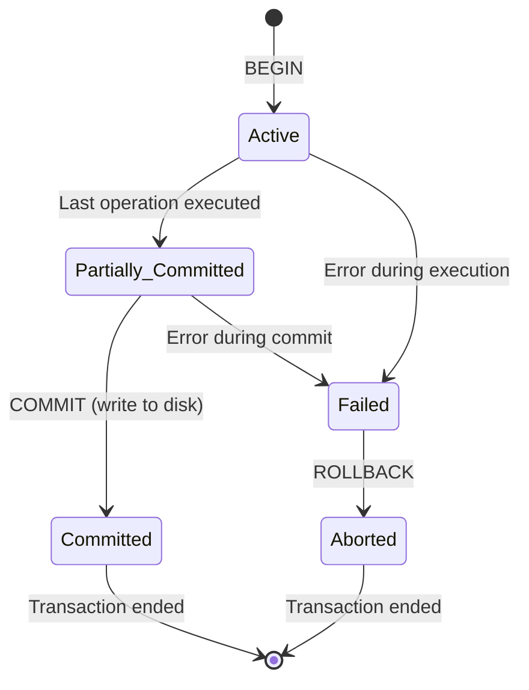

# 📘 MSc Admission Prep — Subject 07: Database Management System (DBMS)
### 🎯 JUST-Style Exam Handbook | Fast Revision Edition

> **Goal:** Deep, visual, exam-focused revision of SQL, ER diagrams, normalization, transactions, and indexing. Every topic includes worked examples, traces, and exam tips.

---

## 📋 Table of Contents

| # | Topic | Tier |
|---|-------|------|
| 1 | [SQL — Joins](#1-sql--joins) | 🔴 Must Master |
| 2 | [SQL — GROUP BY, HAVING, Subqueries](#2-sql--group-by-having-subqueries) | 🔴 Must Master |
| 3 | [ER Diagram & Cardinality](#3-er-diagram--cardinality) | 🔴 Must Master |
| 4 | [Normalization — 1NF to BCNF](#4-normalization--1nf-to-bcnf) | 🔴 Must Master |
| 5 | [Transactions & ACID Properties](#5-transactions--acid-properties) | 🔴 Must Master |
| 6 | [Concurrency Control](#6-concurrency-control) | 🔴 Must Master |
| 7 | [Indexing & B-Tree](#7-indexing--b-tree) | 🔴 Must Master |

---

---

# 1. SQL — Joins

## 💡 Intuition First

> A **JOIN** combines rows from two or more tables based on a related column. Like merging two spreadsheets — you match rows from Sheet A with rows from Sheet B using a common key (like Employee ID).

**Real-world analogy:** You have a list of students and a list of grades. A JOIN lets you see each student's name alongside their grade — matching on student ID.

---

## 📐 Sample Tables

```sql
-- Employees table
+----+----------+--------+
| ID | Name     | DeptID |
+----+----------+--------+
|  1 | Alice    |     10 |
|  2 | Bob      |     20 |
|  3 | Charlie  |     10 |
|  4 | Diana    |   NULL |
+----+----------+--------+

-- Departments table
+--------+-------------+
| DeptID | DeptName    |
+--------+-------------+
|     10 | Engineering |
|     20 | Marketing   |
|     30 | HR          |
+--------+-------------+
```

---

## 🔗 INNER JOIN

> Returns rows where there is a **match in BOTH tables**.

```sql
SELECT e.Name, d.DeptName
FROM Employees e
INNER JOIN Departments d ON e.DeptID = d.DeptID;

Result:
+----------+-------------+
| Name     | DeptName    |
+----------+-------------+
| Alice    | Engineering |
| Bob      | Marketing   |
| Charlie  | Engineering |
+----------+-------------+
-- Diana excluded (DeptID = NULL, no match)
-- HR excluded (no employee in dept 30)
```

---

## 🔗 LEFT JOIN (LEFT OUTER JOIN)

> Returns **all rows from the LEFT table**, and matched rows from the right. Unmatched right = NULL.

```sql
SELECT e.Name, d.DeptName
FROM Employees e
LEFT JOIN Departments d ON e.DeptID = d.DeptID;

Result:
+----------+-------------+
| Name     | DeptName    |
+----------+-------------+
| Alice    | Engineering |
| Bob      | Marketing   |
| Charlie  | Engineering |
| Diana    | NULL        |  ← Diana included, no dept match
+----------+-------------+
```

---

## 🔗 RIGHT JOIN (RIGHT OUTER JOIN)

> Returns **all rows from the RIGHT table**, and matched rows from the left. Unmatched left = NULL.

```sql
SELECT e.Name, d.DeptName
FROM Employees e
RIGHT JOIN Departments d ON e.DeptID = d.DeptID;

Result:
+----------+-------------+
| Name     | DeptName    |
+----------+-------------+
| Alice    | Engineering |
| Bob      | Marketing   |
| Charlie  | Engineering |
| NULL     | HR          |  ← HR included, no employee match
+----------+-------------+
```

---

## 🔗 FULL OUTER JOIN

> Returns **all rows from BOTH tables**. Unmatched rows get NULL on the missing side.

```sql
SELECT e.Name, d.DeptName
FROM Employees e
FULL OUTER JOIN Departments d ON e.DeptID = d.DeptID;

Result:
+----------+-------------+
| Name     | DeptName    |
+----------+-------------+
| Alice    | Engineering |
| Bob      | Marketing   |
| Charlie  | Engineering |
| Diana    | NULL        |  ← no dept
| NULL     | HR          |  ← no employee
+----------+-------------+
```

---

## 🔗 CROSS JOIN

> Returns the **Cartesian product** — every row from left × every row from right.

```sql
SELECT e.Name, d.DeptName
FROM Employees e
CROSS JOIN Departments d;

Result: 4 employees × 3 departments = 12 rows
(every employee paired with every department)
```

---

## 🔗 SELF JOIN

> Join a table **with itself**. Used for hierarchical data (employee-manager).

```sql
-- Find each employee and their manager
SELECT e.Name AS Employee, m.Name AS Manager
FROM Employees e
LEFT JOIN Employees m ON e.ManagerID = m.ID;
```

---

## 📊 Join Types Visual Summary

```
INNER JOIN:          LEFT JOIN:           RIGHT JOIN:
  A ∩ B               A ∪ (A∩B)            (A∩B) ∪ B
  ┌──┬──┐             ┌──┬──┐              ┌──┬──┐
  │  │██│             │██│██│              │  │██│
  └──┴──┘             └──┴──┘              └──┴──┘

FULL OUTER JOIN:     CROSS JOIN:
  A ∪ B               A × B (all combos)
  ┌──┬──┐
  │██│██│
  └──┴──┘
```

---

## ⚖️ Join Types Comparison

| Join | Returns | NULL rows? |
|------|---------|------------|
| INNER | Matching rows only | No |
| LEFT | All left + matching right | Right side NULLs |
| RIGHT | Matching left + all right | Left side NULLs |
| FULL OUTER | All rows from both | Both sides NULLs |
| CROSS | Cartesian product | No |

---

## ⚠️ Common Mistakes

> 🚫 **Mistake 1:** INNER JOIN ≠ OUTER JOIN. INNER only returns matches; OUTER includes non-matches.
> 🚫 **Mistake 2:** LEFT JOIN keeps ALL rows from the LEFT table — even if no match on right.
> 🚫 **Mistake 3:** CROSS JOIN has no ON condition — it's intentional Cartesian product.
> 🚫 **Mistake 4:** MySQL doesn't support FULL OUTER JOIN directly — use UNION of LEFT and RIGHT joins.

---

## ⚡ One-Minute Recap

- INNER: only matching rows from both tables
- LEFT: all left rows + matching right (NULLs for no match)
- RIGHT: matching left + all right rows (NULLs for no match)
- FULL OUTER: all rows from both (NULLs where no match)
- CROSS: every combination (Cartesian product)

---

## 📝 Probable Exam Questions

> **5-mark:** Explain INNER JOIN, LEFT JOIN, and FULL OUTER JOIN with examples and result tables.
> **Write SQL:** Find all employees and their department names, including employees with no department.
> **Short note:** What is a self join? Give an example use case.
> **Diagram:** Draw Venn diagrams showing the difference between INNER, LEFT, and FULL OUTER joins.

---

---

# 2. SQL — GROUP BY, HAVING, Subqueries

## 💡 Intuition First

> **GROUP BY** is like sorting items into buckets and counting/summing each bucket.
> **HAVING** is the filter you apply AFTER grouping (WHERE filters before grouping).
> **Subqueries** are queries nested inside other queries — like asking "find employees who earn more than the average salary" where "average salary" is itself a query.

---

## 📐 Aggregate Functions

```sql
COUNT(*)     -- count rows
COUNT(col)   -- count non-NULL values
SUM(col)     -- sum of values
AVG(col)     -- average
MAX(col)     -- maximum value
MIN(col)     -- minimum value
```

---

## 📐 GROUP BY

> Groups rows with the same value in specified columns, then applies aggregate functions to each group.

```sql
-- Sample: Orders table
+----------+--------+--------+
| OrderID  | CustID | Amount |
+----------+--------+--------+
|        1 |    101 |    500 |
|        2 |    102 |    300 |
|        3 |    101 |    200 |
|        4 |    103 |    800 |
|        5 |    102 |    150 |
+----------+--------+--------+

-- Total amount per customer
SELECT CustID, COUNT(*) AS NumOrders, SUM(Amount) AS TotalSpent
FROM Orders
GROUP BY CustID;

Result:
+--------+-----------+------------+
| CustID | NumOrders | TotalSpent |
+--------+-----------+------------+
|    101 |         2 |        700 |
|    102 |         2 |        450 |
|    103 |         1 |        800 |
+--------+-----------+------------+
```

---

## 📐 HAVING

> Filters groups AFTER aggregation. WHERE cannot use aggregate functions — HAVING can.

```sql
-- Find customers who spent more than 500 total
SELECT CustID, SUM(Amount) AS TotalSpent
FROM Orders
GROUP BY CustID
HAVING SUM(Amount) > 500;

Result:
+--------+------------+
| CustID | TotalSpent |
+--------+------------+
|    101 |        700 |
|    103 |        800 |
+--------+------------+
-- CustID 102 (450) excluded by HAVING
```

---

## ⚖️ WHERE vs HAVING

| Feature | WHERE | HAVING |
|---------|-------|--------|
| Filters | Individual rows | Groups |
| When applied | Before GROUP BY | After GROUP BY |
| Aggregate functions | ❌ Cannot use | ✅ Can use |
| Example | `WHERE salary > 50000` | `HAVING AVG(salary) > 50000` |

```sql
-- Combined example: departments with avg salary > 60000
-- where department has more than 3 employees
SELECT DeptID, AVG(Salary) AS AvgSal, COUNT(*) AS NumEmp
FROM Employees
WHERE Salary > 30000          -- filter rows BEFORE grouping
GROUP BY DeptID
HAVING AVG(Salary) > 60000    -- filter groups AFTER grouping
   AND COUNT(*) > 3;
```

---

## 📐 SQL Query Execution Order

```
Logical execution order (NOT the written order):
  1. FROM / JOIN      ← get the data
  2. WHERE            ← filter rows
  3. GROUP BY         ← group rows
  4. HAVING           ← filter groups
  5. SELECT           ← choose columns
  6. ORDER BY         ← sort results
  7. LIMIT/OFFSET     ← paginate

Written order:
  SELECT → FROM → WHERE → GROUP BY → HAVING → ORDER BY → LIMIT
```

---

## 📐 Subqueries

> A query nested inside another query. Can appear in SELECT, FROM, WHERE, or HAVING.

### Subquery in WHERE

```sql
-- Find employees earning more than average salary
SELECT Name, Salary
FROM Employees
WHERE Salary > (SELECT AVG(Salary) FROM Employees);

-- The inner query runs first: SELECT AVG(Salary) → returns 55000
-- Then outer query: WHERE Salary > 55000
```

### Subquery with IN

```sql
-- Find employees in departments located in 'New York'
SELECT Name
FROM Employees
WHERE DeptID IN (
    SELECT DeptID
    FROM Departments
    WHERE Location = 'New York'
);
```

### Correlated Subquery

> Inner query references the outer query — runs once per row of outer query.

```sql
-- Find employees earning more than their department's average
SELECT e1.Name, e1.Salary, e1.DeptID
FROM Employees e1
WHERE e1.Salary > (
    SELECT AVG(e2.Salary)
    FROM Employees e2
    WHERE e2.DeptID = e1.DeptID  -- references outer query!
);
```

### Subquery in FROM (Derived Table)

```sql
-- Find departments with above-average employee count
SELECT DeptID, EmpCount
FROM (
    SELECT DeptID, COUNT(*) AS EmpCount
    FROM Employees
    GROUP BY DeptID
) AS DeptCounts
WHERE EmpCount > (SELECT AVG(EmpCount) FROM (
    SELECT COUNT(*) AS EmpCount FROM Employees GROUP BY DeptID
) AS Counts);
```

---

## 📐 Nested Query Examples

```sql
-- Find the second highest salary
SELECT MAX(Salary) AS SecondHighest
FROM Employees
WHERE Salary < (SELECT MAX(Salary) FROM Employees);

-- Find customers who never placed an order
SELECT Name FROM Customers
WHERE CustomerID NOT IN (
    SELECT DISTINCT CustomerID FROM Orders
);

-- Find departments where ALL employees earn > 50000
SELECT DeptID FROM Departments d
WHERE NOT EXISTS (
    SELECT 1 FROM Employees e
    WHERE e.DeptID = d.DeptID
    AND e.Salary <= 50000
);
```

---

## ⚠️ Common Mistakes

> 🚫 **Mistake 1:** Using aggregate functions in WHERE — use HAVING instead.
> 🚫 **Mistake 2:** Columns in SELECT that are not in GROUP BY and not aggregated → error in strict SQL.
> 🚫 **Mistake 3:** Correlated subquery is slow (runs per row) — consider JOIN for performance.
> 🚫 **Mistake 4:** `NOT IN` with NULL values behaves unexpectedly — use `NOT EXISTS` instead.

---

## ⚡ One-Minute Recap

- GROUP BY: group rows, apply aggregates per group
- HAVING: filter groups (like WHERE but after grouping)
- WHERE filters rows BEFORE grouping; HAVING filters AFTER
- Subquery: query inside query; can be in WHERE, FROM, SELECT
- Correlated subquery: inner query references outer query (slow but powerful)

---

## 📝 Probable Exam Questions

> **5-mark:** Write SQL to find the department with the highest average salary. Use GROUP BY and HAVING.
> **Write SQL:** Find all employees who earn more than the average salary of their department.
> **Short note:** What is the difference between WHERE and HAVING?
> **Write SQL:** Find the second highest salary from the Employees table using a subquery.

---

---

# 3. ER Diagram & Cardinality

## 💡 Intuition First

> An **ER (Entity-Relationship) diagram** is a blueprint of your database — it shows what data you store (entities), what properties they have (attributes), and how they relate to each other (relationships).

**Real-world analogy:** Before building a house, you draw a floor plan. Before building a database, you draw an ER diagram.

---

## 📐 ER Diagram Components

```
Entity:        Rectangle  □
               Represents a real-world object (Student, Course, Employee)

Attribute:     Ellipse    ○
               Property of an entity (Name, Age, ID)

Relationship:  Diamond    ◇
               Association between entities (Enrolls, Works_In)

Key attribute: Underlined in ellipse
               Uniquely identifies an entity (StudentID)

Weak entity:   Double rectangle  ══
               Cannot exist without a strong entity (OrderItem needs Order)

Multivalued:   Double ellipse  ◎
               Can have multiple values (Phone numbers)

Derived:       Dashed ellipse  - - -
               Computed from other attributes (Age from DOB)
```

---

## 📐 ER Diagram Example

```
                    StudentID  Name    Age
                        ○       ○      ○
                        │       │      │
                    ┌───┴───────┴──────┴───┐
                    │       Student        │
                    └──────────┬───────────┘
                               │
                          ◇ Enrolls ◇
                         /│         │\
                        / │         │ \
                    Grade ○         │
                                    │
                    ┌───────────────┴───┐
                    │      Course       │
                    └───────────────────┘
                    CourseID  CourseName  Credits
                        ○         ○          ○
```

---

## 📐 Cardinality (Relationship Types)

> Cardinality defines **how many instances** of one entity relate to instances of another.

### One-to-One (1:1)

```
Each entity on both sides relates to at most ONE entity on the other side.

Person ──────────── Passport
  1                     1

Example: One person has one passport; one passport belongs to one person.

ER notation:
Person ──1────◇────1── Passport
```

### One-to-Many (1:N)

```
One entity on the left relates to MANY on the right.

Department ──────────── Employee
     1                     N

Example: One department has many employees; each employee belongs to one department.

ER notation:
Department ──1────◇────N── Employee
```

### Many-to-Many (M:N)

```
Many entities on both sides relate to many on the other.

Student ──────────── Course
   M                    N

Example: A student enrolls in many courses; a course has many students.

ER notation:
Student ──M────◇────N── Course

Implementation: Requires a junction/bridge table
  Enrollment(StudentID, CourseID, Grade, EnrollDate)
```

---

## 📐 Participation Constraints

```
Total participation (mandatory): Double line ══
  Every entity MUST participate in the relationship
  Example: Every employee MUST work in a department

Partial participation (optional): Single line ──
  Entity MAY or MAY NOT participate
  Example: An employee MAY manage a department (not all do)

ER notation:
Department ══════◇──── Employee
(total)              (partial)
Every dept must have employees; employees may not manage
```

---

## 📐 ER to Relational Mapping

```
Rules for converting ER to relational tables:

1. Strong entity → Table with all attributes
   Student(StudentID, Name, Age)

2. Weak entity → Table with PK of owner + own partial key
   OrderItem(OrderID, ItemNo, Quantity, Price)
   (OrderID is FK from Order)

3. 1:1 relationship → Add FK to either side (prefer total participation side)
   Person(PersonID, Name, PassportNo)  ← add PassportNo as FK

4. 1:N relationship → Add FK to the N side
   Employee(EmpID, Name, DeptID)  ← DeptID is FK from Department

5. M:N relationship → Create new junction table
   Enrollment(StudentID, CourseID, Grade)
   (StudentID FK → Student, CourseID FK → Course)

6. Multivalued attribute → Create separate table
   StudentPhone(StudentID, PhoneNumber)
```

---

## ⚖️ ER Diagram vs Relational Schema

| Concept | ER Diagram | Relational Schema |
|---------|------------|-------------------|
| Entity | Rectangle | Table |
| Attribute | Ellipse | Column |
| Key attribute | Underlined | Primary Key |
| Relationship | Diamond | Foreign Key / Junction table |
| Cardinality | 1:1, 1:N, M:N | FK placement |

---

## ⚠️ Common Mistakes

> 🚫 **Mistake 1:** M:N relationships need a junction table — you can't represent them with just a FK.
> 🚫 **Mistake 2:** Weak entities have a partial key (dashed underline), not a full primary key.
> 🚫 **Mistake 3:** In 1:N, the FK goes on the N side (many side), not the 1 side.
> 🚫 **Mistake 4:** Total participation (double line) means every entity MUST participate — not optional.

---

## ⚡ One-Minute Recap

- Entity: rectangle | Attribute: ellipse | Relationship: diamond
- 1:1 → FK on either side | 1:N → FK on N side | M:N → junction table
- Total participation: double line (mandatory) | Partial: single line (optional)
- Weak entity: double rectangle, depends on strong entity

---

## 📝 Probable Exam Questions

> **5-mark:** Draw an ER diagram for a university system with Students, Courses, and Professors. Show cardinality.
> **5-mark:** Convert the given ER diagram to a relational schema. Show all tables with primary and foreign keys.
> **Short note:** What is a weak entity? Give an example.
> **Identify:** Given an ER diagram, identify all 1:1, 1:N, and M:N relationships.

---

---

# 4. Normalization — 1NF to BCNF

## 💡 Intuition First

> Normalization is the process of **organizing a database to reduce redundancy and improve data integrity**. Like cleaning up a messy spreadsheet — remove duplicate data, ensure each piece of information is stored in exactly one place.

**Real-world analogy:** Instead of writing a customer's address on every order they place, store the address once in a Customers table and reference it by customer ID. That's normalization.

**Why it matters:** Unnormalized data leads to update anomalies — change one thing in one place, forget to change it elsewhere → inconsistency.

---

## 📐 Anomalies in Unnormalized Data

```
Unnormalized table: StudentCourse
+----------+----------+----------+--------+----------+
| StudentID| Name     | CourseID | Grade  | Advisor  |
+----------+----------+----------+--------+----------+
|      101 | Alice    |    CS101 |      A | Dr. Smith|
|      101 | Alice    |    CS102 |      B | Dr. Smith|
|      102 | Bob      |    CS101 |      C | Dr. Jones|
+----------+----------+----------+--------+----------+

Problems:
  Update anomaly:  Change Alice's advisor → must update 2 rows
  Insertion anomaly: Can't add a student with no courses
  Deletion anomaly:  Delete Bob's only course → lose Bob's advisor info
```

---

## 📐 Functional Dependencies

```
A → B means: "A functionally determines B"
             "Knowing A, you can determine B"
             "B depends on A"

Examples:
  StudentID → Name, Advisor    (knowing ID → know name and advisor)
  CourseID  → CourseName       (knowing course ID → know course name)
  StudentID, CourseID → Grade  (knowing both → know grade)

Types:
  Full FD:    X → Y where Y depends on ALL of X
  Partial FD: X → Y where Y depends on PART of X (X is composite key)
  Transitive: X → Y → Z (X determines Z through Y)
```

---

## 📐 First Normal Form (1NF)

> **Rule:** No repeating groups. Each cell must contain a single (atomic) value. Each row must be unique.

```
VIOLATION of 1NF:
+----------+----------+------------------+
| StudentID| Name     | Courses          |
+----------+----------+------------------+
|      101 | Alice    | CS101, CS102     |  ← multiple values in one cell!
|      102 | Bob      | CS101            |
+----------+----------+------------------+

FIX — Convert to 1NF:
+----------+----------+----------+
| StudentID| Name     | CourseID |
+----------+----------+----------+
|      101 | Alice    |    CS101 |
|      101 | Alice    |    CS102 |
|      102 | Bob      |    CS101 |
+----------+----------+----------+

1NF Rules:
  ✅ Each column has atomic (indivisible) values
  ✅ Each column has a unique name
  ✅ Each row is unique (has a primary key)
  ✅ No repeating groups or arrays
```

---

## 📐 Second Normal Form (2NF)

> **Rule:** Must be in 1NF AND no **partial dependencies** (every non-key attribute must depend on the WHOLE primary key, not just part of it).

> Applies only when the primary key is **composite** (multiple columns).

```
Table in 1NF: StudentCourse(StudentID, CourseID, Grade, StudentName, CourseName)
Primary Key: (StudentID, CourseID)

Functional Dependencies:
  StudentID, CourseID → Grade        ← full dependency ✅
  StudentID → StudentName            ← PARTIAL dependency ❌ (only on StudentID)
  CourseID  → CourseName             ← PARTIAL dependency ❌ (only on CourseID)

FIX — Remove partial dependencies:
  Student(StudentID, StudentName)           ← StudentName depends on StudentID
  Course(CourseID, CourseName)              ← CourseName depends on CourseID
  Enrollment(StudentID, CourseID, Grade)    ← Grade depends on full key

Now in 2NF ✅
```

---

## 📐 Third Normal Form (3NF)

> **Rule:** Must be in 2NF AND no **transitive dependencies** (non-key attributes must not depend on other non-key attributes).

```
Table in 2NF: Student(StudentID, Name, AdvisorID, AdvisorName, AdvisorPhone)
Primary Key: StudentID

Functional Dependencies:
  StudentID → Name, AdvisorID        ← direct ✅
  StudentID → AdvisorName            ← TRANSITIVE ❌
                                        (StudentID → AdvisorID → AdvisorName)
  AdvisorID → AdvisorName, AdvisorPhone ← non-key determines non-key ❌

FIX — Remove transitive dependencies:
  Student(StudentID, Name, AdvisorID)    ← AdvisorID is FK
  Advisor(AdvisorID, AdvisorName, AdvisorPhone)

Now in 3NF ✅
```

---

## 📐 Boyce-Codd Normal Form (BCNF)

> **Rule:** Must be in 3NF AND for every functional dependency X → Y, X must be a **superkey** (candidate key or superset of candidate key).

> BCNF is stricter than 3NF. A table can be in 3NF but not BCNF.

```
Table in 3NF: CourseTeacher(StudentID, CourseID, TeacherID)
Candidate Keys: (StudentID, CourseID) and (StudentID, TeacherID)

Functional Dependencies:
  StudentID, CourseID → TeacherID    ← TeacherID depends on full key ✅
  TeacherID → CourseID               ← TeacherID is NOT a superkey ❌
                                        (violates BCNF!)

FIX — Decompose:
  TeacherCourse(TeacherID, CourseID)    ← TeacherID is key here
  StudentTeacher(StudentID, TeacherID)  ← (StudentID, TeacherID) is key

Now in BCNF ✅
```

---

## 📊 Normalization Summary

| Normal Form | Requirement | Removes |
|-------------|-------------|---------|
| **1NF** | Atomic values, unique rows | Repeating groups |
| **2NF** | 1NF + no partial FDs | Partial dependencies |
| **3NF** | 2NF + no transitive FDs | Transitive dependencies |
| **BCNF** | 3NF + every determinant is superkey | Anomalies in 3NF |

```
Hierarchy:
  BCNF ⊂ 3NF ⊂ 2NF ⊂ 1NF
  (BCNF is the strictest)
```

---

## ✏️ Full Normalization Worked Example

```
Original table: OrderDetails
+----------+----------+----------+----------+----------+----------+
| OrderID  | CustID   | CustName | ProdID   | ProdName | Qty      |
+----------+----------+----------+----------+----------+----------+
|        1 |      101 | Alice    |     P001 | Laptop   |        2 |
|        1 |      101 | Alice    |     P002 | Mouse    |        1 |
|        2 |      102 | Bob      |     P001 | Laptop   |        1 |
+----------+----------+----------+----------+----------+----------+

Step 1 — Check 1NF:
  All values atomic? ✅ Already in 1NF.
  Primary Key: (OrderID, ProdID)

Step 2 — Check 2NF:
  FDs: OrderID → CustID, CustName  (partial — only OrderID part of key)
       ProdID  → ProdName           (partial — only ProdID part of key)
       OrderID, ProdID → Qty        (full dependency ✅)

  Fix: Split into:
    Order(OrderID, CustID, CustName)
    Product(ProdID, ProdName)
    OrderItem(OrderID, ProdID, Qty)

Step 3 — Check 3NF:
  In Order table: OrderID → CustID → CustName (transitive!)
  Fix: Split Order:
    Order(OrderID, CustID)
    Customer(CustID, CustName)

Final tables (3NF):
  Customer(CustID, CustName)
  Order(OrderID, CustID)          ← CustID FK → Customer
  Product(ProdID, ProdName)
  OrderItem(OrderID, ProdID, Qty) ← OrderID FK → Order, ProdID FK → Product
```

---

## ⚠️ Common Mistakes

> 🚫 **Mistake 1:** 2NF only applies when the primary key is composite. Single-column PK → automatically in 2NF if in 1NF.
> 🚫 **Mistake 2:** BCNF can lose some functional dependencies during decomposition — 3NF preserves all FDs.
> 🚫 **Mistake 3:** Normalization can hurt query performance (more joins needed) — sometimes denormalization is intentional.
> 🚫 **Mistake 4:** A table in 3NF is NOT necessarily in BCNF.

---

## 🎯 Exam Tips

> 💡 **Identify FDs first** — normalization is all about functional dependencies.
> 💡 2NF: look for partial FDs (non-key attribute depends on PART of composite key).
> 💡 3NF: look for transitive FDs (non-key → non-key).
> 💡 BCNF: every left side of FD must be a superkey.
> 💡 Always show the decomposed tables with primary and foreign keys.

---

## ⚡ One-Minute Recap

- 1NF: atomic values, no repeating groups
- 2NF: 1NF + no partial FDs (applies to composite keys)
- 3NF: 2NF + no transitive FDs (non-key → non-key)
- BCNF: 3NF + every determinant is a superkey
- Normalization: remove redundancy, prevent anomalies

---

## 📝 Probable Exam Questions

> **5-mark:** Normalize the given table to 3NF. Show each step (1NF → 2NF → 3NF).
> **5-mark:** What is BCNF? How does it differ from 3NF? Give an example where 3NF ≠ BCNF.
> **Short note:** What are update, insertion, and deletion anomalies? How does normalization solve them?
> **Identify:** Given a table with FDs, identify which normal form it violates and how to fix it.

---

---

# 5. Transactions & ACID Properties

## 💡 Intuition First

> A **transaction** is a sequence of database operations that must be treated as a single unit — either ALL succeed or ALL fail. Like a bank transfer: debit one account AND credit another. If the credit fails, the debit must be rolled back.

**Real-world analogy:** Buying a movie ticket online — charge your card AND reserve the seat. If either fails, both must be undone. You can't charge the card without reserving the seat.

---

## 📐 ACID Properties

> The four guarantees that make transactions reliable.

### A — Atomicity

```
"All or nothing"

Either ALL operations in the transaction complete successfully,
OR NONE of them take effect.

Example:
  BEGIN TRANSACTION
    UPDATE Accounts SET balance = balance - 500 WHERE id = 1;  -- debit
    UPDATE Accounts SET balance = balance + 500 WHERE id = 2;  -- credit
  COMMIT

If the credit fails → ROLLBACK → debit is also undone
Account 1 balance is restored to original value
```

### C — Consistency

```
"Database moves from one valid state to another valid state"

All integrity constraints must be satisfied before and after transaction.

Example:
  Constraint: balance >= 0
  Transaction: withdraw 1000 from account with balance 500
  → Violates constraint → transaction ABORTED
  → Database remains consistent (balance stays 500)
```

### I — Isolation

```
"Concurrent transactions don't interfere with each other"

Each transaction executes as if it's the only one running.
Intermediate states are invisible to other transactions.

Example:
  T1: reads balance (500), calculates new balance (300)
  T2: reads balance (500) at the same time
  Without isolation: T2 might read stale data
  With isolation: T2 waits or sees consistent snapshot
```

### D — Durability

```
"Committed transactions survive system failures"

Once a transaction is committed, its changes are permanent —
even if the system crashes immediately after.

Implemented via: Write-Ahead Logging (WAL)
  Log changes to disk BEFORE applying them to database
  On recovery: replay log to restore committed transactions
```

---

## 📐 Transaction States



```
States:
  Active:               Transaction is executing
  Partially Committed:  Last statement executed, not yet committed
  Committed:            All changes written permanently
  Failed:               Error occurred
  Aborted:              Rolled back, database restored to before state
```

---

## 📐 Isolation Levels

> Different levels of isolation trade off between consistency and performance.

| Level | Dirty Read | Non-Repeatable Read | Phantom Read |
|-------|------------|---------------------|--------------|
| **Read Uncommitted** | ✅ Possible | ✅ Possible | ✅ Possible |
| **Read Committed** | ❌ Prevented | ✅ Possible | ✅ Possible |
| **Repeatable Read** | ❌ Prevented | ❌ Prevented | ✅ Possible |
| **Serializable** | ❌ Prevented | ❌ Prevented | ❌ Prevented |

```
Dirty Read:           Read uncommitted data from another transaction
Non-Repeatable Read:  Same query returns different results within transaction
Phantom Read:         New rows appear in repeated query (another transaction inserted)

Higher isolation = more consistent but slower (more locking)
Lower isolation = faster but more anomalies possible
```

---

## ⚠️ Common Mistakes

> 🚫 **Mistake 1:** Consistency is maintained by the APPLICATION and database constraints — not just the DBMS.
> 🚫 **Mistake 2:** Isolation doesn't mean transactions run sequentially — they can run concurrently with proper locking.
> 🚫 **Mistake 3:** Durability requires persistent storage (disk) — in-memory databases need special handling.
> 🚫 **Mistake 4:** COMMIT makes changes permanent; ROLLBACK undoes all changes since BEGIN.

---

## ⚡ One-Minute Recap

- Atomicity: all or nothing
- Consistency: valid state → valid state
- Isolation: transactions don't interfere
- Durability: committed changes survive crashes
- Transaction states: Active → Partially Committed → Committed (or Failed → Aborted)

---

## 📝 Probable Exam Questions

> **5-mark:** Explain the ACID properties of transactions with examples.
> **Short note:** What is atomicity? How is it implemented in a DBMS?
> **Explain:** What are dirty reads, non-repeatable reads, and phantom reads?
> **Diagram:** Draw the transaction state diagram with all states and transitions.

---

---

# 6. Concurrency Control

## 💡 Intuition First

> When multiple transactions run simultaneously, they can interfere with each other and cause data corruption. Concurrency control ensures that concurrent execution produces the same result as some serial execution — like traffic lights preventing collisions at an intersection.

---

## 📐 Concurrency Problems

### Lost Update

```
T1: Read balance = 500
T2: Read balance = 500
T1: Write balance = 500 - 100 = 400
T2: Write balance = 500 + 200 = 700  ← T1's update LOST!

Correct result should be: 500 - 100 + 200 = 600
```

### Dirty Read

```
T1: Write balance = 300 (not yet committed)
T2: Read balance = 300  ← reads uncommitted data
T1: ROLLBACK → balance back to 500
T2: used wrong value 300!
```

### Unrepeatable Read

```
T1: Read balance = 500
T2: Write balance = 300, COMMIT
T1: Read balance = 300  ← different value! (same transaction, different result)
```

---

## 📐 Lock-Based Concurrency Control

### Types of Locks

```
Shared Lock (S-lock / Read lock):
  Multiple transactions can hold S-lock simultaneously
  Used for READ operations
  "I'm reading — others can read too, but no writes"

Exclusive Lock (X-lock / Write lock):
  Only ONE transaction can hold X-lock
  Used for WRITE operations
  "I'm writing — nobody else can read or write"

Compatibility matrix:
        S-lock    X-lock
S-lock:   ✅        ❌
X-lock:   ❌        ❌
```

### Two-Phase Locking (2PL)

> The most common concurrency control protocol. Guarantees serializability.

```
Phase 1 — Growing phase:
  Transaction acquires locks (can acquire, cannot release)

Phase 2 — Shrinking phase:
  Transaction releases locks (can release, cannot acquire)

Lock point: moment when transaction holds maximum locks

Example:
  T1: Lock(A) → Lock(B) → [LOCK POINT] → Unlock(A) → Unlock(B)
       ←── Growing ──────►◄──── Shrinking ────────────►

Strict 2PL: Hold ALL locks until COMMIT/ROLLBACK
  (prevents cascading rollbacks)
```

---

## 📐 Deadlock in Transactions

```
T1: Lock(A), wait for Lock(B)
T2: Lock(B), wait for Lock(A)
→ DEADLOCK! Neither can proceed.

Detection: Wait-for graph
  T1 → T2 (T1 waits for T2)
  T2 → T1 (T2 waits for T1)
  Cycle detected → deadlock!

Resolution: Abort one transaction (victim selection)
  Choose victim based on: age, number of locks, work done

Prevention:
  Wait-Die:   Older transaction waits; younger aborts
  Wound-Wait: Older transaction preempts younger; younger waits
```

---

## 📐 Timestamp-Based Concurrency Control

```
Each transaction gets a timestamp when it starts.
Older timestamp = higher priority.

Rules:
  Read(X) by T:
    If TS(T) < Write_TS(X): T reads outdated data → ABORT T
    Else: allow read, update Read_TS(X) = max(Read_TS(X), TS(T))

  Write(X) by T:
    If TS(T) < Read_TS(X): T's write is too late → ABORT T
    If TS(T) < Write_TS(X): T's write is obsolete → ABORT T
    Else: allow write, update Write_TS(X) = TS(T)
```

---

## ⚖️ Locking vs Timestamp Concurrency Control

| Feature | Locking (2PL) | Timestamp |
|---------|---------------|-----------|
| Mechanism | Locks on data items | Timestamps on transactions |
| Deadlock | Possible | No deadlock (abort instead) |
| Starvation | Possible | Possible (young transactions aborted) |
| Overhead | Lock management | Timestamp comparison |
| Serializability | Guaranteed (2PL) | Guaranteed |

---

## ⚠️ Common Mistakes

> 🚫 **Mistake 1:** 2PL prevents deadlock — FALSE. 2PL ensures serializability but deadlock is still possible.
> 🚫 **Mistake 2:** Shared locks allow concurrent reads — multiple transactions CAN hold S-locks simultaneously.
> 🚫 **Mistake 3:** Strict 2PL holds locks until commit — this prevents dirty reads but reduces concurrency.

---

## ⚡ One-Minute Recap

- Lost update, dirty read, unrepeatable read = concurrency problems
- S-lock: shared (read) | X-lock: exclusive (write)
- 2PL: growing phase (acquire) → shrinking phase (release)
- Deadlock: cycle in wait-for graph → abort one transaction
- Strict 2PL: hold all locks until commit (safest)

---

## 📝 Probable Exam Questions

> **5-mark:** Explain the lost update problem. How does locking solve it?
> **Short note:** What is Two-Phase Locking (2PL)? What does it guarantee?
> **Explain:** What is a deadlock in database transactions? How is it detected and resolved?
> **Compare:** Lock-based vs timestamp-based concurrency control.

---

---

# 7. Indexing & B-Tree

## 💡 Intuition First

> An **index** is like the index at the back of a textbook — instead of reading every page to find "binary search," you look it up in the index and jump directly to page 47. Without an index, the database scans every row (full table scan). With an index, it jumps directly to the relevant rows.

**Real-world analogy:** A phone book sorted by last name. Finding "Smith" is fast because it's sorted. Finding by first name requires scanning every entry (no index on first name).

---

## 📐 Why Indexing?

```
Without index:
  SELECT * FROM Employees WHERE EmpID = 12345;
  → Scan all 1,000,000 rows → O(n) → SLOW

With index on EmpID:
  → Jump directly to row → O(log n) → FAST

Cost: Index takes extra storage + slows down INSERT/UPDATE/DELETE
Benefit: Dramatically speeds up SELECT queries
```

---

## 📐 Types of Indexes

### Primary Index

```
Built on the primary key (ordered file).
One entry per data block (sparse index).

Data file (ordered by EmpID):
  Block 1: EmpID 1-100
  Block 2: EmpID 101-200
  ...

Primary Index:
  Key    │ Block Pointer
  ───────┼──────────────
  1      │ → Block 1
  101    │ → Block 2
  201    │ → Block 3
```

### Secondary Index

```
Built on non-key, non-ordering field.
Dense index (one entry per record).

Index on Salary:
  Salary │ Record Pointer
  ───────┼───────────────
  25000  │ → Record 45
  30000  │ → Record 12
  35000  │ → Record 78
  ...
```

### Clustered vs Non-Clustered

```
Clustered Index:
  Data rows physically sorted by index key
  Only ONE clustered index per table
  Fast for range queries (data is contiguous)

Non-Clustered Index:
  Separate structure, points to data rows
  Multiple non-clustered indexes per table
  Slower for range queries (random I/O)
```

---

## 📐 B-Tree Index

> The most common index structure. Balanced tree where all leaf nodes are at the same depth.

```
B-Tree of order m:
  Each node has at most m children
  Each node has at most m-1 keys
  All leaf nodes at same level
  Keys in sorted order

Example B-Tree (order 3):
                    [30, 70]
                   /    |    \
            [10,20]  [40,60]  [80,90]
           /  |  \   /  |  \   /  |  \
          ...      ...       ...

Properties:
  ✅ Balanced (all leaves at same depth)
  ✅ Sorted keys → efficient range queries
  ✅ O(log n) search, insert, delete
  ✅ Self-balancing (splits and merges on insert/delete)
```

### B+ Tree (Most Common in DBMS)

```
B+ Tree differences from B-Tree:
  All data stored in LEAF nodes only
  Internal nodes store only keys (for routing)
  Leaf nodes linked in a doubly-linked list

                    [30, 70]
                   /    |    \
            [10,20]  [40,60]  [80,90]
               │         │         │
    [10,20,30]←→[40,60,70]←→[80,90,100]
    (leaf nodes with data, linked together)

Advantages over B-Tree:
  ✅ Range queries: traverse leaf linked list
  ✅ All data at same level → consistent access time
  ✅ Internal nodes can have more keys (no data stored)
     → shorter tree → fewer I/Os
```

---

## 📐 B+ Tree Operations

### Search

```
Search for key 60:
  Start at root [30, 70]
  60 > 30 and 60 < 70 → go to middle child [40, 60]
  60 >= 60 → go to right child leaf
  Find 60 in leaf → return record pointer
  Time: O(log n)
```

### Insertion

```
Insert 25 into B+ Tree (order 3, max 2 keys per node):

Before: leaf [10, 20] → [30, 40] → [50, 60]

Insert 25 → goes to [10, 20] leaf
  [10, 20, 25] → OVERFLOW (max 2 keys)
  Split: [10, 20] and [25]
  Push middle key (20) up to parent
  Parent updated: [20, 30, 70] → may need to split too
```

---

## ⚖️ Index Types Comparison

| Type | Structure | Search | Range Query | Space |
|------|-----------|--------|-------------|-------|
| **B-Tree** | Balanced tree | O(log n) | Good | Medium |
| **B+ Tree** | Balanced tree + linked leaves | O(log n) | Excellent | Medium |
| **Hash Index** | Hash table | O(1) avg | ❌ Poor | Low |
| **Bitmap Index** | Bit arrays | Fast for low cardinality | Good | Low |

---

## ⚠️ Common Mistakes

> 🚫 **Mistake 1:** B+ Tree stores data only in leaf nodes. B-Tree stores data in ALL nodes.
> 🚫 **Mistake 2:** Hash index is O(1) for equality but CANNOT do range queries.
> 🚫 **Mistake 3:** Too many indexes slow down writes (INSERT/UPDATE/DELETE must update all indexes).
> 🚫 **Mistake 4:** Clustered index = data physically sorted. Non-clustered = separate structure.

---

## 🎯 Exam Tips

> 💡 **B+ Tree** is the standard index structure in MySQL (InnoDB), PostgreSQL — know it well.
> 💡 B+ Tree leaf nodes are linked → efficient range queries (scan leaves sequentially).
> 💡 Order of B-Tree = max children per node. Max keys = order - 1.
> 💡 Index speeds up SELECT but slows INSERT/UPDATE/DELETE — trade-off.

---

## ⚡ One-Minute Recap

- Index: data structure for fast lookup (like book index)
- B-Tree: balanced, sorted, O(log n) operations
- B+ Tree: B-Tree + data only in leaves + linked leaf list → best for range queries
- Clustered: data physically sorted | Non-clustered: separate structure
- Hash index: O(1) equality, no range queries

---

## 📝 Probable Exam Questions

> **5-mark:** Explain B+ Tree indexing. How does it differ from B-Tree? Why is it preferred in DBMS?
> **Short note:** What is the difference between clustered and non-clustered indexes?
> **Draw:** Draw a B+ Tree of order 3 after inserting keys: 10, 20, 30, 40, 50, 60.
> **Conceptual:** Why does adding too many indexes hurt write performance?

---

---

# 🏁 Master Quick Revision Sheet — DBMS

## ⚡ SQL Quick Reference

```sql
-- Basic query structure
SELECT col1, col2, AGG_FUNC(col3)
FROM table1
JOIN table2 ON table1.id = table2.fk
WHERE condition              -- filter rows (before grouping)
GROUP BY col1, col2
HAVING AGG_condition         -- filter groups (after grouping)
ORDER BY col1 DESC
LIMIT n OFFSET m;

-- Common aggregate functions
COUNT(*), COUNT(col), SUM(col), AVG(col), MAX(col), MIN(col)

-- Join types
INNER JOIN  -- matching rows only
LEFT JOIN   -- all left + matching right
RIGHT JOIN  -- matching left + all right
FULL OUTER JOIN -- all rows from both
CROSS JOIN  -- Cartesian product
```

## 🔑 Key Facts to Remember

| Fact | Detail |
|------|--------|
| INNER JOIN | Only matching rows |
| LEFT JOIN | All left rows (NULLs for no match on right) |
| WHERE vs HAVING | WHERE: before GROUP BY | HAVING: after GROUP BY |
| 1NF | Atomic values, no repeating groups |
| 2NF | 1NF + no partial FDs (composite key only) |
| 3NF | 2NF + no transitive FDs |
| BCNF | 3NF + every determinant is superkey |
| ACID | Atomicity, Consistency, Isolation, Durability |
| S-lock | Shared (read), multiple allowed |
| X-lock | Exclusive (write), only one allowed |
| 2PL | Growing phase → Shrinking phase |
| B+ Tree | Data in leaves only, leaves linked |
| Clustered index | Data physically sorted by key |

## 🧠 Memory Tricks

- **ACID:** "**A**ll **C**ommitted **I**solated **D**ata" → Atomicity, Consistency, Isolation, Durability
- **Normal forms:** "**1** Atom, **2** No Partial, **3** No Transitive, **B**CNF Superkey"
- **Join types:** "**I**nner = **I**ntersection | **L**eft = **L**eft all | **R**ight = **R**ight all | **F**ull = **F**ull union"
- **B+ Tree:** "**B**ottom stores **D**ata, **L**eaves **L**inked" → data in leaves, linked list

## 🎯 Top 10 Most Probable Exam Questions

1. Explain all types of SQL JOINs with examples and result tables
2. Write SQL with GROUP BY, HAVING, and subquery
3. Draw ER diagram for a given scenario with cardinality
4. Normalize a given table from 1NF to 3NF (show each step)
5. Explain BCNF with an example where 3NF ≠ BCNF
6. Explain ACID properties with examples
7. Explain 2PL protocol and what it guarantees
8. Explain B+ Tree structure and why it's preferred over B-Tree
9. What is a deadlock in transactions? How is it detected?
10. Difference between WHERE and HAVING with examples

## 📊 Normalization Quick Reference

```
1NF: No multi-valued cells, no repeating groups
     Fix: Separate rows for each value

2NF: No partial FDs (non-key depends on PART of composite key)
     Fix: Move partial FD to separate table

3NF: No transitive FDs (non-key → non-key)
     Fix: Move transitive FD to separate table

BCNF: Every determinant must be a superkey
      Fix: Decompose — may lose some FDs
```

---

> 📌 **End of Subject 07: Database Management System**
>
> Next: **Subject 08 — Artificial Intelligence & Machine Learning** →

---

*Handbook generated for MSc Admission Preparation | JUST-Style Exam Focus*
*Version 1.0 | Database Management System*
