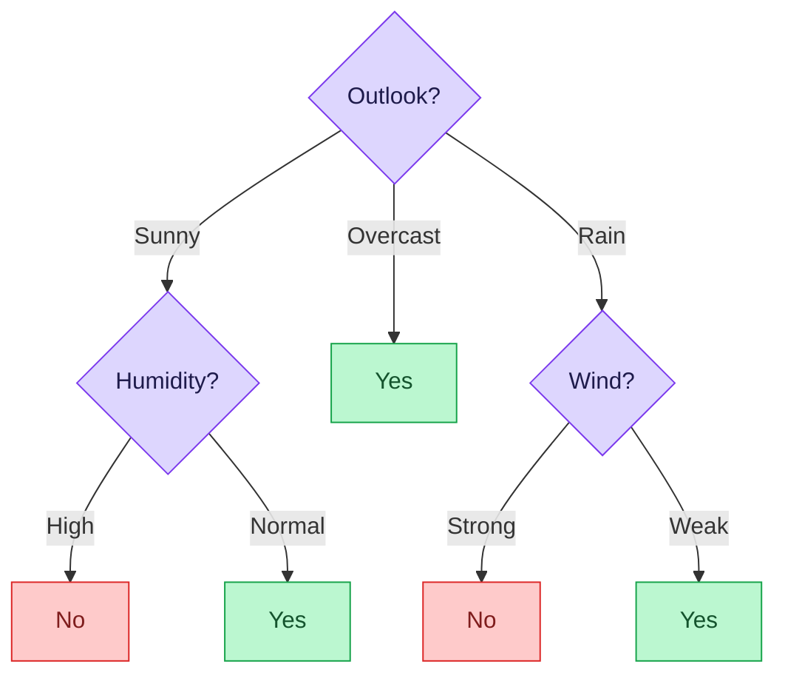

# 📘 MSc Admission Prep — Subject 08: Artificial Intelligence & Machine Learning
### 🎯 JUST-Style Exam Handbook | Fast Revision Edition

> **Goal:** Visual, exam-focused revision of ML fundamentals, evaluation metrics, and AI ethics. Every topic includes intuition, diagrams, worked examples, and exam tips.

---

## 📋 Table of Contents

| # | Topic | Tier |
|---|-------|------|
| 1 | [Supervised vs Unsupervised Learning](#1-supervised-vs-unsupervised-learning) | 🔴 Must Master |
| 2 | [Overfitting vs Underfitting](#2-overfitting-vs-underfitting) | 🔴 Must Master |
| 3 | [Decision Trees](#3-decision-trees) | 🔴 Must Master |
| 4 | [Random Forest](#4-random-forest) | 🔴 Must Master |
| 5 | [Evaluation Metrics](#5-evaluation-metrics) | 🔴 Must Master |
| 6 | [AI Ethics](#6-ai-ethics) | 🔴 Must Master |

---

---

# 1. Supervised vs Unsupervised Learning

## 💡 Intuition First

> **Supervised learning** is like learning with a teacher — you're given examples with correct answers (labeled data), and you learn to predict answers for new examples.
>
> **Unsupervised learning** is like exploring without a teacher — you're given data with no labels and must find hidden patterns or structure on your own.

**Real-world analogies:**
- Supervised: A student learning from a textbook with answer keys → learns to solve new problems
- Unsupervised: A botanist sorting unknown plants into groups by similarity → discovers natural clusters

---

## 📐 Supervised Learning

```
Training data: (input, correct output) pairs
Goal: Learn a mapping function f: input → output

Examples:
  Email spam detection:
    Input: email text
    Output: spam / not spam (labeled)
    Learn: which words/patterns indicate spam

  House price prediction:
    Input: size, location, bedrooms
    Output: price (labeled)
    Learn: relationship between features and price
```

### Types of Supervised Learning

| Type | Output | Examples |
|------|--------|---------|
| **Classification** | Discrete class label | Spam/Not spam, Cat/Dog, Disease/Healthy |
| **Regression** | Continuous value | House price, Temperature, Stock price |

### Common Supervised Algorithms

```
Classification:
  Logistic Regression, Decision Tree, Random Forest,
  SVM, KNN, Naive Bayes, Neural Networks

Regression:
  Linear Regression, Polynomial Regression,
  Decision Tree Regression, SVR
```

---

## 📐 Unsupervised Learning

```
Training data: inputs ONLY (no labels)
Goal: Discover hidden structure/patterns

Examples:
  Customer segmentation:
    Input: purchase history, demographics
    No labels — find natural customer groups

  Anomaly detection:
    Input: network traffic data
    No labels — find unusual patterns (attacks)
```

### Types of Unsupervised Learning

| Type | Goal | Examples |
|------|------|---------|
| **Clustering** | Group similar data points | K-Means, DBSCAN, Hierarchical |
| **Dimensionality Reduction** | Reduce features | PCA, t-SNE, Autoencoders |
| **Association Rules** | Find co-occurring patterns | Apriori (market basket analysis) |
| **Generative Models** | Learn data distribution | GANs, VAEs |

---

## 📐 Semi-Supervised & Reinforcement Learning

```
Semi-Supervised:
  Small amount of labeled data + large amount of unlabeled
  Use labeled data to guide learning on unlabeled data
  Example: Medical image classification (few labeled scans)

Reinforcement Learning:
  Agent learns by interacting with environment
  Receives rewards/penalties for actions
  Goal: maximize cumulative reward
  Example: Game playing (AlphaGo), Robot navigation
```

---

## ⚖️ Supervised vs Unsupervised — Master Comparison

| Feature | Supervised | Unsupervised |
|---------|------------|--------------|
| Training data | Labeled (input + output) | Unlabeled (input only) |
| Goal | Predict output for new input | Discover hidden structure |
| Feedback | Direct (correct answer known) | None |
| Evaluation | Accuracy, F1, MSE | Silhouette score, inertia |
| Complexity | Lower (guided) | Higher (no guidance) |
| Examples | Classification, Regression | Clustering, Dimensionality reduction |
| Use case | Spam filter, price prediction | Customer segmentation, anomaly detection |

---

## ⚠️ Common Mistakes

> 🚫 **Mistake 1:** Supervised learning requires labeled data — labeling is expensive and time-consuming.
> 🚫 **Mistake 2:** Unsupervised learning doesn't mean "no evaluation" — you still evaluate cluster quality.
> 🚫 **Mistake 3:** Reinforcement learning is neither supervised nor unsupervised — it's a separate paradigm.
> 🚫 **Mistake 4:** Classification output is discrete (classes); Regression output is continuous (numbers).

---

## ⚡ One-Minute Recap

- Supervised: labeled data, learn input→output mapping
- Unsupervised: unlabeled data, find hidden patterns
- Classification: discrete output | Regression: continuous output
- Clustering: group similar points | Dimensionality reduction: reduce features
- Semi-supervised: small labeled + large unlabeled

---

## 📝 Probable Exam Questions

> **5-mark:** Compare supervised and unsupervised learning with examples of each.
> **Short note:** What is the difference between classification and regression?
> **Classify:** For each scenario, identify if it's supervised or unsupervised: (a) spam detection, (b) customer grouping, (c) house price prediction, (d) topic discovery in documents.

---

---

# 2. Overfitting vs Underfitting

## 💡 Intuition First

> **Overfitting** is like a student who memorizes every past exam question but can't solve new problems — they learned the noise, not the pattern.
>
> **Underfitting** is like a student who barely studied — they can't even answer the questions they've seen before.
>
> **Good fit** = a student who understood the concepts and can apply them to new problems.

---

## 📐 The Bias-Variance Tradeoff

```
Bias:     Error from wrong assumptions (model too simple)
          High bias → underfitting

Variance: Error from sensitivity to small fluctuations in training data
          High variance → overfitting

The tradeoff:
  Simple model:  High bias, Low variance  → underfitting
  Complex model: Low bias, High variance  → overfitting
  Goal:          Low bias AND Low variance → good fit

Visual:
  Underfitting:    Overfitting:      Good fit:
  ___________      ~~~~~^~~~~~       ___/‾\___
  (flat line,      (wiggly line,     (smooth curve,
   misses all)      fits noise)       captures pattern)
```

---

## 📐 Visual Comparison

```
Training data: ● (actual points)
True pattern:  ─── (smooth curve)

Underfitting (High Bias):
  Model: ─────────────── (straight line)
  Misses the curve entirely
  High training error + High test error

Good Fit:
  Model: ──/‾\──  (smooth curve)
  Captures the pattern
  Low training error + Low test error

Overfitting (High Variance):
  Model: ~^~v~^~v~ (wiggly line through every point)
  Fits every training point perfectly
  Low training error + HIGH test error
```

---

## 📐 Detecting Overfitting/Underfitting

```
Learning curves:

Underfitting:
  Training error:   HIGH ────────────────
  Validation error: HIGH ────────────────
  (both high, close together)

Overfitting:
  Training error:   LOW  ────────────────
  Validation error: HIGH ────────────────
  (large gap between training and validation)

Good fit:
  Training error:   LOW  ────────────────
  Validation error: LOW  ────────────────
  (both low, small gap)
```

---

## 🔧 Solutions

### Fixing Underfitting (High Bias)

```
✅ Use a more complex model (more layers, more features)
✅ Add more features (feature engineering)
✅ Reduce regularization
✅ Train longer (more epochs)
✅ Try a different algorithm
```

### Fixing Overfitting (High Variance)

```
✅ Get more training data
✅ Reduce model complexity (fewer parameters)
✅ Regularization:
     L1 (Lasso): adds |weights| penalty → sparse weights
     L2 (Ridge): adds weights² penalty → small weights
✅ Dropout (neural networks): randomly disable neurons during training
✅ Early stopping: stop training when validation error starts increasing
✅ Cross-validation: use k-fold CV to estimate true performance
✅ Ensemble methods (Random Forest): average multiple models
```

---

## 📐 Cross-Validation

```
k-Fold Cross-Validation (k=5):

Data: [──────────────────────────────────]
       ↓ Split into 5 equal folds

Fold 1: [TEST][train][train][train][train]
Fold 2: [train][TEST][train][train][train]
Fold 3: [train][train][TEST][train][train]
Fold 4: [train][train][train][TEST][train]
Fold 5: [train][train][train][train][TEST]

Final score = average of 5 test scores

Benefits:
  ✅ Uses all data for both training and testing
  ✅ More reliable estimate of model performance
  ✅ Detects overfitting
```

---

## ⚖️ Overfitting vs Underfitting Summary

| Aspect | Underfitting | Good Fit | Overfitting |
|--------|-------------|----------|-------------|
| Bias | High | Low | Low |
| Variance | Low | Low | High |
| Training error | High | Low | Very Low |
| Test error | High | Low | High |
| Model complexity | Too simple | Just right | Too complex |
| Fix | More complexity | — | Less complexity, regularization |

---

## ⚠️ Common Mistakes

> 🚫 **Mistake 1:** Low training error does NOT mean good model — check test/validation error too.
> 🚫 **Mistake 2:** More data helps overfitting but NOT underfitting (underfitting needs better model).
> 🚫 **Mistake 3:** Regularization reduces overfitting but too much regularization causes underfitting.
> 🚫 **Mistake 4:** Overfitting = memorizing training data, not learning the underlying pattern.

---

## ⚡ One-Minute Recap

- Underfitting: model too simple, high bias, high training AND test error
- Overfitting: model too complex, high variance, low training but high test error
- Bias-variance tradeoff: can't minimize both simultaneously
- Fix underfitting: more complexity | Fix overfitting: regularization, more data, simpler model
- Cross-validation: reliable performance estimate using k folds

---

## 📝 Probable Exam Questions

> **5-mark:** Explain overfitting and underfitting. How can each be detected and fixed?
> **Short note:** What is the bias-variance tradeoff?
> **Diagram:** Draw learning curves for underfitting, good fit, and overfitting.
> **Explain:** What is k-fold cross-validation? Why is it better than a single train-test split?

---

---

# 3. Decision Trees

## 💡 Intuition First

> A decision tree is like a **flowchart for making decisions**. At each node, you ask a question about a feature. Based on the answer, you go left or right. You keep going until you reach a leaf node that gives you the final answer (class or value).

**Real-world analogy:** A doctor diagnosing a patient — "Do you have a fever? → Yes → Do you have a cough? → Yes → Likely flu." That's a decision tree.

---

## 📐 Decision Tree Structure

```
                    [Age > 30?]              ← Root node (best split)
                   /           \
                Yes             No
                /                 \
        [Income > 50K?]        [Student?]   ← Internal nodes
        /          \            /      \
      Yes           No        Yes       No
      /               \       /           \
  [Buy: Yes]    [Buy: No] [Buy: Yes]  [Buy: No]  ← Leaf nodes
```

### Components

| Component | Description |
|-----------|-------------|
| **Root node** | Top node, best splitting feature |
| **Internal node** | Decision point (feature + threshold) |
| **Branch** | Outcome of a decision |
| **Leaf node** | Final prediction (class or value) |
| **Depth** | Length of longest path from root to leaf |

---

## 📐 How to Build a Decision Tree

> At each node, choose the feature that **best separates** the data. Two common measures:

### Information Gain (ID3 Algorithm)

```
Information Gain = Entropy(parent) - Weighted Entropy(children)

Entropy(S) = -Σ pᵢ log₂(pᵢ)
  where pᵢ = proportion of class i in set S

Example:
  Dataset: 9 positive (+), 5 negative (-)
  Entropy(S) = -(9/14)log₂(9/14) - (5/14)log₂(5/14)
             = -(0.643)(−0.637) - (0.357)(−1.485)
             = 0.410 + 0.530 = 0.940

  After splitting on feature A:
    Left branch:  6+, 2- → Entropy = -(6/8)log₂(6/8) - (2/8)log₂(2/8) = 0.811
    Right branch: 3+, 3- → Entropy = -(3/6)log₂(3/6) - (3/6)log₂(3/6) = 1.000

  Weighted entropy = (8/14)(0.811) + (6/14)(1.000) = 0.463 + 0.429 = 0.892

  Information Gain(A) = 0.940 - 0.892 = 0.048

Choose the feature with HIGHEST information gain.
```

### Gini Impurity (CART Algorithm)

```
Gini(S) = 1 - Σ pᵢ²

Example:
  9 positive, 5 negative (14 total):
  Gini = 1 - (9/14)² - (5/14)²
       = 1 - 0.413 - 0.128
       = 0.459

Pure node (all same class): Gini = 0
Maximally impure (50/50):   Gini = 0.5

Choose split that minimizes weighted Gini impurity.
```

---

## 📐 Worked Example — Full Decision Tree

```
Dataset: Play Tennis?
+------+----------+--------+------+--------+
| Day  | Outlook  | Temp   | Wind | Play?  |
+------+----------+--------+------+--------+
|    1 | Sunny    | Hot    | Weak | No     |
|    2 | Sunny    | Hot    | Strong| No    |
|    3 | Overcast | Hot    | Weak | Yes    |
|    4 | Rain     | Mild   | Weak | Yes    |
|    5 | Rain     | Cool   | Weak | Yes    |
|    6 | Rain     | Cool   | Strong| No    |
|    7 | Overcast | Cool   | Strong| Yes   |
|    8 | Sunny    | Mild   | Weak | No     |
|    9 | Sunny    | Cool   | Weak | Yes    |
|   10 | Rain     | Mild   | Weak | Yes    |
|   11 | Sunny    | Mild   | Strong| Yes   |
|   12 | Overcast | Mild   | Strong| Yes   |
|   13 | Overcast | Hot    | Weak | Yes    |
|   14 | Rain     | Mild   | Strong| No    |
+------+----------+--------+------+--------+

Total: 9 Yes, 5 No
Entropy(S) = -(9/14)log₂(9/14) - (5/14)log₂(5/14) ≈ 0.940

Information Gain for Outlook:
  Sunny (5 days):    2 Yes, 3 No → Entropy = 0.971
  Overcast (4 days): 4 Yes, 0 No → Entropy = 0 (pure!)
  Rain (5 days):     3 Yes, 2 No → Entropy = 0.971

  Weighted = (5/14)(0.971) + (4/14)(0) + (5/14)(0.971)
           = 0.347 + 0 + 0.347 = 0.694

  IG(Outlook) = 0.940 - 0.694 = 0.246

(Similarly compute for Temperature, Humidity, Wind)
Outlook has highest IG → use as root
```

Decision Tree:



---

## 📐 Pruning

> Decision trees can overfit by growing too deep. **Pruning** removes branches that don't improve generalization.

```
Pre-pruning (Early stopping):
  Stop growing when:
    - Node has fewer than min_samples
    - Information gain below threshold
    - Max depth reached

Post-pruning (Reduced Error Pruning):
  Grow full tree first
  Then remove branches that don't improve validation accuracy
  Replace subtree with leaf node (majority class)
```

---

## ⚖️ Decision Tree Advantages & Disadvantages

| Advantage | Disadvantage |
|-----------|-------------|
| Easy to understand and visualize | Prone to overfitting (deep trees) |
| No feature scaling needed | Unstable (small data change → different tree) |
| Handles both numerical and categorical | Biased toward features with more levels |
| Fast prediction | Not great for linear relationships |
| Feature importance built-in | Single tree has high variance |

---

## ⚠️ Common Mistakes

> 🚫 **Mistake 1:** Higher entropy = more impure (uncertain). Lower entropy = purer (more certain).
> 🚫 **Mistake 2:** Information gain = entropy BEFORE - entropy AFTER split (not the other way).
> 🚫 **Mistake 3:** Gini = 0 means pure node (all same class). Gini = 0.5 means maximally impure.
> 🚫 **Mistake 4:** Decision trees don't require feature normalization — they use thresholds, not distances.

---

## ⚡ One-Minute Recap

- Decision tree: flowchart of feature-based decisions
- Split criterion: Information Gain (ID3) or Gini Impurity (CART)
- High IG / Low Gini → better split
- Entropy = 0: pure node | Entropy = 1: maximally impure (50/50)
- Pruning: prevent overfitting by limiting tree growth

---

## 📝 Probable Exam Questions

> **5-mark:** Explain how a decision tree is built using Information Gain. Show the entropy calculation.
> **Short note:** What is Gini impurity? How is it used in decision trees?
> **Trace:** Given a small dataset, build a decision tree step by step.
> **Explain:** What is pruning in decision trees? Why is it needed?

---

---

# 4. Random Forest

## 💡 Intuition First

> A single decision tree is like asking one expert for advice — they might be wrong. A **random forest** is like asking 100 experts and taking a vote — the majority is usually right. More diverse opinions → better collective decision.

**Real-world analogy:** A jury of 12 people is more reliable than a single judge. Each juror sees slightly different evidence (random subsets), and the majority verdict is more robust.

---

## 📐 How Random Forest Works

```
Step 1: Bootstrap Sampling (Bagging)
  Create n different training sets by sampling WITH replacement
  Each tree sees ~63% of original data (different subset)

  Original data: [1,2,3,4,5,6,7,8,9,10]
  Tree 1 data:   [1,1,3,5,5,7,8,9,9,10]  (with replacement)
  Tree 2 data:   [2,3,3,4,6,6,7,8,10,10]
  Tree 3 data:   [1,2,4,4,5,7,7,8,9,10]
  ...

Step 2: Random Feature Selection
  At each split, consider only a RANDOM SUBSET of features
  Typically: √(total features) for classification
             total features / 3 for regression
  This ensures trees are diverse (decorrelated)

Step 3: Build n Decision Trees
  Each tree trained on its bootstrap sample
  Each split uses random feature subset
  Trees grown to full depth (no pruning)

Step 4: Aggregate Predictions
  Classification: MAJORITY VOTE
    Tree 1: Yes, Tree 2: No, Tree 3: Yes, Tree 4: Yes
    → Final: Yes (3 out of 4)

  Regression: AVERAGE
    Tree 1: 250K, Tree 2: 270K, Tree 3: 260K
    → Final: (250+270+260)/3 = 260K
```

---

## 📐 Why Random Forest Works

```
Key insight: Ensemble of diverse, uncorrelated trees

Single decision tree:
  High variance (sensitive to training data)
  Overfits easily

Random forest:
  Each tree has high variance BUT
  Trees are DECORRELATED (different data + different features)
  Averaging decorrelated trees → variance REDUCES
  Bias stays similar

Mathematically:
  Variance of average of n correlated trees:
    Var = ρσ² + (1-ρ)σ²/n
    where ρ = correlation between trees, σ² = tree variance

  If ρ = 0 (uncorrelated): Var = σ²/n → reduces with more trees!
  Random feature selection reduces ρ → better ensemble
```

---

## 📐 Feature Importance

```
Random forest provides feature importance scores:
  Measure how much each feature reduces impurity across all trees

Example output:
  Feature         Importance
  ─────────────────────────
  Age             0.35  ← most important
  Income          0.28
  Education       0.20
  Marital Status  0.12
  Gender          0.05

Use: Feature selection, understanding model
```

---

## 📐 Out-of-Bag (OOB) Error

```
Each tree is trained on ~63% of data
The remaining ~37% (out-of-bag samples) can be used for validation

OOB error = average error on OOB samples across all trees
Provides free cross-validation estimate without separate validation set!
```

---

## ⚖️ Decision Tree vs Random Forest

| Feature | Decision Tree | Random Forest |
|---------|---------------|---------------|
| Number of models | 1 | n (typically 100-500) |
| Overfitting | High | Low |
| Variance | High | Low |
| Bias | Low | Low |
| Interpretability | High (visualizable) | Low (black box) |
| Training speed | Fast | Slower |
| Prediction speed | Fast | Slower |
| Feature importance | Yes | Yes (more reliable) |
| Handles missing data | Moderate | Better |

---

## ⚖️ Bagging vs Boosting

```
Bagging (Random Forest):
  Trees built INDEPENDENTLY in parallel
  Each tree on different bootstrap sample
  Combine by averaging/voting
  Reduces VARIANCE

Boosting (AdaBoost, Gradient Boosting, XGBoost):
  Trees built SEQUENTIALLY
  Each tree corrects errors of previous tree
  Misclassified samples get higher weight
  Reduces BIAS

  Tree 1 → errors → Tree 2 (focuses on errors) → errors → Tree 3 ...
  Final: weighted combination of all trees
```

---

## ⚠️ Common Mistakes

> 🚫 **Mistake 1:** Random forest uses random FEATURE subsets at each split, not just random data.
> 🚫 **Mistake 2:** More trees = better (up to a point) — but diminishing returns after ~100-500 trees.
> 🚫 **Mistake 3:** Random forest reduces variance, not bias. If single tree has high bias, forest will too.
> 🚫 **Mistake 4:** Bagging (parallel) ≠ Boosting (sequential). Random forest is a type of bagging.

---

## ⚡ One-Minute Recap

- Random forest: ensemble of decision trees using bagging + random features
- Bootstrap sampling: train each tree on random subset (with replacement)
- Random features: at each split, consider only √n features
- Aggregate: majority vote (classification) or average (regression)
- Reduces variance of single tree | provides feature importance | OOB error estimate

---

## 📝 Probable Exam Questions

> **5-mark:** Explain how a random forest is built. How does it reduce overfitting compared to a single decision tree?
> **Short note:** What is bagging? How does it differ from boosting?
> **Explain:** What is out-of-bag error in random forests?
> **Compare:** Decision tree vs Random forest — advantages and disadvantages.

---

---

# 5. Evaluation Metrics

## 💡 Intuition First

> Accuracy alone is misleading. If 99% of emails are not spam, a model that always says "not spam" gets 99% accuracy — but it's useless! We need metrics that reveal the full picture of model performance.

**Real-world analogy:** A medical test for a rare disease. If the disease affects 1% of people, a test that always says "negative" is 99% accurate but catches zero cases. We need sensitivity (recall) and specificity.

---

## 📐 Confusion Matrix

> The foundation of all classification metrics.

```
                    PREDICTED
                  Positive  Negative
ACTUAL  Positive │   TP   │   FN   │
        Negative │   FP   │   TN   │

TP = True Positive  (predicted positive, actually positive) ✅
TN = True Negative  (predicted negative, actually negative) ✅
FP = False Positive (predicted positive, actually negative) ❌ Type I error
FN = False Negative (predicted negative, actually positive) ❌ Type II error

Example: Spam detection
  TP = correctly identified spam
  TN = correctly identified not-spam
  FP = legitimate email marked as spam (annoying!)
  FN = spam email not caught (dangerous!)
```

---

## 📐 Core Metrics

### Accuracy

```
Accuracy = (TP + TN) / (TP + TN + FP + FN)

"What fraction of all predictions were correct?"

Example: TP=90, TN=850, FP=10, FN=50
  Accuracy = (90+850)/(90+850+10+50) = 940/1000 = 94%

Problem: Misleading for imbalanced datasets!
  If 95% negative: model predicting all negative → 95% accuracy but useless
```

### Precision

```
Precision = TP / (TP + FP)

"Of all predicted positives, how many were actually positive?"
"When the model says YES, how often is it right?"

Example: TP=90, FP=10
  Precision = 90/(90+10) = 90/100 = 90%

High precision = few false alarms
Use when: FP is costly (spam filter — don't want to block real emails)
```

### Recall (Sensitivity / True Positive Rate)

```
Recall = TP / (TP + FN)

"Of all actual positives, how many did the model catch?"
"What fraction of real positives did we find?"

Example: TP=90, FN=50
  Recall = 90/(90+50) = 90/140 = 64.3%

High recall = few missed positives
Use when: FN is costly (cancer detection — don't want to miss cancer)
```

### F1 Score

```
F1 = 2 × (Precision × Recall) / (Precision + Recall)
   = 2TP / (2TP + FP + FN)

"Harmonic mean of Precision and Recall"
Balances both metrics — useful when both FP and FN matter

Example: Precision=0.90, Recall=0.643
  F1 = 2 × (0.90 × 0.643) / (0.90 + 0.643)
     = 2 × 0.579 / 1.543
     = 0.750 = 75%

F1 is low if EITHER precision OR recall is low.
```

---

## 📐 Worked Example — Full Metrics Calculation

```
Confusion Matrix for disease detection:
                    PREDICTED
                  Positive  Negative
ACTUAL  Positive │   85   │   15   │  (100 actual positive)
        Negative │   20   │  880   │  (900 actual negative)

TP=85, FN=15, FP=20, TN=880
Total = 1000

Accuracy  = (85+880)/1000 = 965/1000 = 96.5%
Precision = 85/(85+20) = 85/105 = 80.95%
Recall    = 85/(85+15) = 85/100 = 85%
F1        = 2×(0.8095×0.85)/(0.8095+0.85)
          = 2×0.6881/1.6595 = 82.95%

Interpretation:
  96.5% accuracy looks great BUT
  Only 85% of actual disease cases caught (recall)
  20 healthy people incorrectly diagnosed (FP)
```

---

## 📐 Precision-Recall Tradeoff

```
Adjusting the classification threshold:

High threshold (e.g., 0.9):
  Model only predicts positive when very confident
  → High Precision, Low Recall
  → Few false alarms, but misses many positives

Low threshold (e.g., 0.3):
  Model predicts positive more liberally
  → Low Precision, High Recall
  → Catches most positives, but many false alarms

Precision-Recall curve:
  Precision
  │ ●
  │  ●
  │   ●
  │     ●
  │        ●
  └──────────────► Recall

AUC-PR: Area under Precision-Recall curve
  Higher AUC = better model
```

---

## 📐 Accuracy Paradox

```
Problem: High accuracy can be misleading for imbalanced data.

Example: Credit card fraud detection
  Dataset: 9990 legitimate, 10 fraudulent (0.1% fraud rate)

  Dumb model: always predict "legitimate"
  Accuracy = 9990/10000 = 99.9% ← looks amazing!
  But: catches 0 fraud cases (recall = 0%)

  This is the ACCURACY PARADOX.

Solution: Use Precision, Recall, F1, or AUC-ROC instead of accuracy
          for imbalanced datasets.
```

---

## 📐 Additional Metrics

### Specificity (True Negative Rate)

```
Specificity = TN / (TN + FP)
"Of all actual negatives, how many did we correctly identify?"
Complement of False Positive Rate
```

### ROC Curve & AUC

```
ROC (Receiver Operating Characteristic) curve:
  X-axis: False Positive Rate = FP/(FP+TN)
  Y-axis: True Positive Rate (Recall) = TP/(TP+FN)

  Perfect model: AUC = 1.0 (top-left corner)
  Random model:  AUC = 0.5 (diagonal line)

  TPR
  1│●────────────
   │  ●
   │    ●
   │      ●
  0└──────────────► FPR
   0              1

AUC (Area Under Curve): single number summarizing ROC
  AUC = 0.9 → excellent | AUC = 0.7 → acceptable | AUC = 0.5 → random
```

---

## ⚖️ Metrics Summary — When to Use What

| Metric | Formula | Use When |
|--------|---------|---------|
| **Accuracy** | (TP+TN)/Total | Balanced classes |
| **Precision** | TP/(TP+FP) | FP is costly (spam filter) |
| **Recall** | TP/(TP+FN) | FN is costly (disease detection) |
| **F1 Score** | 2×P×R/(P+R) | Both FP and FN matter |
| **AUC-ROC** | Area under ROC | Overall model comparison |
| **Specificity** | TN/(TN+FP) | When true negatives matter |

---

## ⚠️ Common Mistakes

> 🚫 **Mistake 1:** Accuracy is NOT always the right metric — use F1 or AUC for imbalanced data.
> 🚫 **Mistake 2:** Precision and Recall trade off — improving one often hurts the other.
> 🚫 **Mistake 3:** F1 is the harmonic mean (not arithmetic mean) of precision and recall.
> 🚫 **Mistake 4:** High recall with low precision = model predicts positive too often (many false alarms).

---

## 🎯 Exam Tips

> 💡 **Confusion matrix** is the foundation — always draw it first.
> 💡 Memorize: Precision = TP/(TP+FP) | Recall = TP/(TP+FN)
> 💡 F1 = harmonic mean — punishes extreme values (if either P or R is 0, F1 = 0).
> 💡 Accuracy paradox: always mention this when discussing imbalanced datasets.

---

## ⚡ One-Minute Recap

- Confusion matrix: TP, TN, FP, FN
- Accuracy: (TP+TN)/Total — misleading for imbalanced data
- Precision: TP/(TP+FP) — how many predicted positives are correct
- Recall: TP/(TP+FN) — how many actual positives were caught
- F1: harmonic mean of P and R — balances both
- Accuracy paradox: high accuracy ≠ good model for imbalanced data

---

## 📝 Probable Exam Questions

> **5-mark:** Given a confusion matrix, calculate accuracy, precision, recall, and F1 score.
> **Short note:** What is the accuracy paradox? Give an example.
> **Explain:** When would you prefer recall over precision? Give a real-world example.
> **Draw:** Draw a confusion matrix for a binary classifier and label all four cells.

---

---

# 6. AI Ethics

## 💡 Intuition First

> AI systems are increasingly making decisions that affect people's lives — loan approvals, medical diagnoses, hiring decisions, content recommendations. When these systems are biased, opaque, or misused, the consequences are real and serious. AI ethics is about building AI that is fair, transparent, accountable, and safe.

---

## 📐 Deepfakes

```
What: AI-generated synthetic media (video, audio, images)
      that realistically depicts people saying/doing things they never did.

How: Deep learning (GANs — Generative Adversarial Networks)
     Generator: creates fake content
     Discriminator: tries to detect fakes
     They compete → generator improves until fakes are convincing

Harms:
  ❌ Non-consensual intimate imagery (NCII)
  ❌ Political disinformation (fake speeches by leaders)
  ❌ Financial fraud (fake CEO voice calls)
  ❌ Reputation damage
  ❌ Erosion of trust in authentic media

Detection:
  ✅ Deepfake detection models (analyze artifacts)
  ✅ Digital watermarking / provenance tracking
  ✅ C2PA (Content Credentials) standard
```

---

## 📐 LLM Bias

```
What: Large Language Models (ChatGPT, Gemini, etc.) can exhibit
      systematic biases that reflect and amplify societal prejudices.

Sources of bias:
  Training data bias:
    LLMs trained on internet text → internet has human biases
    Historical data reflects past discrimination

  Representation bias:
    Underrepresentation of certain languages, cultures, demographics
    Model performs worse for underrepresented groups

  Amplification:
    Model may amplify existing biases beyond what's in training data

Examples:
  "Doctor" → model associates with male pronouns
  "Nurse" → model associates with female pronouns
  Sentiment analysis performs worse on African American English
  Resume screening favors certain names/backgrounds

Mitigation:
  ✅ Diverse, representative training data
  ✅ Bias auditing and red-teaming
  ✅ RLHF (Reinforcement Learning from Human Feedback)
  ✅ Fairness constraints during training
  ✅ Regular bias testing across demographic groups
```

---

## 📐 Misinformation & AI

```
AI-generated misinformation:
  LLMs can generate convincing false information at scale
  Automated fake news articles, social media posts
  Personalized disinformation campaigns

Types:
  Misinformation: false info spread without intent to deceive
  Disinformation: false info spread WITH intent to deceive
  Malinformation: true info used to cause harm

AI's role:
  ❌ Generates convincing fake content cheaply and at scale
  ❌ Personalizes content to target specific beliefs
  ❌ Creates fake personas (sockpuppets) for influence campaigns

Countermeasures:
  ✅ AI-generated content labeling/watermarking
  ✅ Fact-checking tools
  ✅ Media literacy education
  ✅ Platform content moderation
  ✅ Provenance tracking (who created this content?)
```

---

## 📐 Hallucination

```
What: LLMs confidently generate false, fabricated, or nonsensical
      information that sounds plausible.

Why it happens:
  LLMs predict the next token based on patterns
  They don't "know" facts — they generate plausible text
  No internal fact-checking mechanism
  Training data may contain errors

Types:
  Factual hallucination: wrong facts stated confidently
    "The Eiffel Tower was built in 1850" (actually 1889)

  Source hallucination: citing non-existent papers/books
    "According to Smith et al. (2019)..." (paper doesn't exist)

  Reasoning hallucination: flawed logical steps
    Correct-sounding but logically invalid reasoning

Real-world harm:
  ❌ Medical misinformation
  ❌ Legal errors (lawyers citing fake cases)
  ❌ Academic fraud
  ❌ Business decisions based on false data

Mitigation:
  ✅ Retrieval-Augmented Generation (RAG): ground LLM in real documents
  ✅ Fact-checking pipelines
  ✅ Uncertainty quantification ("I'm not sure about this")
  ✅ Human oversight for high-stakes decisions
```

---

## 📐 Privacy Concerns

```
AI and privacy risks:

1. Training data privacy:
   LLMs trained on internet data may memorize personal information
   Can reproduce private data (emails, medical records) from training

2. Inference attacks:
   Attackers can extract training data through clever prompting
   Model inversion: reconstruct training data from model outputs

3. Surveillance:
   Facial recognition at scale → mass surveillance
   Behavioral profiling from social media

4. Data collection:
   AI services collect vast user data
   Conversations with AI assistants stored and analyzed

5. Re-identification:
   "Anonymized" data can be re-identified using AI
   Combining datasets reveals private information

Regulations:
  GDPR (EU): right to explanation, right to erasure
  CCPA (California): data privacy rights
  AI Act (EU): risk-based regulation of AI systems
```

---

## 📐 AI Fairness Principles

```
Key fairness concepts:

Individual fairness:
  Similar individuals should be treated similarly
  "Treat like cases alike"

Group fairness:
  Model should perform equally across demographic groups
  Equal accuracy for men and women, different races, etc.

Fairness metrics:
  Demographic parity: equal positive prediction rates across groups
  Equal opportunity: equal true positive rates across groups
  Equalized odds: equal TPR and FPR across groups

The fairness-accuracy tradeoff:
  Optimizing for fairness may reduce overall accuracy
  Different fairness definitions can conflict with each other
  (Impossibility theorem: can't satisfy all fairness criteria simultaneously)
```

---

## ⚖️ AI Ethics Principles (Summary)

| Principle | Meaning |
|-----------|---------|
| **Fairness** | No discrimination based on protected attributes |
| **Transparency** | Explainable decisions, open about AI use |
| **Accountability** | Clear responsibility for AI decisions |
| **Privacy** | Protect personal data, minimize collection |
| **Safety** | Prevent harm, robust to adversarial attacks |
| **Beneficence** | AI should benefit humanity |
| **Non-maleficence** | AI should not cause harm |

---

## ⚠️ Common Mistakes

> 🚫 **Mistake 1:** Bias in AI is not just a technical problem — it reflects societal biases in training data.
> 🚫 **Mistake 2:** Hallucination is not the same as lying — LLMs don't "know" they're wrong.
> 🚫 **Mistake 3:** Deepfakes are not only video — they include audio, images, and text.
> 🚫 **Mistake 4:** Removing sensitive attributes (race, gender) from training data doesn't eliminate bias — proxy variables remain.

---

## ⚡ One-Minute Recap

- Deepfakes: AI-generated synthetic media, harms include disinformation and fraud
- LLM bias: reflects training data biases, amplifies societal prejudices
- Misinformation: AI generates convincing false content at scale
- Hallucination: LLMs confidently state false information
- Privacy: training data memorization, surveillance, re-identification risks
- AI ethics: fairness, transparency, accountability, privacy, safety

---

## 📝 Probable Exam Questions

> **5-mark:** What is AI hallucination? Why does it occur and what are its real-world harms?
> **Short note:** What are deepfakes? What ethical concerns do they raise?
> **Explain:** What is bias in LLMs? What are its sources and how can it be mitigated?
> **Discuss:** What privacy risks does AI pose? How can they be addressed?

---

---

# 🏁 Master Quick Revision Sheet — AI & Machine Learning

## ⚡ Metrics Cheat Sheet

```
Confusion Matrix:
                  Predicted +    Predicted -
  Actual +    │     TP        │     FN      │
  Actual -    │     FP        │     TN      │

Accuracy  = (TP + TN) / (TP + TN + FP + FN)
Precision = TP / (TP + FP)          ← "when I say yes, am I right?"
Recall    = TP / (TP + FN)          ← "did I catch all the yeses?"
F1        = 2 × P × R / (P + R)     ← harmonic mean
Specificity = TN / (TN + FP)

Type I error  = False Positive (FP)
Type II error = False Negative (FN)
```

## 🔑 Key Facts to Remember

| Fact | Detail |
|------|--------|
| Supervised | Labeled data, predict output |
| Unsupervised | Unlabeled data, find patterns |
| Overfitting | Low train error, high test error (high variance) |
| Underfitting | High train AND test error (high bias) |
| Entropy = 0 | Pure node (all same class) |
| Entropy = 1 | Maximally impure (50/50 split) |
| Gini = 0 | Pure node |
| Gini = 0.5 | Maximally impure |
| Random forest | Bagging + random features → reduces variance |
| Bagging | Parallel trees, reduces variance |
| Boosting | Sequential trees, reduces bias |
| Accuracy paradox | High accuracy ≠ good model (imbalanced data) |
| Hallucination | LLM confidently states false information |
| Deepfake | AI-generated synthetic media (GAN-based) |

## 🧠 Memory Tricks

- **Precision vs Recall:** "**P**recision = **P**redicted positive quality | **R**ecall = **R**eal positive coverage"
- **Type I vs Type II:** "**I** cried wolf (**FP**) | **II** missed the wolf (**FN**)"
- **Overfitting vs Underfitting:** "**Over** = memorized | **Under** = didn't learn"
- **Bagging vs Boosting:** "**Bag** = **B**unch together (parallel) | **Boost** = **B**uild on mistakes (sequential)"
- **Entropy formula:** "**E** = **-Σ p log p**" (negative sum of p times log p)

## 🎯 Top 10 Most Probable Exam Questions

1. Compare supervised vs unsupervised learning with examples
2. Explain overfitting and underfitting — detection and solutions
3. Explain decision tree construction using Information Gain
4. Calculate entropy and information gain for a given dataset
5. Explain random forest — how it reduces overfitting
6. Given confusion matrix, calculate all metrics (accuracy, P, R, F1)
7. Explain the accuracy paradox with an example
8. What is AI hallucination? Why does it occur?
9. Compare bagging and boosting
10. What are the ethical concerns of deepfakes and LLM bias?

## 📊 Algorithm Quick Reference

```
┌──────────────────┬──────────────┬──────────────┬──────────────┐
│ Algorithm        │ Type         │ Output       │ Key Feature  │
├──────────────────┼──────────────┼──────────────┼──────────────┤
│ Decision Tree    │ Supervised   │ Class/Value  │ Interpretable│
│ Random Forest    │ Supervised   │ Class/Value  │ Ensemble     │
│ K-Means          │ Unsupervised │ Clusters     │ Centroid-based│
│ Linear Regression│ Supervised   │ Continuous   │ Line fitting │
│ Logistic Reg.    │ Supervised   │ Probability  │ Classification│
│ SVM              │ Supervised   │ Class        │ Max margin   │
│ KNN              │ Supervised   │ Class/Value  │ Distance-based│
│ Naive Bayes      │ Supervised   │ Class        │ Probabilistic│
└──────────────────┴──────────────┴──────────────┴──────────────┘
```

---

> 📌 **End of Subject 08: Artificial Intelligence & Machine Learning**
>
> Next: **Subject 09 — Object Oriented Programming** →

---

*Handbook generated for MSc Admission Preparation | JUST-Style Exam Focus*
*Version 1.0 | Artificial Intelligence & Machine Learning*
