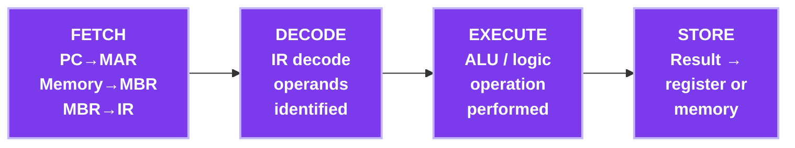

# 📘 MSc Admission Prep — Subject 12: Computer Architecture
### 🎯 JUST-Style Exam Handbook | Tier B — Moderately Important

---

## 📋 Table of Contents

| # | Topic |
|---|-------|
| 1 | [Instruction Cycle](#1-instruction-cycle) |
| 2 | [Pipelining](#2-pipelining) |
| 3 | [Pipeline Hazards](#3-pipeline-hazards) |
| 4 | [Cache Memory & Mapping](#4-cache-memory--mapping) |
| 5 | [RISC vs CISC](#5-risc-vs-cisc) |

---

# 1. Instruction Cycle

## 💡 Intuition First

> Every instruction a CPU executes goes through a fixed sequence of steps — fetch it from memory, decode what it means, execute it, and store the result. This is the **instruction cycle** (also called fetch-decode-execute cycle).

---

## 📐 Instruction Cycle Steps



```
Registers involved:
  PC  = Program Counter (address of next instruction)
  MAR = Memory Address Register
  MBR = Memory Buffer Register
  IR  = Instruction Register
  ACC = Accumulator
```

### Detailed Steps

```
1. FETCH:
   MAR ← PC           (copy PC to MAR)
   MBR ← Memory[MAR]  (read instruction from memory)
   IR  ← MBR          (load instruction into IR)
   PC  ← PC + 1       (increment PC to next instruction)

2. DECODE:
   Decode IR to determine:
   - Operation code (opcode)
   - Operand addresses

3. EXECUTE:
   Perform the operation (ADD, SUB, LOAD, STORE, JUMP...)
   May involve additional memory access (for operands)

4. WRITE BACK:
   Store result in register or memory
```

---

## ⚡ One-Minute Recap

- Fetch: PC→MAR, Memory→MBR→IR, PC++
- Decode: interpret opcode and operands
- Execute: perform operation (ALU)
- Write back: store result

---

## 📝 Probable Exam Questions

> **5-mark:** Explain the instruction cycle (fetch-decode-execute) with a diagram.
> **Short note:** What is the role of the Program Counter in the instruction cycle?

---

---

# 2. Pipelining

## 💡 Intuition First

> Pipelining is like an **assembly line** in a factory. Instead of completing one car before starting the next, different stages work on different cars simultaneously. While one car is being painted, another is being assembled, and another is being tested.

**Real-world analogy:** Laundry — while clothes are drying, you're washing the next load. While those are washing, you're folding the previous load. All stages active simultaneously.

---

## 📐 5-Stage Pipeline

```
Stages: IF → ID → EX → MEM → WB
  IF  = Instruction Fetch
  ID  = Instruction Decode / Register Read
  EX  = Execute (ALU operation)
  MEM = Memory Access
  WB  = Write Back

Without pipelining (sequential):
  I1: IF ID EX MEM WB
  I2:                  IF ID EX MEM WB
  I3:                                   IF ID EX MEM WB
  Time for 3 instructions: 15 cycles

With pipelining:
  Cycle:  1   2   3   4   5   6   7
  I1:    IF  ID  EX  MEM  WB
  I2:        IF  ID  EX  MEM  WB
  I3:            IF  ID  EX  MEM  WB
  Time for 3 instructions: 7 cycles!
```

### Pipeline Performance

```
Without pipeline: n instructions × k stages = n×k cycles
With pipeline:    k + (n-1) cycles  (k to fill, then 1 per instruction)

Speedup = (n×k) / (k + n-1)
For large n: Speedup ≈ k (number of stages)

Example: 5-stage pipeline, 100 instructions:
  Without: 100 × 5 = 500 cycles
  With:    5 + 99 = 104 cycles
  Speedup: 500/104 ≈ 4.8×
```

---

## ⚡ One-Minute Recap

- Pipeline: overlap instruction execution across stages
- 5 stages: IF, ID, EX, MEM, WB
- Speedup ≈ number of stages (for large n)
- Time with pipeline: k + (n-1) cycles

---

## 📝 Probable Exam Questions

> **5-mark:** Explain pipelining with a timing diagram. Calculate speedup for 100 instructions with 5-stage pipeline.
> **Draw:** Show the pipeline timing diagram for 4 instructions in a 5-stage pipeline.

---

# 3. Pipeline Hazards

## 💡 Intuition First

> Hazards are situations that **prevent the next instruction from executing** in the next clock cycle — like a traffic jam on the assembly line.

---

## 📐 Types of Hazards

### 1. Structural Hazard

```
Cause: Two instructions need the same hardware resource simultaneously

Example: Only one memory unit — instruction fetch AND data access
         both need memory at the same time

Solution:
  ✅ Separate instruction cache and data cache (Harvard architecture)
  ✅ Stall the pipeline (insert bubble/NOP)
```

### 2. Data Hazard (RAW — Read After Write)

```
Cause: Instruction needs data that hasn't been written yet

Example:
  I1: ADD R1, R2, R3    (R1 = R2 + R3)
  I2: SUB R4, R1, R5    (R4 = R1 - R5) ← needs R1 from I1!

Pipeline:
  I1: IF  ID  EX  MEM  WB
  I2:     IF  ID  EX   ← needs R1, but I1 hasn't written it yet!

Solutions:
  ✅ Forwarding/Bypassing: pass result directly from EX to next EX
     (don't wait for WB)
  ✅ Pipeline stall (insert NOPs): wait until data is available
  ✅ Compiler reordering: reorder instructions to avoid dependency
```

### 3. Control Hazard (Branch Hazard)

```
Cause: Branch instruction — don't know next instruction until branch resolved

Example:
  I1: BEQ R1, R2, LABEL   (if R1==R2, jump to LABEL)
  I2: ADD ...              (fetched but may not execute!)
  I3: SUB ...              (fetched but may not execute!)

Solutions:
  ✅ Branch prediction: guess the outcome (taken/not taken)
     Static: always predict not taken
     Dynamic: use history (branch predictor hardware)
  ✅ Delayed branching: execute instruction after branch regardless
  ✅ Flush pipeline: discard wrong instructions (penalty = branch delay)
```

---

## ⚖️ Hazard Summary

| Hazard | Cause | Solution |
|--------|-------|---------|
| **Structural** | Resource conflict | Separate resources, stall |
| **Data (RAW)** | Read before write completes | Forwarding, stall, reorder |
| **Control** | Branch outcome unknown | Branch prediction, flush |

---

## ⚡ One-Minute Recap

- Structural: resource conflict → separate caches or stall
- Data (RAW): instruction needs result not yet written → forwarding or stall
- Control: branch → don't know next instruction → branch prediction
- Forwarding: bypass WB, send result directly from EX stage

---

## 📝 Probable Exam Questions

> **5-mark:** Explain the three types of pipeline hazards with examples and solutions.
> **Short note:** What is data forwarding? How does it solve data hazards?

---

---

# 4. Cache Memory & Mapping

## 💡 Intuition First

> Cache is a **small, fast memory** between the CPU and main RAM. Since accessing RAM is slow, frequently used data is kept in cache for fast access. Like keeping your most-used books on your desk instead of the library shelf.

---

## 📐 Memory Hierarchy

```
Speed (fast→slow) / Size (small→large) / Cost (expensive→cheap):

CPU Registers  ← fastest, smallest (~bytes)
     ↕
L1 Cache       ← ~32KB, ~1ns
     ↕
L2 Cache       ← ~256KB, ~5ns
     ↕
L3 Cache       ← ~8MB, ~20ns
     ↕
Main Memory (RAM) ← ~8GB, ~100ns
     ↕
SSD/HDD        ← ~1TB, ~1ms-10ms
```

### Cache Hit and Miss

```
Cache Hit:  Data found in cache → fast access
Cache Miss: Data NOT in cache → fetch from RAM → slow

Hit ratio h = (cache hits) / (total accesses)

Effective Access Time (EAT):
  EAT = h × Tc + (1-h) × Tm
  where Tc = cache access time, Tm = main memory access time

Example: h=0.9, Tc=10ns, Tm=100ns
  EAT = 0.9×10 + 0.1×100 = 9 + 10 = 19ns
  (vs 100ns without cache — 5× faster!)
```

---

## 📐 Cache Mapping Techniques

### Direct Mapping

```
Each main memory block maps to EXACTLY ONE cache line.
Cache line = Memory block address MOD (number of cache lines)

Example: 8 cache lines (0-7), memory blocks 0-31
  Block 0  → Cache line 0 (0 MOD 8 = 0)
  Block 8  → Cache line 0 (8 MOD 8 = 0)
  Block 16 → Cache line 0 (16 MOD 8 = 0)
  Block 1  → Cache line 1
  Block 9  → Cache line 1
  ...

Problem: Conflict misses — blocks that map to same line evict each other
Advantage: Simple, fast lookup
```

### Fully Associative Mapping

```
Any memory block can go into ANY cache line.
No fixed mapping — search all lines for a match.

Advantage: No conflict misses, flexible
Disadvantage: Slow (must search all lines), expensive hardware
```

### Set-Associative Mapping (n-way)

```
Cache divided into sets, each set has n lines.
Block maps to a specific SET (like direct mapping),
but can go into ANY line within that set.

2-way set associative: 2 lines per set
4-way set associative: 4 lines per set

Best of both worlds:
  ✅ Less conflict than direct mapping
  ✅ Less hardware than fully associative
  ✅ Most common in real CPUs (L1: 4-way, L2: 8-way)
```

### Cache Replacement Policies

```
When cache is full and new block must be loaded:
  LRU (Least Recently Used): evict least recently accessed
  FIFO: evict oldest block
  Random: evict random block
  LFU (Least Frequently Used): evict least accessed
```

---

## ⚖️ Cache Mapping Comparison

| Type | Flexibility | Conflict Misses | Hardware Cost |
|------|-------------|-----------------|---------------|
| Direct | Low | High | Low |
| Fully Associative | High | None | High |
| Set-Associative | Medium | Low | Medium |

---

## ⚡ One-Minute Recap

- Cache: fast memory between CPU and RAM
- Hit: data in cache (fast) | Miss: fetch from RAM (slow)
- EAT = h×Tc + (1-h)×Tm
- Direct: one cache line per block | Fully associative: any line | Set-associative: any line in a set
- LRU is most common replacement policy

---

## 📝 Probable Exam Questions

> **5-mark:** Explain direct mapping cache with an example. What is its main disadvantage?
> **Calculate:** Cache hit ratio = 0.95, cache time = 5ns, memory time = 50ns. Find EAT.
> **Compare:** Direct mapping vs set-associative mapping.

---

# 5. RISC vs CISC

## 💡 Intuition First

> **RISC** (Reduced Instruction Set Computer): few, simple instructions — each does one thing, executes in one cycle. Like a specialist worker.
>
> **CISC** (Complex Instruction Set Computer): many, complex instructions — one instruction can do many things. Like a generalist worker.

---

## 📐 RISC vs CISC Comparison

| Feature | RISC | CISC |
|---------|------|------|
| Instructions | Few, simple | Many, complex |
| Instruction size | Fixed (32-bit) | Variable |
| Execution | 1 cycle per instruction | Multiple cycles |
| Addressing modes | Few | Many |
| Registers | Many (32+) | Few |
| Memory access | Load/Store only | Any instruction |
| Pipelining | Easy (fixed size) | Harder |
| Compiler | Complex (more work) | Simpler |
| Examples | ARM, MIPS, RISC-V | x86, x86-64 |

### RISC Design Philosophy

```
✅ Simple instructions → easy to pipeline
✅ Many registers → fewer memory accesses
✅ Load/Store architecture → only LOAD and STORE access memory
✅ Fixed instruction length → easy fetch and decode
✅ Hardwired control → faster than microcode
```

### CISC Design Philosophy

```
✅ Complex instructions → fewer instructions per program
✅ Backward compatibility (x86 has 40+ years of software)
✅ Compiler can use powerful instructions
✅ Smaller code size (fewer instructions needed)
Modern x86: internally translates CISC to RISC-like micro-ops!
```

---

## ⚠️ Common Mistakes

> 🚫 **Mistake 1:** Modern x86 (CISC) processors internally use RISC-like micro-operations — the distinction is blurring.
> 🚫 **Mistake 2:** RISC doesn't mean "fewer transistors" — it means simpler instruction set.
> 🚫 **Mistake 3:** ARM (RISC) is used in smartphones; x86 (CISC) in desktops/servers.

---

## ⚡ One-Minute Recap

- RISC: simple, fixed-size instructions, many registers, load/store only, easy pipeline
- CISC: complex, variable-size instructions, few registers, any instruction accesses memory
- RISC examples: ARM, MIPS | CISC examples: x86, x86-64
- Modern trend: CISC processors use RISC micro-ops internally

---

## 📝 Probable Exam Questions

> **5-mark:** Compare RISC and CISC architectures. Give examples of each.
> **Short note:** What is the load/store architecture in RISC?

---

# 🏁 Quick Revision — Computer Architecture

## Key Facts

```
Instruction cycle: Fetch → Decode → Execute → Write Back
Pipeline stages:   IF → ID → EX → MEM → WB
Pipeline speedup:  ≈ k (number of stages) for large n
Hazard types:      Structural, Data (RAW), Control
Data hazard fix:   Forwarding (bypass)
Control hazard fix: Branch prediction
Cache EAT:         h×Tc + (1-h)×Tm
Cache mapping:     Direct < Set-Associative < Fully Associative
RISC:              ARM, MIPS — simple, fixed, load/store
CISC:              x86 — complex, variable, any memory access
```

---

> 📌 **End of Subject 12: Computer Architecture**

---
